---
## Front matter
lang: ru-RU
title: Лабораторная работы №1
subtitle: Установка и конфигурация операционной системы на виртуальную машину
author:
  - Кузнецова С. В.
institute:
  - Российский университет дружбы народов, Москва, Россия
date: 17 февраля 2024

## i18n babel
babel-lang: russian
babel-otherlangs: english

## Formatting pdf
toc: false
toc-title: Содержание
slide_level: 2
aspectratio: 169
section-titles: true
theme: metropolis
header-includes:
 - \metroset{progressbar=frametitle,sectionpage=progressbar,numbering=fraction}
 - '\makeatletter'
 - '\beamer@ignorenonframefalse'
 - '\makeatother'
---

# Информация

## Докладчик

:::::::::::::: {.columns align=center}
::: {.column width="70%"}

  * Кузнецова София Вадимовна
  * Российский университет дружбы народов

:::
::: {.column width="30%"}

:::
::::::::::::::

# Ход работы

## Виртуальная машина

{ #fig:001 width=50% }

## Дистрибутив Linux Rocky

{ #fig:002 width=50% }

## Окно «Имя и операционная система виртуальной машины»

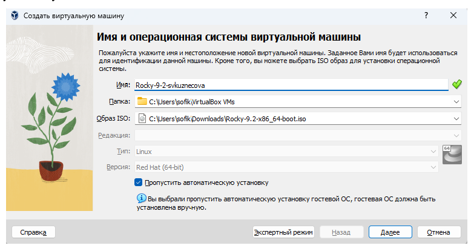{ #fig:003 width=70% }

## Окно «Оборудование»

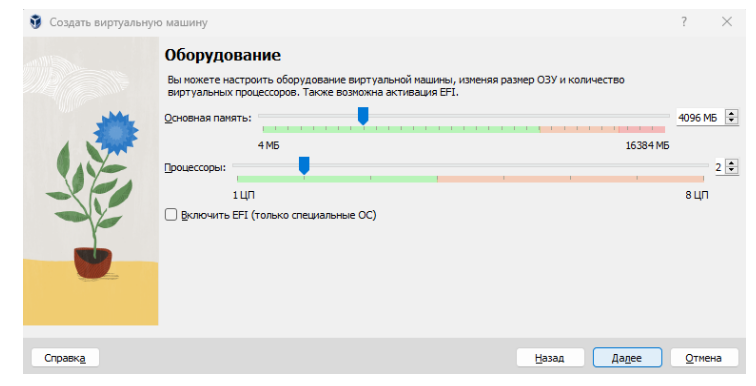{ #fig:004 width=70% }

## Окно «Виртуальный жёсткий диск»
	
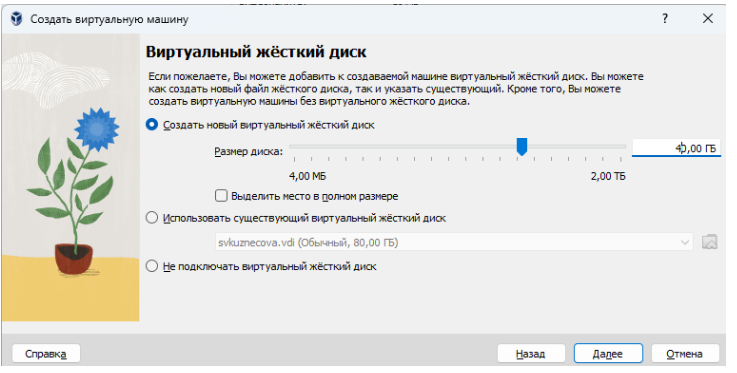{ #fig:005 width=70% }

## Запуск виртуальной машины

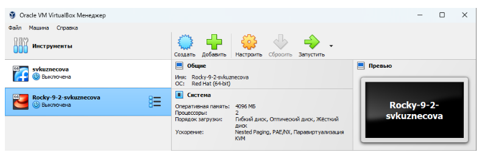{ #fig:006 width=70% }

## Rocky Linux 9.2

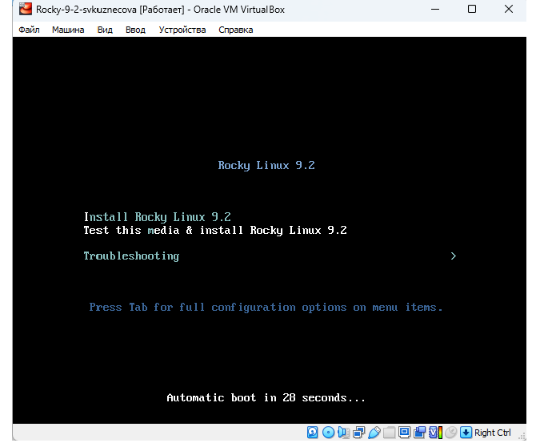{ #fig:007 width=50% }

## Интерфейс ОС

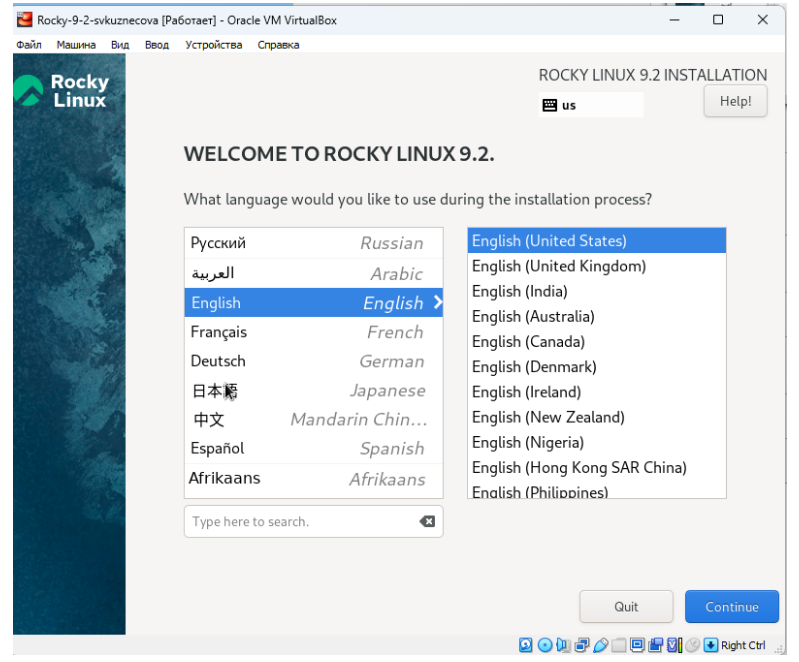{ #fig:008 width=50% }

## Окно настройки установки: место установки

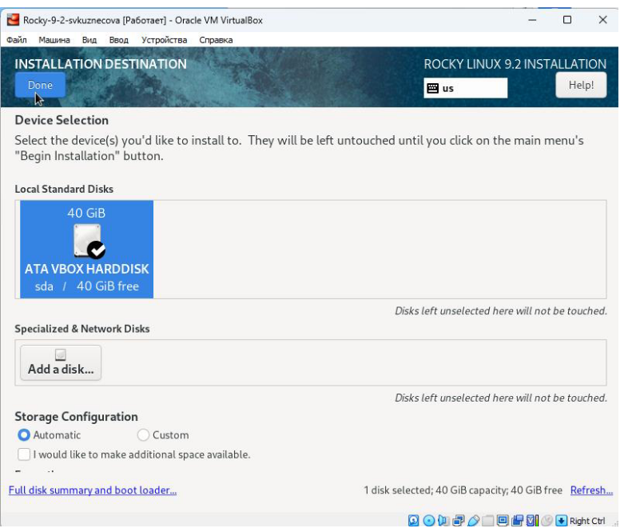{ #fig:009 width=50% }

## Окно настройки установки: выбор программ

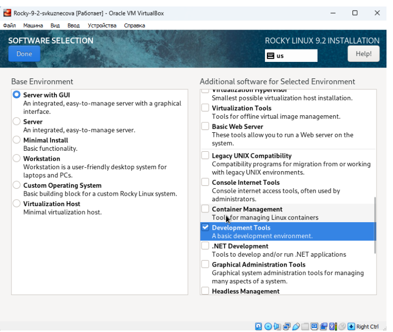{ #fig:010 width=50% }.

## Окно настройки установки: отключение KDUMP

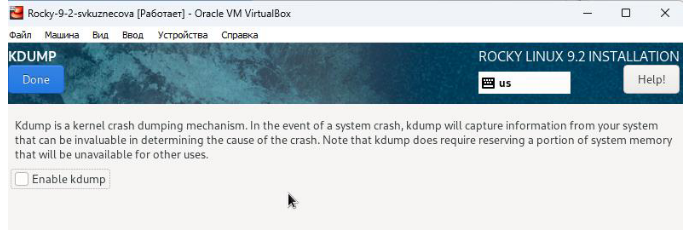{ #fig:011 width=70% }

## Окно настройки установки: сеть и имя узла

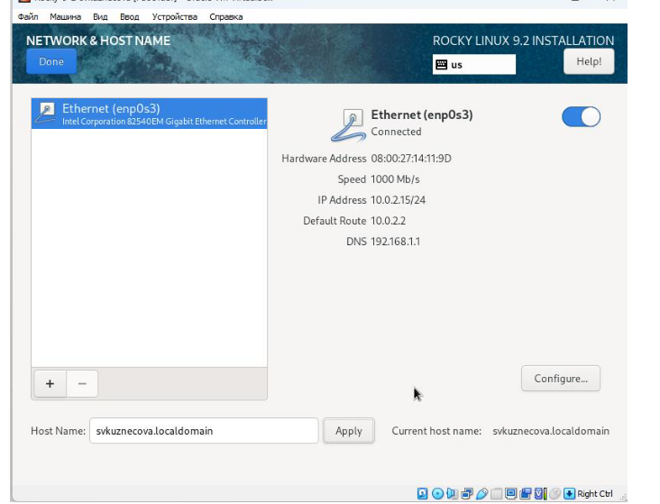{ #fig:012 width=50% }

## Окно настройки установки: язык клавиатуры и горячие клавиши
    	   	
{ #fig:013 width=50% }

## Пароль для root
	
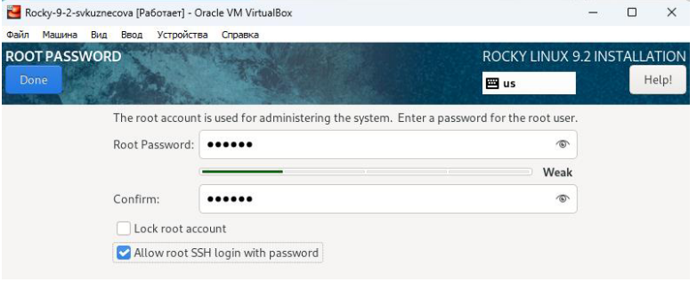{ #fig:014 width=70% }

## Установка ОС

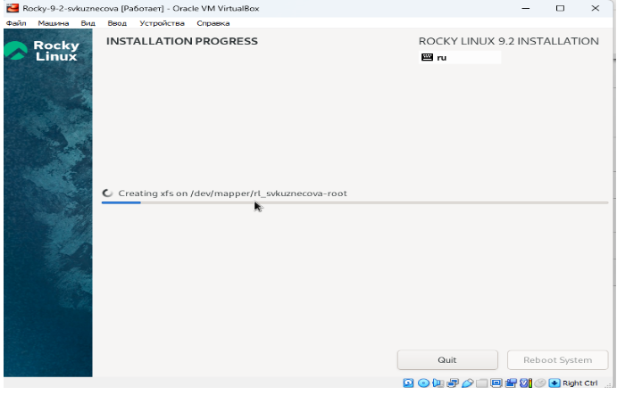{ #fig:015 width=70% }

## Подключение образа диска Дополнительной гостевой ОС

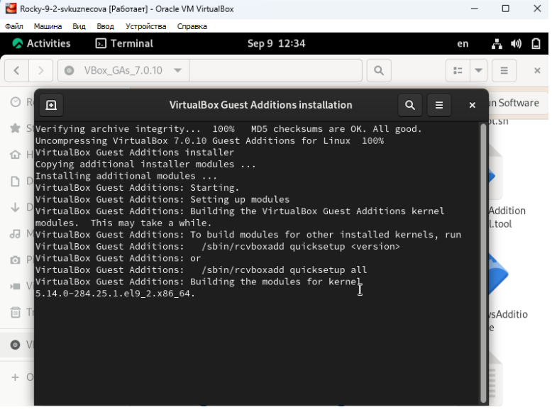{ #fig:016 width=50% }

# Выводы

В ходе выполнения лабораторной работы были приобретены практические навыки установки операционной системы на виртуальную машину и настройки минимально необходимых для дальнейшей работы.

## {.standout}

Спасибо за внимание!

