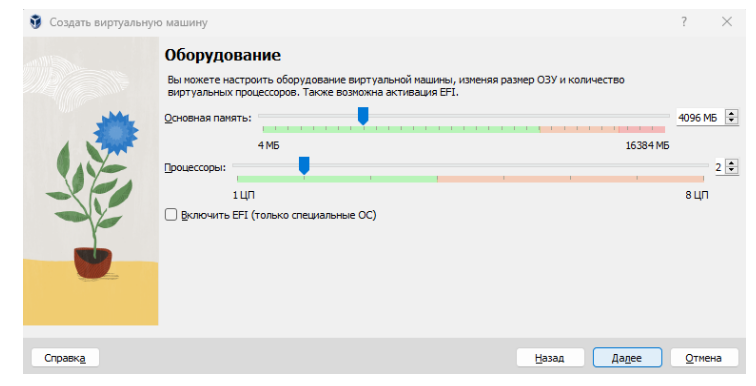
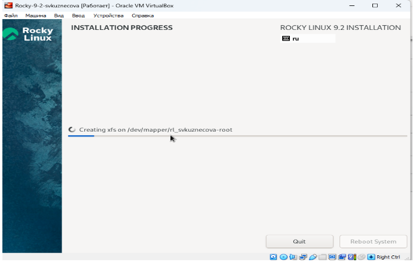

---
## Front matter
title: "Отчёт по лабораторной работе №1"
subtitle: "дисциплина: Основы информационной безопасности"
author: "Студент: Кузнецова София Вадимовна"

## Generic otions
lang: ru-RU
toc-title: "Содержание"

## Bibliography
bibliography: bib/cite.bib
csl: pandoc/csl/gost-r-7-0-5-2008-numeric.csl

## Pdf output format
toc: true # Table of contents
toc-depth: 2
lof: true # List of figures
lot: true # List of tables
fontsize: 12pt
linestretch: 1.5
papersize: a4
documentclass: scrreprt
## I18n polyglossia
polyglossia-lang:
  name: russian
  options:
	- spelling=modern
	- babelshorthands=true
polyglossia-otherlangs:
  name: english
## I18n babel
babel-lang: russian
babel-otherlangs: english
## Fonts
mainfont: PT Serif
romanfont: PT Serif
sansfont: PT Sans
monofont: PT Mono
mainfontoptions: Ligatures=TeX
romanfontoptions: Ligatures=TeX
sansfontoptions: Ligatures=TeX,Scale=MatchLowercase
monofontoptions: Scale=MatchLowercase,Scale=0.9
## Biblatex
biblatex: true
biblio-style: "gost-numeric"
biblatexoptions:
  - parentracker=true
  - backend=biber
  - hyperref=auto
  - language=auto
  - autolang=other*
  - citestyle=gost-numeric
## Pandoc-crossref LaTeX customization
figureTitle: "Рис."
tableTitle: "Таблица"
listingTitle: "Листинг"
lofTitle: "Список иллюстраций"
lolTitle: "Листинги"
## Misc options
indent: true
header-includes:
  - \usepackage{indentfirst}
  - \usepackage{float} # keep figures where there are in the text
  - \floatplacement{figure}{H} # keep figures where there are in the text
---

# Цель работы

Целью данной работы является приобретение практических навыков установки операционной системы на виртуальную машину, настройки минимально необходимых для дальнейшей работы сервисов.

# Выполнение лабораторной работы

Произведём скачивание и установку виртуальной машины через сайт: https://www.virtualbox.org/.

{ #fig:001 width=70% }

Следующим шагом нужно скачать дистрибутив Linux Rocky, воспользовавшись сайтом: https://rockylinux.org/download/. 

{ #fig:002 width=70% }

Создаём новую виртуальную машину: в VirtualBox выберите Машина Создать. Указываем имя виртуальной машины, тип операционной системы — Linux, версию операционной системы — RedHat (64-bit). Указываем путь к iso-образу устанавливаемого дистрибутива, отмечаем «Пропустить автоматическую установку».
    	   	
{ #fig:003 width=70% }

Указываем размер основной памяти виртуальной машины 4096 МБ и число процессоров 2.
	
{ #fig:004 width=70% }

Задаём размер виртуального жёсткого диска – 40ГБ.
	
{ #fig:005 width=70% }

После выставления всех требуемых параметров нужно запустить виртуальную машину. 

{ #fig:006 width=70% }

Устанавливаем Rocky Linux 9.2.

{ #fig:007 width=70% }

Переходим к настройкам установки операционной системы и выбираем английский язык для интерфейса.

{ #fig:008 width=70% }

При выборе места установки оставляем параметры, которые были выставлены автоматически. 

{ #fig:009 width=70% }

В разделе выбора программ указываем в качестве базового окружения Server with GUI , а в качестве дополнения — Development Tools.

{ #fig:010 width=70% }

Отключаем KDUMP.

{ #fig:011 width=70% }

Включаем сетевое соединение и в качестве имени узла указываем svkuznecova.localdomain.

{ #fig:012 width=70% }

Скорректируем раскладку клавиатуры (добавим русский язык, но в качестве языка по умолчанию укажем английский язык; зададим комбинацию клавиш для переключения между раскладками клавиатуры - Alt + Shift ). 
    	   	
{ #fig:013 width=70% }

Устанавливаем пароль для root и пользователя с правами администратора.
	
{ #fig:014 width=70% }

Начинаем процесс установки ОС.

{ #fig:015 width=70% }

Дожидаемся и завершаем установку. После успешной установки выполняем перезагрузку системы. Последним пунктом нашей лабораторнойработы становится подключение образа диска Дополнительной гостевой ОC. 

{ #fig:016 width=70% }

# Выводы

В ходе выполнения лабораторной работы были приобретены практические навыки установки операционной системы на виртуальную машину и настройки минимально необходимых для дальнейшей работы.
