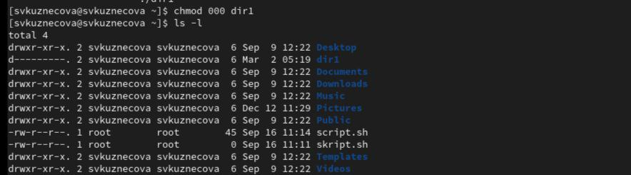

---
## Front matter
lang: ru-RU
title: Лабораторная работы №2
subtitle: Дискреционное разграничение прав в Linux. Основные атрибуты
author:
  - Кузнецова С. В.
institute:
  - Российский университет дружбы народов, Москва, Россия
date:  1 марта  2024

## i18n babel
babel-lang: russian
babel-otherlangs: english

## Formatting pdf
toc: false
toc-title: Содержание
slide_level: 2
aspectratio: 169
section-titles: true
theme: metropolis
header-includes:
 - \metroset{progressbar=frametitle,sectionpage=progressbar,numbering=fraction}
 - '\makeatletter'
 - '\beamer@ignorenonframefalse'
 - '\makeatother'
---

# Информация

## Докладчик

:::::::::::::: {.columns align=center}
::: {.column width="70%"}

  * Кузнецова София Вадимовна
  * Российский университет дружбы народов

:::
::: {.column width="30%"}

:::
::::::::::::::

# Ход работы

## Guest

{ #fig:001 width=70% }

## Вход в систему от имени пользователя guest

{ #fig:002 width=70% }

## pwd и whoami

{ #fig:003 width=70% }

## id и groups

{ #fig:004 width=70% }

## uid и gid пользователя
	
{ #fig:005 width=70% }

{ #fig:006 width=70% }

## Список поддиректорий директории

{ #fig:007 width=70% }

## Атрибуты установленные на поддиректориях

{ #fig:008 width=70% }

## Команды ls -l и lsattr

{ #fig:009 width=50% }

{ #fig:010 width=50% }

## Снятие с директории всех атрибутов

{ #fig:011 width=70% }

## Создание файла в директории dir1 и сообщение об ошибке отразилось на создании файла

{ #fig:012 width=10% }

{ #fig:013 width=10% }

{ #fig:014 width=10% }

# Выводы

В ходе выполнения лабораторной работы были приобретены практические навыки работы в консоли с атрибутами файлов, закрепление теоретических основ дискреционного разграничения доступа в современных системах с открытым кодом на базе ОС Linux1.

## {.standout}

Спасибо за внимание!

