---
## Front matter
title: "Отчёт по лабораторной работе №2"
subtitle: "дисциплина: Основы информационной безопасности"
author: "Студент: Кузнецова София Вадимовна"

## Generic otions
lang: ru-RU
toc-title: "Содержание"

## Bibliography
bibliography: bib/cite.bib
csl: pandoc/csl/gost-r-7-0-5-2008-numeric.csl

## Pdf output format
toc: true # Table of contents
toc-depth: 2
lof: true # List of figures
lot: true # List of tables
fontsize: 12pt
linestretch: 1.5
papersize: a4
documentclass: scrreprt
## I18n polyglossia
polyglossia-lang:
  name: russian
  options:
	- spelling=modern
	- babelshorthands=true
polyglossia-otherlangs:
  name: english
## I18n babel
babel-lang: russian
babel-otherlangs: english
## Fonts
mainfont: PT Serif
romanfont: PT Serif
sansfont: PT Sans
monofont: PT Mono
mainfontoptions: Ligatures=TeX
romanfontoptions: Ligatures=TeX
sansfontoptions: Ligatures=TeX,Scale=MatchLowercase
monofontoptions: Scale=MatchLowercase,Scale=0.9
## Biblatex
biblatex: true
biblio-style: "gost-numeric"
biblatexoptions:
  - parentracker=true
  - backend=biber
  - hyperref=auto
  - language=auto
  - autolang=other*
  - citestyle=gost-numeric
## Pandoc-crossref LaTeX customization
figureTitle: "Рис."
tableTitle: "Таблица"
listingTitle: "Листинг"
lofTitle: "Список иллюстраций"
lolTitle: "Листинги"
## Misc options
indent: true
header-includes:
  - \usepackage{indentfirst}
  - \usepackage{float} # keep figures where there are in the text
  - \floatplacement{figure}{H} # keep figures where there are in the text
---

# Цель работы

Получение практических навыков работы в консоли с атрибутами файлов, закрепление теоретических основ дискреционного разграничения доступа в современных системах с открытым кодом на базе ОС Linux1

# Выполнение лабораторной работы

В установленной при выполнении предыдущей лабораторной работы операционной системе создала учётную запись пользователя guest (использую учётную запись администратора).

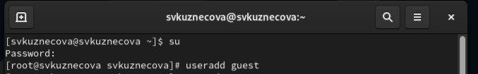{ #fig:001 width=70% }

Задала пароль для пользователя guest (использую учётную запись администратора) и вошла в систему от имени пользователя guest.

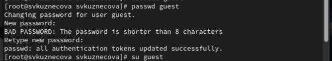{ #fig:002 width=70% }

Определила директорию, в которой я нахожусь, командой pwd. Сравнила её с приглашением командной строки. Определила, является ли она вашей домашней директорией. Уточнила имя пользователя командой whoami.
    	   	
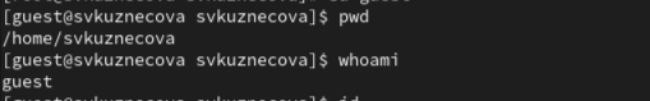{ #fig:003 width=70% }

Уточнила имя пользователя, его группу, а также группы, куда входит пользователь, командой id. Выведенные значения uid, gid и др. Сравнила вывод id с выводом команды groups.
	
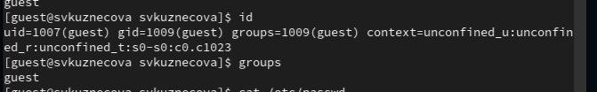{ #fig:004 width=70% }

Просмотрела файл /etc/passwd командой cat /etc/passwd. Нашла в нём свою учётную запись. Определила uid пользователя. Определила gid пользователя. Сравнила найденные значения с полученными в предыдущих пунктах.
В качестве фильтра для вывода только строк, содержащих определённые буквенные сочетания:cat /etc/passwd | grep guest

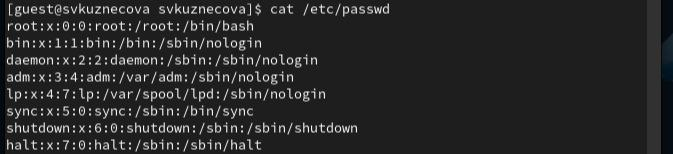{ #fig:005 width=70% }

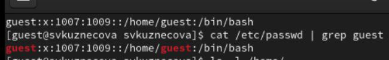{ #fig:006 width=70% }

Определила существующие в системе директории командой ls -l /home/. Удалось получить список поддиректорий директории. 

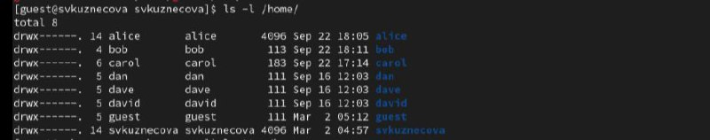{ #fig:007 width=70% }

Проверила, какие расширенные атрибуты установлены на поддиректориях, находящихся в директории /home, командой: lsattr /home.

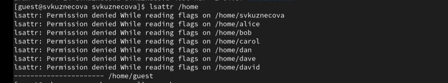{ #fig:008 width=70% }

Создала в домашней директории поддиректорию dir1 командой mkdir dir1. Определила командами ls -l и lsattr, какие права доступа и расширенные атрибуты были выставлены на директорию dir1

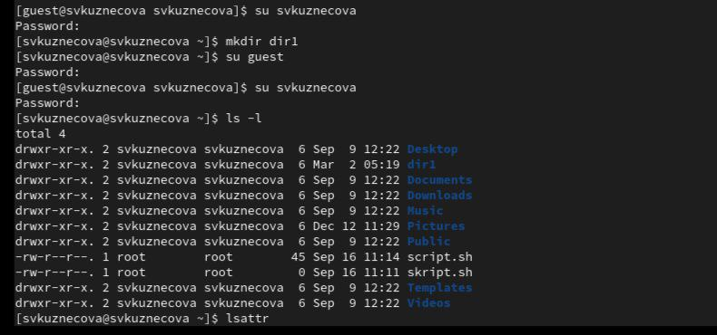{ #fig:009 width=70% }

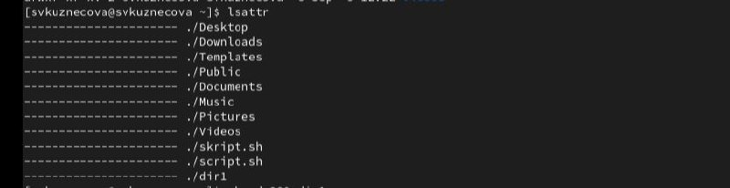{ #fig:010 width=70% }

Сняла с директории dir1 все атрибуты командой chmod 000 dir1 и проверила с её помощью правильность выполнения команды ls -l.

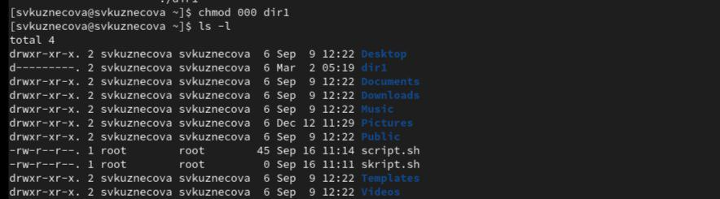{ #fig:011 width=70% }

Попыталась создать в директории dir1 файл file1 командой echo "test" > /home/guest/dir1/file1. Но получила отказ в выполнении операции по созданию файла. Оценила, как сообщение об ошибке отразилось на создании файла. Проверила командой ls -l /home/guest/dir1.

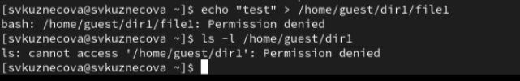{ #fig:012 width=70% }

{ #fig:013 width=70% }

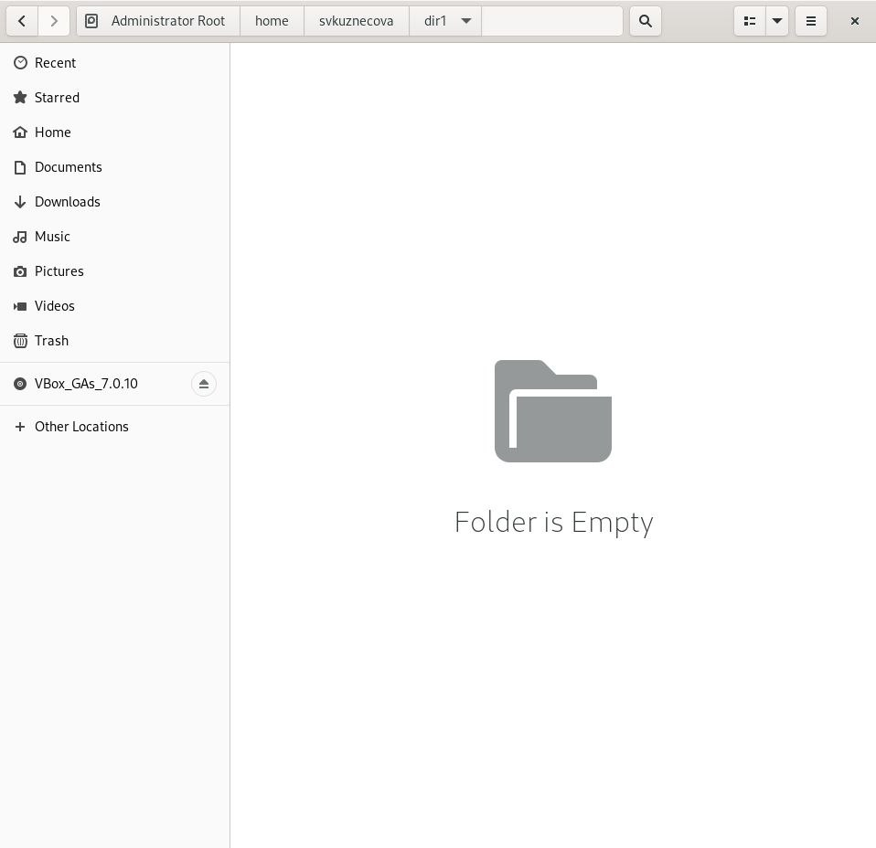{ #fig:014 width=70% }

Таблицы

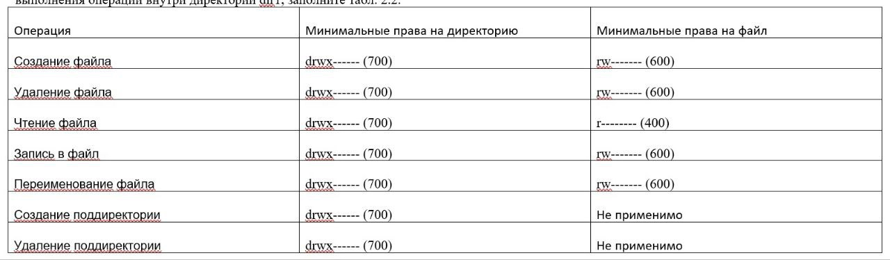{ #fig:015 width=70% }

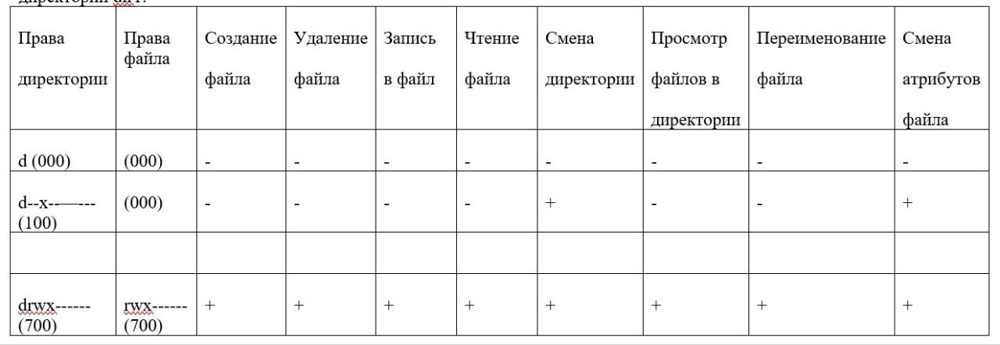{ #fig:016 width=70% }

# Выводы

В ходе выполнения лабораторной работы были приобретены практические навыки работы в консоли с атрибутами файлов, закрепление теоретических основ дискреционного разграничения доступа в современных системах с открытым кодом на базе ОС Linux1.
