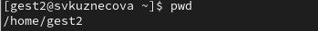

---
## Front matter
lang: ru-RU
title: Лабораторная работы №3
subtitle: Дискреционное разграничение прав в Linux. Два пользователя
author:
  - Кузнецова С. В.
institute:
  - Российский университет дружбы народов, Москва, Россия
date:  15 марта  2024

## i18n babel
babel-lang: russian
babel-otherlangs: english

## Formatting pdf
toc: false
toc-title: Содержание
slide_level: 2
aspectratio: 169
section-titles: true
theme: metropolis
header-includes:
 - \metroset{progressbar=frametitle,sectionpage=progressbar,numbering=fraction}
 - '\makeatletter'
 - '\beamer@ignorenonframefalse'
 - '\makeatother'
---

# Информация

## Докладчик

:::::::::::::: {.columns align=center}
::: {.column width="70%"}

  * Кузнецова София Вадимовна
  * Российский университет дружбы народов

:::
::: {.column width="30%"}

:::
::::::::::::::

# Ход работы

## В установленной операционной системе создаём учётную запись пользователя gest

{#fig:001 width=70%}

## Аналогично создаём второго пользователя gest2.

{#fig:002 width=70%}

## Добавляем пользователя gest2 в группу gest

{#fig:003 width=70%}

## Вход в систему от пользователей gest и gest2 в разных консолях

{#fig:04.1 width=50%}

{#fig:04.2 width=50%}

## Команда pwd
	
{#fig:05.1 width=50%}

{#fig:05.2 width=50%}

## Уточняем имя пользователя, его группу, кто входит в неё и к каким группам принадлежит он сам. Команды groups gest и groups gest2 и  id -Gn и id -G.

{#fig:06.1 width=50%}

{#fig:06.2 width=50%}

## Просматриваем файл командой cat /etc/group.

{#fig:007 width=70%}

## Команда newgrp gest

{#fig:008 width=70%}

## Изменяем права директории /home/gest, разрешив все действия для пользователей группы

{#fig:009 width=70%}

## От имени пользователя gest снимаем с директории /home/guest/dir1 все атрибуты командой chmod 000 dir.

{#fig:010 width=70%}

## Таблица

{#fig:011 width=70%}

# Выводы

Получила практические навыки работы в консоли с атрибутами файлов для групп пользователей.

## {.standout}

Спасибо за внимание!
