---
## Front matter
title: "Отчёт по лабораторной работе №3"
subtitle: "дисциплина: Основы информационной безопасности"
author: "Студент: Кузнецова София Вадимовна"

## Generic otions
lang: ru-RU
toc-title: "Содержание"

## Bibliography
bibliography: bib/cite.bib
csl: pandoc/csl/gost-r-7-0-5-2008-numeric.csl

## Pdf output format
toc: true # Table of contents
toc-depth: 2
lof: true # List of figures
lot: true # List of tables
fontsize: 12pt
linestretch: 1.5
papersize: a4
documentclass: scrreprt
## I18n polyglossia
polyglossia-lang:
  name: russian
  options:
	- spelling=modern
	- babelshorthands=true
polyglossia-otherlangs:
  name: english
## I18n babel
babel-lang: russian
babel-otherlangs: english
## Fonts
mainfont: PT Serif
romanfont: PT Serif
sansfont: PT Sans
monofont: PT Mono
mainfontoptions: Ligatures=TeX
romanfontoptions: Ligatures=TeX
sansfontoptions: Ligatures=TeX,Scale=MatchLowercase
monofontoptions: Scale=MatchLowercase,Scale=0.9
## Biblatex
biblatex: true
biblio-style: "gost-numeric"
biblatexoptions:
  - parentracker=true
  - backend=biber
  - hyperref=auto
  - language=auto
  - autolang=other*
  - citestyle=gost-numeric
## Pandoc-crossref LaTeX customization
figureTitle: "Рис."
tableTitle: "Таблица"
listingTitle: "Листинг"
lofTitle: "Список иллюстраций"
lotTitle: "Список таблиц"
lolTitle: "Листинги"
## Misc options
indent: true
header-includes:
  - \usepackage{indentfirst}
  - \usepackage{float} # keep figures where there are in the text
  - \floatplacement{figure}{H} # keep figures where there are in the text
---

# Цель работы

Получение практических навыков работы в консоли с атрибутами фай-
лов для групп пользователей.

# Выполнение лабораторной работы

В установленной операционной системе создайте учётную запись пользователя gest (использую учётную запись администратора): useradd gest. Задала пароль для пользователя gest (использую учётную запись администратора): passwd gest.

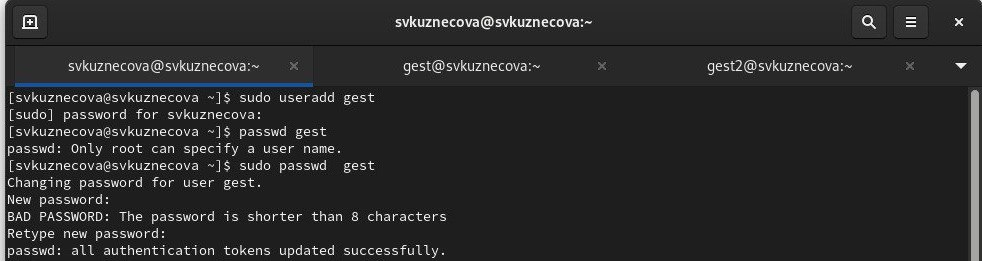{#fig:001 width=70%}

Аналогично создала второго пользователя gest2.

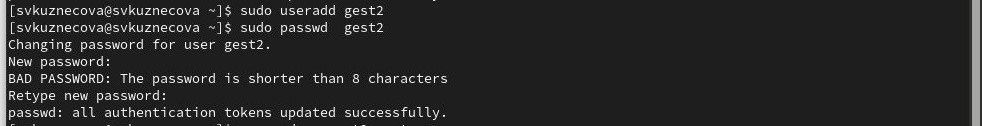{#fig:002 width=70%}

Добавила пользователя gest2 в группу gest: gpasswd -a gust2 gеst.

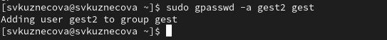{#fig:003 width=70%}

Осуществила вход в систему от двух пользователей на двух разных консолях: gest на первой консоли и gest2 на второй консоли.

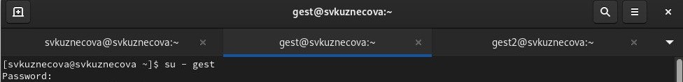{#fig:04.1 width=70%}

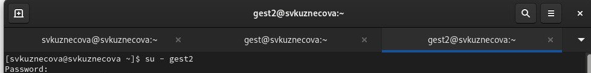{#fig:04.2 width=70%}

Для обоих пользователей командой pwd определила директорию, в которой я нахожусь. Сравнила её с приглашениями командной строки.

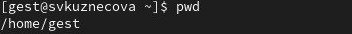{#fig:05.1 width=70%}

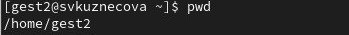{#fig:05.2 width=70%}

Уточнила имя пользователя, его группу, кто входит в неё и к каким группам принадлежит он сам. Определите командами
groups gest и groups gest2, в какие группы входят пользователи gest и gest2. Сравните вывод команды groups с выводом команд id -Gn и id -G.

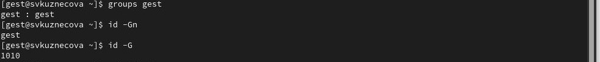{#fig:06.1 width=70%}

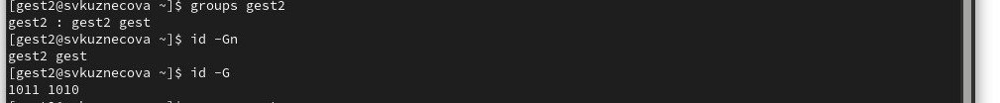{#fig:06.2 width=70%}

Сравнила полученную информацию с содержимым файла /etc/group. Просмотрите файл командой cat /etc/group.

{#fig:007 width=70%}

От имени пользователя gest2 выполнила регистрацию пользователя gest2 в группе gest командой newgrp gest.

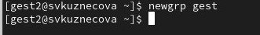{#fig:008 width=70%}

От имени пользователя gest измените права директории /home/gest, разрешив все действия для пользователей группы: chmod g+rwx /home/gest.

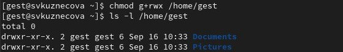{#fig:009 width=70%}

От имени пользователя gest снимите с директории /home/guest/dir1 все атрибуты командой chmod 000 dir.

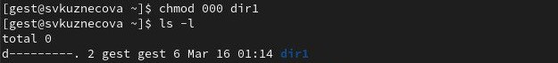{#fig:010 width=70%}

Таблица

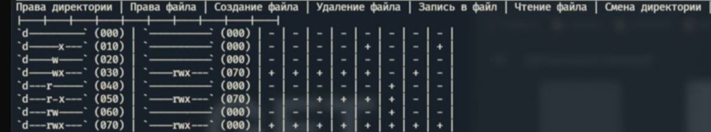{#fig:011 width=70%}

# Выводы

Получила практические навыки работы в консоли с атрибутами файлов для групп пользователей.

