---
## Front matter
lang: ru-RU
title: Лабораторная работа №4
subtitle: Операционные системы
author:
  - Кузнецова С.В.
date: 04 марта 2023

## i18n babel
babel-lang: russian
babel-otherlangs: english

## Formatting pdf
toc: false
toc-title: Содержание
slide_level: 2
aspectratio: 169
section-titles: true
theme: metropolis
header-includes:
 - \metroset{progressbar=frametitle,sectionpage=progressbar,numbering=fraction}
 - '\makeatletter'
 - '\beamer@ignorenonframefalse'
 - '\makeatother'
---

## О себе

- Кузнецова София Вадимовна 
- Группа НПИбд-02-22

## Цели и задачи

Приобретение навыков работы с системой с помощью командной строки.

# Выполнение лабораторной работы

## Домашний каталог

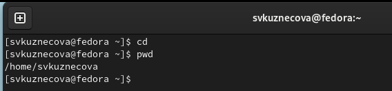{#fig:001 width=70%}

## Каталог /tmp

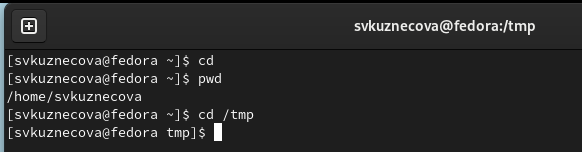{#fig:002 width=70%}

## Cодержимое каталога

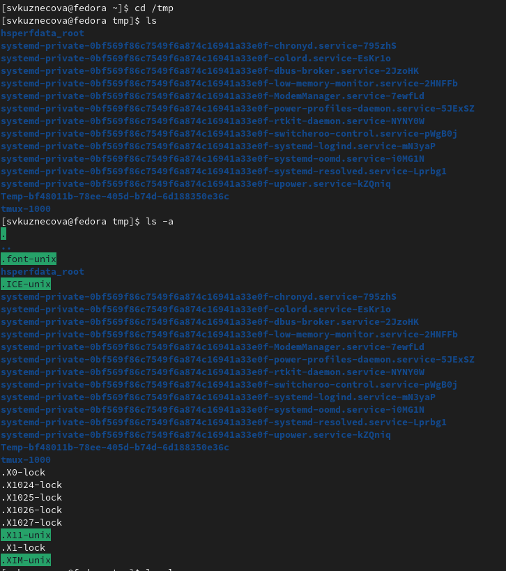{#fig:003 width=70%} 

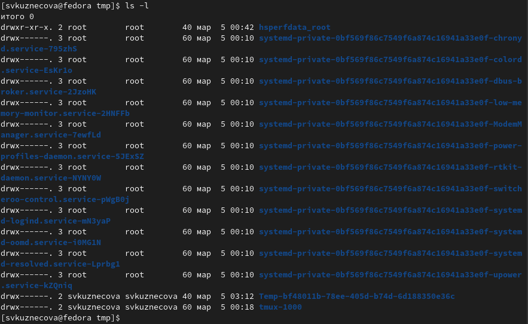{#fig:004 width=70%} 

## Каталог /var/spool

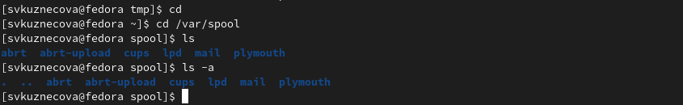{#fig:005 width=70%}

## Создание каталога

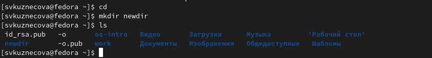{#fig:008 width=70%}

## Создание внутреннего каталога morefun

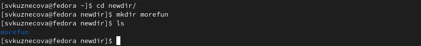{#fig:008 width=70%}

## Создание 3 каталогов

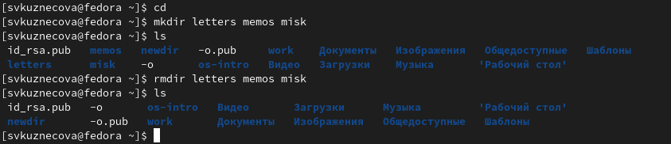{#fig:009 width=70%}

## Удаление каталогов

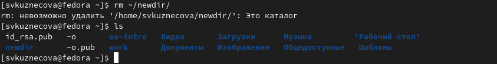{#fig:010 width=70%}

## Удаление каталога morefun.

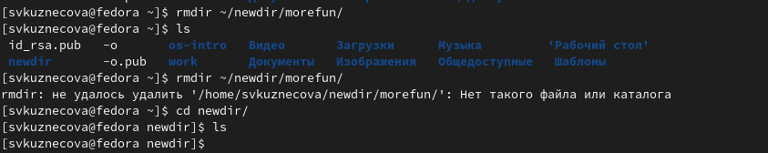{#fig:011 width=70%}

## Команда man

.png){#fig:012 width=70%}

## Содержимое подкаталогов

.png){#fig:013 width=70%}

## Сортировка файлов

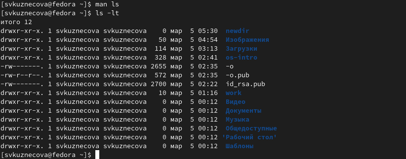{#fig:014 width=70%}

## Опции команд cd, pwd, mkdir, rmdir, rm

.png){#fig:015 width=70%}

.png){#fig:016 width=70%}

.png){#fig:017 width=70%}

.png){#fig:018 width=70%}

.png){#fig:019 width=70%}

.png){#fig:020 width=70%}

## Команда history

.png){#fig:021 width=70%}

## Вывод

По результатам выполнения работы были получены навыки работы с командной строкой.
