---
## Front matter
title: "Отчёт по лабораторной работе №4"
subtitle: "Дисциплина: Операционные системы"
author: "Кузнецова София Вадимовна"

## Generic options
lang: ru-RU
toc-title: "Содержание"

## Bibliography
bibliography: bib/cite.bib
csl: pandoc/csl/gost-r-7-0-5-2008-numeric.csl

## Pdf output format
toc: true # Table of contents
toc-depth: 2
lof: true # List of figures
lot: true # List of tables
fontsize: 12pt
linestretch: 1.5
papersize: a4
documentclass: scrreprt
## I18n polyglossia
polyglossia-lang:
  name: russian
  options:
	- spelling=modern
	- babelshorthands=true
polyglossia-otherlangs:
  name: english
## I18n babel
babel-lang: russian
babel-otherlangs: english
## Fonts
mainfont: PT Serif
romanfont: PT Serif
sansfont: PT Sans
monofont: PT Mono
mainfontoptions: Ligatures=TeX
romanfontoptions: Ligatures=TeX
sansfontoptions: Ligatures=TeX,Scale=MatchLowercase
monofontoptions: Scale=MatchLowercase,Scale=0.9
## Biblatex
biblatex: true
biblio-style: "gost-numeric"
biblatexoptions:
  - parentracker=true
  - backend=biber
  - hyperref=auto
  - language=auto
  - autolang=other*
  - citestyle=gost-numeric
## Pandoc-crossref LaTeX customization
figureTitle: "Рис."
tableTitle: "Таблица"
listingTitle: "Листинг"
lofTitle: "Список иллюстраций"
lotTitle: "Список таблиц"
lolTitle: "Листинги"
## Misc options
indent: true
header-includes:
  - \usepackage{indentfirst}
  - \usepackage{float} # keep figures where there are in the text
  - \floatplacement{figure}{H} # keep figures where there are in the text
---

# Цель работы

Приобретение навыков работы с системой с помощью командной строки.

# Теоретическое введение

3.1 Формат команды

Командой в операционной системе называется записанный по специальным
правилам текст (возможно с аргументами), представляющий собой указание
на выполнение какой-либо функций (или действий) в операционной системе.
Обычно первым словом идёт имя команды, остальной текст — аргументы или
опции, конкретизирующие действие. Общий формат команд можно представить
следующим образом:

3.2 Команда man.

Команда man используется для просмотра (оперативная помощь) в диалоговом
режиме руководства (manual) по основным командам операционной системы
типа Linux. Формат команды:
man <команда>

3.3 Команда cd.

Команда cd используется для перемещения по файловой системе операци-
онной системы типа Linux. Файловая система ОС типа Linux — иерархическая
система каталогов, подкаталогов и файлов, которые обычно организованы и
сгруппированы по функциональному признаку. Самый верхний каталог в иерар-
хии называется корневым и обозначается символом /. Корневой каталог содержит
системные файлы и другие каталоги. Формат команды:
cd [путь_к_каталогу]

3.4 Команда pwd.

Для определения абсолютного пути к текущему каталогу используется команда
pwd (print working directory).

3.5 Команда ls.

Команда ls используется для просмотра содержимого каталога. Формат коман-
ды:
ls [-опции] [путь]
Некоторые файлы в операционной системе скрыты от просмотра и обычно
используются для настройки рабочей среды. Имена таких файлов начинаются с
точки. Для того, чтобы отобразить имена скрытых файлов, необходимо исполь-
зовать команду ls с опцией a:
ls -a
Можно также получить информацию о типах файлов (каталог, исполняемый
файл, ссылка), для чего используется опция F. При использовании этой опции в
поле имени выводится символ, который определяет тип файла:
ls -F
Чтобы вывести на экран подробную информацию о файлах и каталогах, необхо-
димо использовать опцию l. При этом о каждом файле и каталоге будет выведена
следующая информация: – тип файла,
– право доступа,
– число ссылок,
– владелец,
– размер,
– дата последней ревизии,
– имя файла или каталога.

3.6 Команда mkdir.
Команда mkdir используется для создания каталогов. Формат команды:
mkdir имя_каталога1 [имя_каталога2...]

3.7 Команда rm.

Команда rm используется для удаления файлов и/или каталогов. Формат ко-
манды:
rm [-опции] [файл]
Если требуется, чтобы выдавался запрос подтверждения на удаление файла,
то необходимо использовать опцию i. Чтобы удалить каталог, содержащий фай-
лы, нужно использовать опцию r. Без указания этой опции команда не будет
выполняться.
Если каталог пуст, то можно воспользоваться командой rmdir. Если удаляемый
каталог содержит файлы, то команда не будет выполнена — нужно использовать
rm -r имя_каталога

3.8 Команда history.

Для вывода на экран списка ранее выполненных команд используется команда
history. Выводимые на экран команды в списке нумеруются. К любой коман-
де из выведенного на экран списка можно обратиться по её номеру в списке,
воспользовавшись конструкцией !.

# Выполнение лабораторной работы

1. Определим имя домашнего каталога.

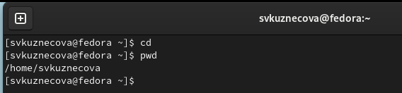{#fig:001 width=70%}

2. Перейдем в каталог /tmp c помощью команды cd.

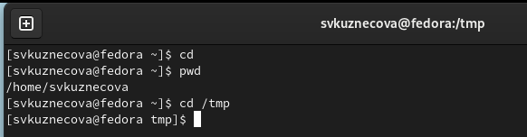{#fig:002 width=70%}

3. С помощью команды ls выведем содержимое каталога.

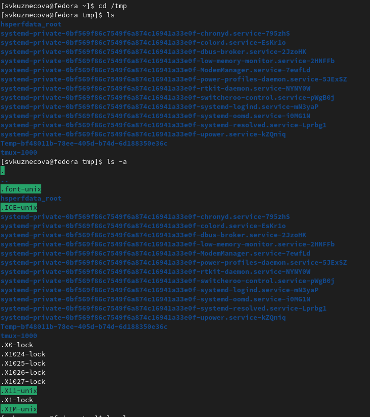{#fig:003 width=70%} 

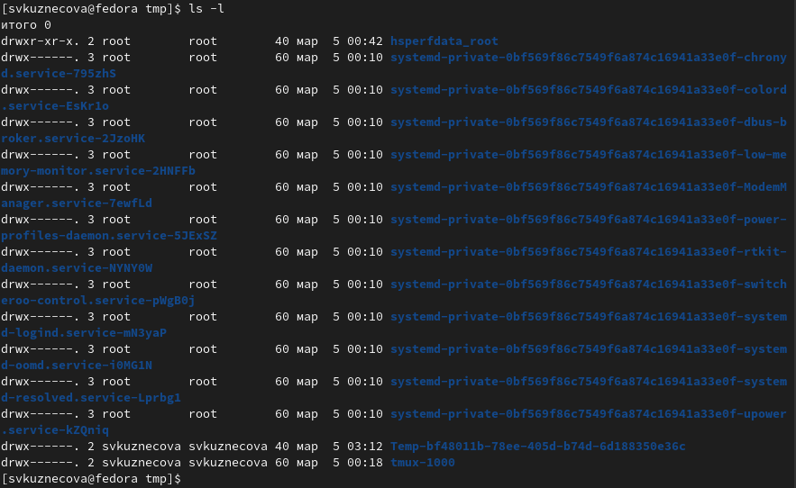{#fig:004 width=70%} 

4. Попробуем перейти в каталог /var/spool.

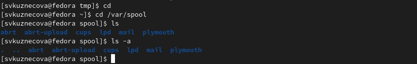{#fig:005 width=70%}

Каталог успешно найден.

5. С помощью команды ls выведем содержимое домашнего каталога с указанием владельца (svkuznecova).

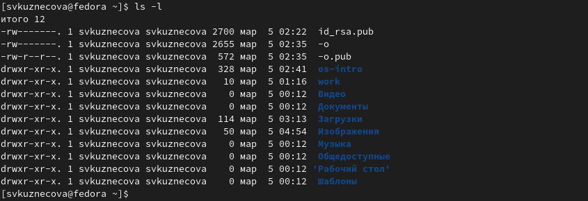{#fig:006 width=70%}

6. С помощью команды mkdir создадим каталог с именем newdir.

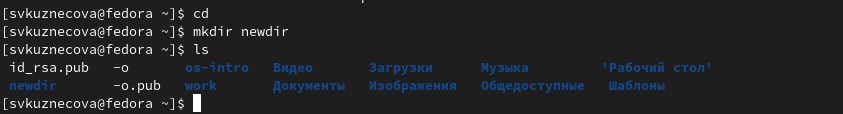{#fig:007 width=70%}

7. В ранее созданном каталоге создадим внутренний каталог morefun.

{#fig:008 width=70%}

8. Cоздадим три новых каталога с именами letters, memos, misk. 

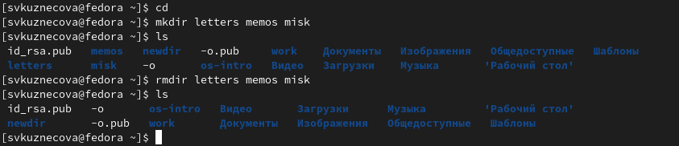{#fig:009 width=70%}

Затем удалим эти каталоги командой rm.

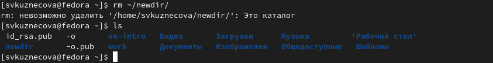{#fig:010 width=70%}

С помощью команды ls подтверждаем удаление.

9. Удалим каталог morefun.

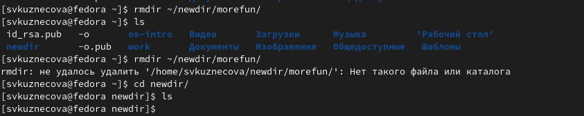{#fig:011 width=70%}

С помощью команды ls подтверждаем удаление.

10. Введем команду man для вывода функций команды ls.

.png){#fig:012 width=70%}

Чтобы вывести содержимое подкаталогов, необходима функция -r (вывод рекурсивно).

.png){#fig:013 width=70%}

11. Введем команду man с опцией -lt (time) для сортировки файлов по времени.

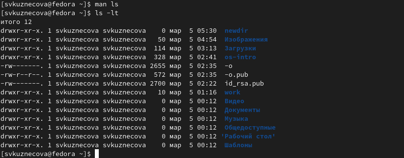{#fig:014 width=70%}

12. Введем команды man для вызова опций команд cd, pwd, mkdir,
rmdir, rm.

.png){#fig:015 width=70%}

.png){#fig:016 width=70%}

.png){#fig:017 width=70%}

.png){#fig:018 width=70%}

.png){#fig:019 width=70%}

.png){#fig:020 width=70%}

13. C помощью команды history найдем и модифицируем команд ls и pwd.

.png){#fig:021 width=70%}

# Контрольные вопросы

1. Что такое командная строка?
Командная строка - интерфейс для ввода команд

2. При помощи какой команды можно определить абсолютный путь текущего
каталога? Приведите пример.
pwd.

3. При помощи какой команды и каких опций можно определить только тип
файлов и их имена в текущем каталоге? Приведите примеры.
ls -F

4. Каким образом отобразить информацию о скрытых файлах? Приведите
примеры.
ls -a.

5. При помощи каких команд можно удалить файл и каталог? Можно ли это
сделать одной и той же командой? Приведите примеры.
rmdir и rm.

6. Каким образом можно вывести информацию о последних выполненных
пользователем командах? работы?
history

7. Как воспользоваться историей команд для их модифицированного выпол-
нения? Приведите примеры.
history

9. Дайте определение и приведите примера символов экранирования.
Экранирование символов — замена в тексте управляющих символов на соот-
ветствующие текстовые подстановки.

10. Охарактеризуйте вывод информации на экран после выполнения команды
ls с опцией l.
В каждом файле и каталоге будет выведена информация: тип файла, право доступа, число ссылок, владелец, раз-
мер, дата последней ревизии, имя файла или каталога.

11. Что такое относительный путь к файлу? Приведите примеры использования
относительного и абсолютного пути при выполнении какой-либо команды.
Относительный путь - задается относительно определенного каталога.
Абсолютный путь - полный путь к файлу.

12. Как получить информацию об интересующей вас команде?
При помощи команды man.

13. Какая клавиша или комбинация клавиш служит для автоматического до-
полнения вводимых команд?
Tab

# Выводы

По результатам выполнения работы были получены навыки работы с командной строкой.

