---
## Front matter
lang: ru-RU
title: Лабораторная работа №5
subtitle: Анализ файловой системы Linux. Команды для работы с файлами и каталогами
author:
  - Кузнецова София Вадимовна
institute:
  - Российский университет дружбы народов, Москва, Россия
date: 9 марта 2023

## i18n babel
babel-lang: russian
babel-otherlangs: english

## Formatting pdf
toc: false
toc-title: Содержание
slide_level: 2
aspectratio: 169
section-titles: true
theme: metropolis
header-includes:
 - \metroset{progressbar=frametitle,sectionpage=progressbar,numbering=fraction}
 - '\makeatletter'
 - '\beamer@ignorenonframefalse'
 - '\makeatother'
---

# Информация

## Докладчик

:::::::::::::: {.columns align=center}
::: {.column width="70%"}

  * Кузнецова София Вадимовна
  * Студенческий билет - 1132227132
  * НПИбд-02-22
  * Российский университет дружбы народов

:::
::: {.column width="30%"}

:::
::::::::::::::

# Цели и задачи

Ознакомление с файловой системой Linux, её структурой, именами и содержанием
каталогов. Приобретение практических навыков по применению команд для работы
с файлами и каталогами, по управлению процессами (и работами), по проверке исполь-
зования диска и обслуживанию файловой системы.

# Выполнение лабораторной работы

## Команда cp

Копируем файл /usr/include/sys/io.h в домашний каталог и назовём его equipment, используя команду ср.

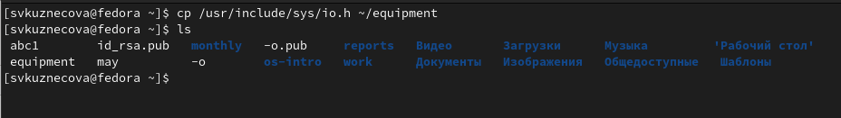{width=70%}

## Команда mv

Создаём каталог ~/ski.plases и переместив в созданную директорию файл equipment.

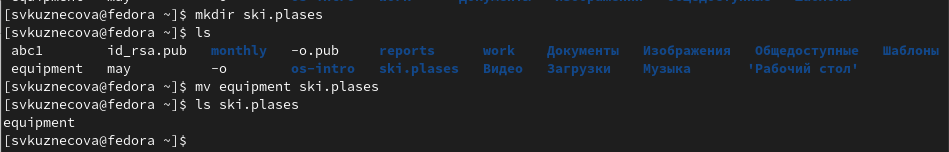{width=70%}

## Команда touch

Создаём файл abc1 (команда touch) и копируем его  в каталог ski.plases, назовём equiplist2.

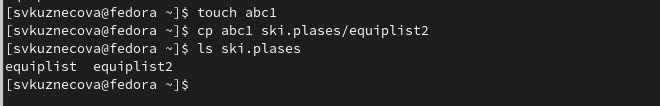{width=70%}

## Команда chmod

Создаём файлы my_os и feathers и каталоги australia и play, присвоим им следующие права доступа используя команду chmod.

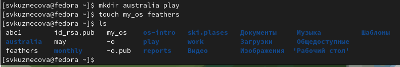{width=50%}

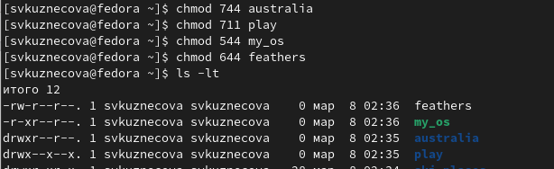{width=50%}

## Команда cat

Просмотрим содержимое файла /etc/password.

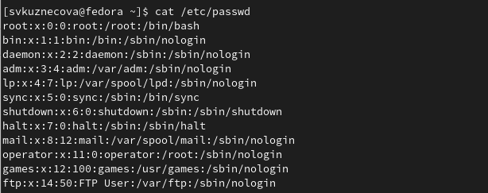{width=70%}

## Команда mv

Переместим файл ~/file.old в каталог ~/play.

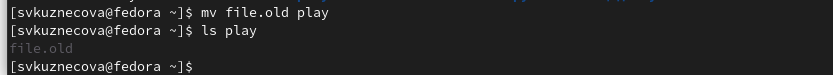{width=70%}

## Команда chmod

Лишим владельца файла ~/feathers права на чтение, попробуем просмотреть его и скопировать. В результате без прав на чтение владелец файла не сможет просмотреть и скопировать этот файл.

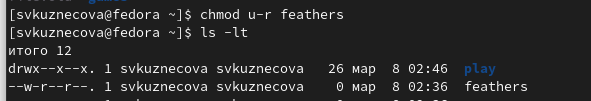{width=50%}

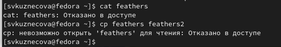{width=50%}

## Команда chmod

Лишаем владельца каталога ~/play права на выполнение и попробуем перейти в него. Без прав на выполнение владнлец не сможет перейти в каталог.Далее восстановим владельцу права на выполнение. 

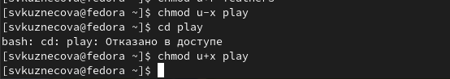{width=70%}

## Команда mount

Команда mount используется для просмотра используемых в операциооной системе файловых систем.

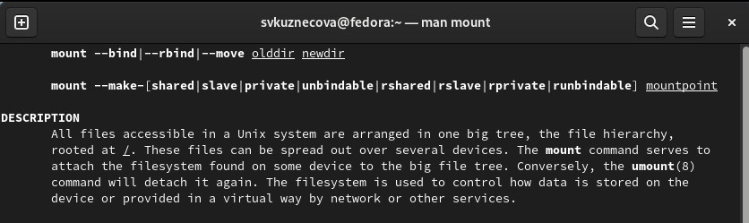{width=70%}

## Команда fsck

Команда fsck нужна для проверки и восстановления файловой системы.

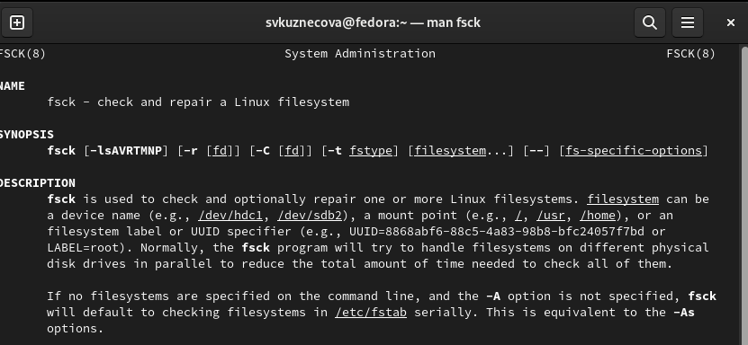{width=70%}

## Команда mkfs

Команда mkfs используется для создания файловой системы Linux на устройстве, обычно в разделе диска.

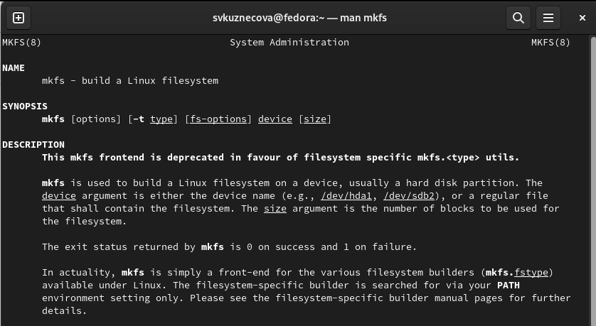{width=50%}

## Команда kill

Команда kill отправляет сигнал процессу, указанному с помощью каждого из операндов идентификатора процесса.

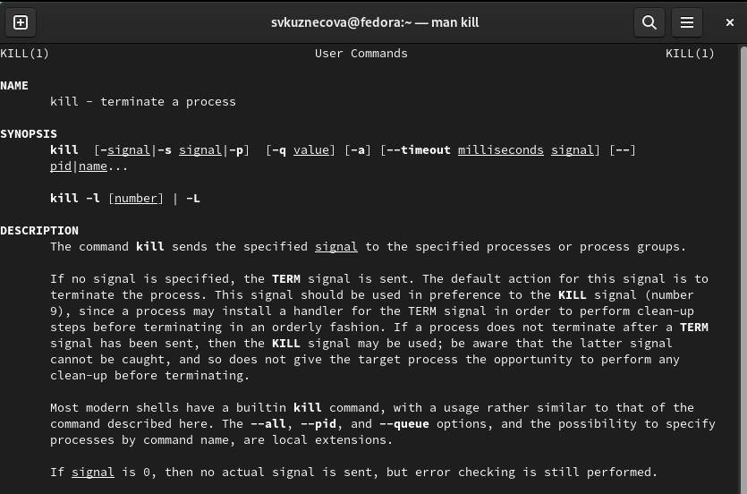{width=50%}

# Вывод

В ходе выполнения лабораторной работы мы ознакомились с файловой системой Linux, её структурой, именами и содержанием каталогов. Приобрели практические навыки по применению команд для работы с файлами и каталогами, по управлению процессами (и работами), по проверке использования диска и обслуживанию файловой системы.
