---
## Front matter
title: "Лабораторная работа №5"
subtitle: "Анализ файловой системы Linux. Команды для работы с файлами и каталогами"
author: "Кузнецова София Вадимовна"

## Generic otions
lang: ru-RU
toc-title: "Содержание"

## Bibliography
bibliography: bib/cite.bib
csl: pandoc/csl/gost-r-7-0-5-2008-numeric.csl

## Pdf output format
toc: true # Table of contents
toc-depth: 2
lof: true # List of figures
lot: true # List of tables
fontsize: 12pt
linestretch: 1.5
papersize: a4
documentclass: scrreprt
## I18n polyglossia
polyglossia-lang:
  name: russian
  options:
	- spelling=modern
	- babelshorthands=true
polyglossia-otherlangs:
  name: english
## I18n babel
babel-lang: russian
babel-otherlangs: english
## Fonts
mainfont: PT Serif
romanfont: PT Serif
sansfont: PT Sans
monofont: PT Mono
mainfontoptions: Ligatures=TeX
romanfontoptions: Ligatures=TeX
sansfontoptions: Ligatures=TeX,Scale=MatchLowercase
monofontoptions: Scale=MatchLowercase,Scale=0.9
## Biblatex
biblatex: true
biblio-style: "gost-numeric"
biblatexoptions:
  - parentracker=true
  - backend=biber
  - hyperref=auto
  - language=auto
  - autolang=other*
  - citestyle=gost-numeric
## Pandoc-crossref LaTeX customization
figureTitle: "Рис."
tableTitle: "Таблица"
listingTitle: "Листинг"
lofTitle: "Список иллюстраций"
lotTitle: "Список таблиц"
lolTitle: "Листинги"
## Misc options
indent: true
header-includes:
  - \usepackage{indentfirst}
  - \usepackage{float} # keep figures where there are in the text
  - \floatplacement{figure}{H} # keep figures where there are in the text
---

# Цель работы

Ознакомление с файловой системой Linux, её структурой, именами и содержанием
каталогов. Приобретение практических навыков по применению команд для работы
с файлами и каталогами, по управлению процессами (и работами), по проверке исполь-
зования диска и обслуживанию файловой системы.

# Теоретическое введение

## Команды для работы с файлами и каталогами

Для создания текстового файла можно использовать команду touch.
Формат команды:
touch имя-файла
Для просмотра файлов небольшого размера можно использовать команду cat.
Формат команды:
cat имя-файла
Для просмотра файлов постранично удобнее использовать команду less.
Формат команды:
less имя-файла
Следующие клавиши используются для управления процессом просмотра:
– Space — переход к следующей странице,
– ENTER — сдвиг вперёд на одну строку,
– b — возврат на предыдущую страницу,
– h — обращение за подсказкой,
– q — выход из режима просмотра файла.
Команда head выводит по умолчанию первые 10 строк файла.
Формат команды:
head [-n] имя-файла,
где n — количество выводимых строк.
Команда tail выводит умолчанию 10 последних строк файла.
Формат команды:
tail [-n] имя-файла,
где n — количество выводимых строк.

## Копирование файлов и каталогов

Команда cp используется для копирования файлов и каталогов.
Формат команды:
cp [-опции] исходный_файл целевой_файл

## Перемещение и переименование файлов и каталогов

Команды mv и mvdir предназначены для перемещения и переименования файлов
и каталогов.
Формат команды mv:
mv [-опции] старый_файл новый_файл

## Права доступа

Каждый файл или каталог имеет права доступа.
В сведениях о файле или каталоге указываются:
– тип файла (символ (-) обозначает файл, а символ (d) — каталог);
– права для владельца файла (r — разрешено чтение, w — разрешена запись, x — разре-
шено выполнение, - — право доступа отсутствует);
– права для членов группы (r — разрешено чтение, w — разрешена запись, x — разрешено
выполнение, - — право доступа отсутствует);
– права для всех остальных (r — разрешено чтение, w — разрешена запись, x — разрешено
выполнение, - — право доступа отсутствует).

## Изменение прав доступа

Права доступа к файлу или каталогу можно изменить, воспользовавшись командой
chmod. Сделать это может владелец файла (или каталога) или пользователь с правами
администратора.
Формат команды:
chmod режим имя_файла
Режим (в формате команды) имеет следующие компоненты структуры и способ запи-
си:
= установить право
- лишить права
+ дать право
r чтение
w запись
x выполнение
u (user) владелец файла
g (group) группа, к которой принадлежит владелец файла
o (others) все остальные
В работе с правами доступа можно использовать их цифровую запись (восьмеричное
значение) вместо символьной

## Анализ файловой системы

Файловая система в Linux состоит из фалов и каталогов. Каждому физическому носи-
телю соответствует своя файловая система.
Существует несколько типов файловых систем. Перечислим наиболее часто встречаю-
щиеся типы:
– ext2fs (second extended filesystem);
– ext2fs (third extended file system);
– ext4 (fourth extended file system);
– ReiserFS;
– xfs;
– fat (file allocation table);
– ntfs (new technology file system).
Для просмотра используемых в операционной системе файловых систем можно вос-
пользоваться командой mount без параметров. В результате её применения можно
получить примерно следующее:
mount
 proc on /proc type proc (rw)
 sysfs on /sys type sysfs (rw,nosuid,nodev,noexec)
 udev on /dev type tmpfs (rw,nosuid)
 devpts on /dev/pts type devpts (rw,nosuid,noexec)
 /dev/sda1 on /mnt/a type ext3 (rw,noatime)
 /dev/sdb2 on /mnt/docs type reiserfs (rw,noatime)
 shm on /dev/shm type tmpfs (rw,noexec,nosuid,nodev)
 usbfs on /proc/bus/usb type usbfs
 (rw,noexec,nosuid,devmode=0664,devgid=85)
 binfmt_misc on /proc/sys/fs/binfmt_misc type binfmt_misc
 (rw,noexec,nosuid,nodev)
 nfsd on /proc/fs/nfs type nfsd (rw,noexec,nosuid,nodev)
В данном случае указаны имена устройств, названия соответствующих им точек мон-
тирования (путь), тип файловой системы и параметрами монтирования.
В контексте команды mount устройство — специальный файл устройства, с помощью
которого операционная система получает доступ к аппаратному устройству. Файлы
устройств обычно располагаются в каталоге /dev, имеют сокращённые имена (например,
sdaN, sdbN или hdaN, hdbN, где N — порядковый номер устройства, sd — устройства SCSI,
hd — устройства MFM/IDE).
Точка монтирования — каталог (путь к каталогу), к которому присоединяются файлы
устройств.
Другой способ определения смонтированных в операционной системе файловых си-
стем — просмотр файла/etc/fstab. Сделать это можно например с помощью команды
cat:
cat /etc/fstab
 /dev/hda1 / ext2 defaults 1 1
 /dev/hda5 /home ext2 defaults 1 2
 /dev/hda6 swap swap defaults 0 0
 /dev/hdc /mnt/cdrom auto umask=0,user,noauto,ro,exec,users 0 0
 none /mnt/floppy supermount dev=/dev/fd0,fs=ext2:vfat,--,
 sync,umask=0 0 0
 none /proc proc defaults 0 0
 none /dev/pts devpts mode=0622 0 0
 В каждой строке этого файла указано:
– имя устройство;
– точка монтирования;
– тип файловой системы;
– опции монтирования;
– специальные флаги для утилиты dump;
– порядок проверки целостности файловой системы с помощью утилиты fsck.
Для определения объёма свободного пространства на файловой системе можно вос-
пользоваться командой df, которая выведет на экран список всех файловых систем
в соответствии с именами устройств, с указанием размера и точки монтирования. На-
пример:
df
Filesystem 1024-blocks Used Available Capacity Mounted on
/dev/hda3 297635 169499 112764 60% /
С помощью команды fsck можно проверить (а в ряде случаев восстановить) целост-
ность файловой системы:
Формат команды:
fsck имя_устройства
Пример:
fsck /dev/sda1

# Выполнение лабораторной работы

Копируем файл /usr/include/sys/io.h в домашний каталог и назовём его equipment, используя команду ср.

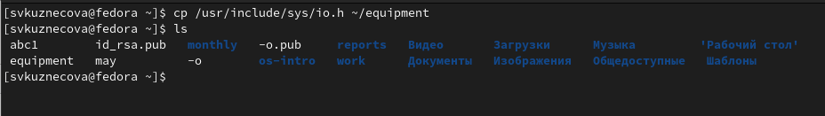{#fig:001 width=70%}

Создаём каталог ~/ski.plases и переместив в созданную директорию файл equipment.

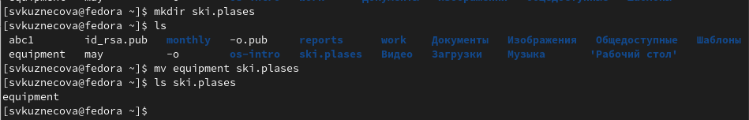{#fig:002 width=70%}

Переименуем файл equipment в equilist (команда mv).

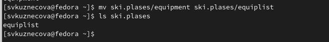{#fig:003 width=70%}

Создаём файл abc1 (команда touch) и копируем его  в каталог ski.plases, назовём equiplist2.

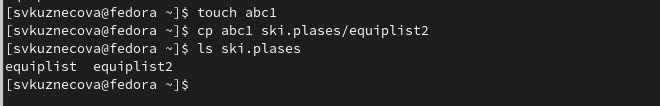{#fig:004 width=70%}

Создаём каталог с именем equipment в каталоге ski.plases и переместим ~/ski.plases/equiplist и equiplist2.

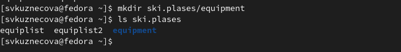{#fig:005 width=70%}

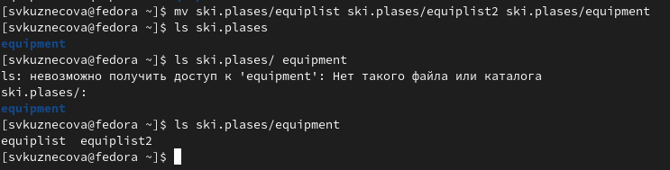{#fig:006 width=70%}

Создаём новый каталог newdir  и переименуем в plans.

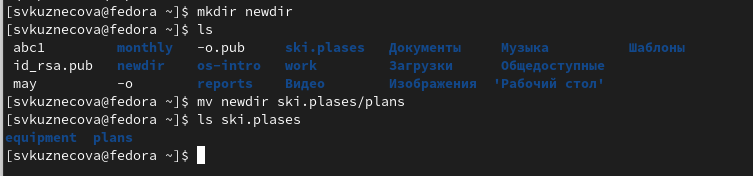{#fig:007 width=70%}

Создаём файлы my_os и feathers и каталоги australia и play, присвоим им следующие права доступа используя команду chmod.

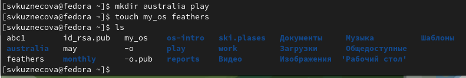{#fig:008 width=70%}

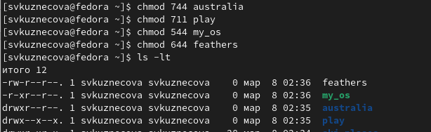{#fig:009 width=70%}

Просмотрим содержимое файла /etc/password.

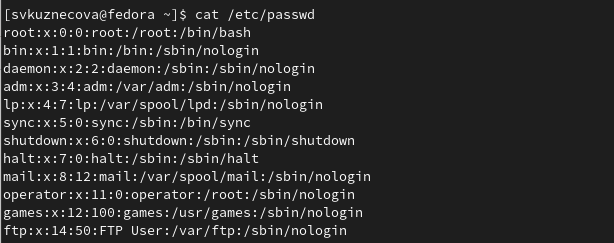{#fig:010 width=70%}

Копируем файл ~/feathers в файл ~/file.old.

{#fig:011 width=70%}

Переместим файл ~/file.old в каталог ~/play.

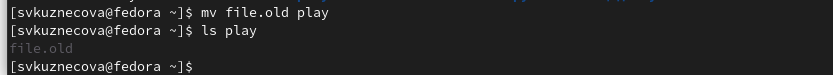{#fig:012 width=70%}

Копируем каталог ~/play в каталог ~/fun.

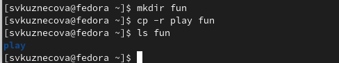{#fig:013 width=70%}

Переместим каталог fun и назовём его games.

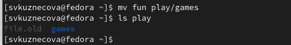{#fig:014 width=70%}

Лишим владельца файла ~/feathers права на чтение, попробуем просмотреть его и скопировать. В результате без прав на чтение владелец файла не сможет просмотреть и скопировать этот файл.

{#fig:015.1 width=70%}

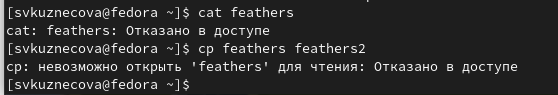{#fig:015.2 width=70%}

Лишаем владельца каталога ~/play права на выполнение и попробуем перейти в него. Без прав на выполнение владнлец не сможет перейти в каталог.Далее восстановим владельцу права на выполнение. 

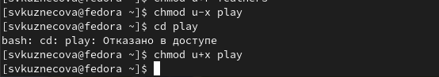{#fig:016 width=70%}

Используя команду man просмотрим описание команд mount, fsck, mkfs, kill.

Команда mount используется для просмотра используемых в операциооной системе файловых систем.

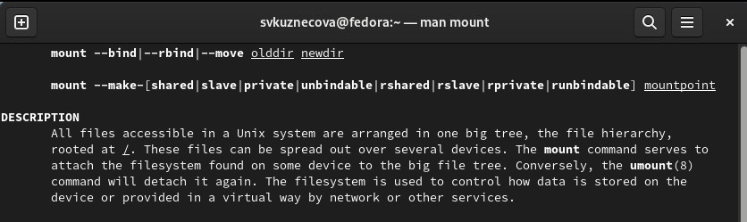{#fig:017 width=70%}

Команда fsck нужна для проверки и восстановления файловой системы.

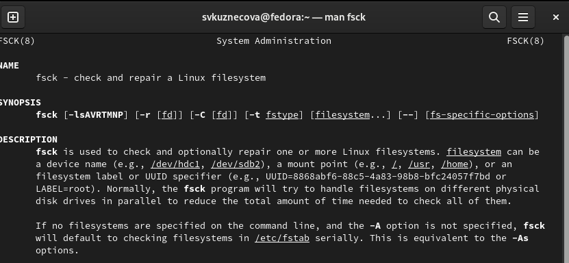{#fig:018 width=70%}

Команда mkfs используется для создания файловой системы Linux на устройстве, обычно в разделе диска.

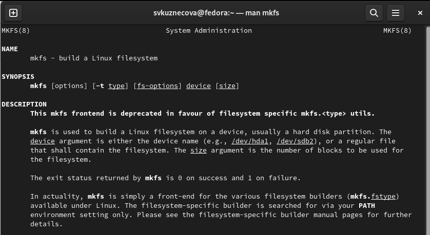{#fig:019 width=70%}

Команда kill отправляет сигнал процессу, указанному с помощью каждого из операндов идентификатора процесса.

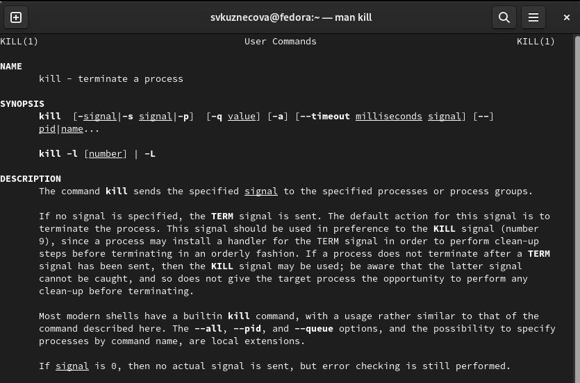{#fig:020 width=70%}

# Выводы
 
В ходе выполнения лабораторной работы мы ознакомились с файловой системой Linux, её структурой, именами и содержанием каталогов. Приобрели практические навыки по применению команд для работы с файлами и каталогами, по управлению процессами (и работами), по проверке использования диска и обслуживанию файловой системы.

# Контрольные вопрос
1.Дайте характеристику каждой файловой системе, существующей на жёстком диске
компьютера, на котором вы выполняли лабораторную работу.

Ext2, Ext3, Ext4 или Extended Filesystem - это стандартная файловая система
для Linux. Она была разработана еще для Minix. Она самая стабильная из всех
существующих, кодовая база изменяется очень редко и эта файловая система содер-
жит больше всего функций. Версия ext2 была разработана уже именно для Linux и
получила много улучшений. В 2001 году вышла ext3, которая добавила еще больше
стабильности благодаря использованию журналирования. В 2006 была выпущена
версия ext4, которая используется во всех дистрибутивах Linux до сегодняшнего
дня. В ней было внесено много улучшений, в том числе увеличен максимальный
размер раздела до одного экзабайта.
JFS или Journaled File System была разработана в IBM для AIX UNIX и использо-
валась в качестве альтернативы для файловых систем ext. Сейчас она используется
там, где необходима высокая стабильность и минимальное потребление ресурсов.
При разработке файловой системы ставилась цель создать максимально эффектив-
ную файловую систему для многопроцессорных компьютеров. Также как и ext, это
журналируемая файловая система, но в журнале хранятся только метаданные, что
может привести к использованию старых версий файлов после сбоев.
ReiserFS - была разработана намного позже, в качестве альтернативы ext3 с улуч-
шенной производительностью и расширенными возможностями. Она была разрабо-
тана под руководством Ганса Райзера и поддерживает только Linux. Из особенностей
можно отметить динамический размер блока, что позволяет упаковывать несколько небольших файлов в один блок, что предотвращает фрагментацию и улучшает
работу с небольшими файлами. Еще одно преимущество - в возможности изменять
размеры разделов на лету. Но минус в некоторой нестабильности и риске потери
данных при отключении энергии. Раньше ReiserFS применялась по умолчанию в
SUSE Linux, но сейчас разработчики перешли на Btrfs.
XFS - это высокопроизводительная файловая система, разработанная в Silicon
Graphics для собственной операционной системы еще в 2001 году. Она изначально
была рассчитана на файлы большого размера, и поддерживала диски до 2 Терабайт.
Из преимуществ файловой системы можно отметить высокую скорость работы с
большими файлами, отложенное выделение места, увеличение разделов на лету и
незначительный размер служебной информации.
XFS - журналируемая файловая система, однако в отличие от ext, в журнал
записываются только изменения метаданных. Она используется по умолчанию в
дистрибутивах на основе Red Hat. Из недостатков - это невозможность уменьшения
размера, сложность восстановления данных и риск потери файлов при записи, если
будет неожиданное отключение питания, поскольку большинство данных находится
в памяти.
Btrfs или B-Tree File System - это совершенно новая файловая система, которая
сосредоточена на отказоустойчивости, легкости администрирования и восстановле-
ния данных. Файловая система объединяет в себе очень много новых интересных
возможностей, таких как размещение на нескольких разделах, поддержка подто-
мов, изменение размера не лету, создание мгновенных снимков, а также высокая
производительность. Но многими пользователями файловая система Btrfs счита-
ется нестабильной. Тем не менее, она уже используется как файловая система по
умолчанию в OpenSUSE и SUSE Linux.

2.Приведите общую структуру файловой системы и дайте характеристику каждой ди-
ректории первого уровня этой структуры.

root каталог. Содержит в себе всю иерархию системы;                                                                                         /bin — здесь находятся двоичные исполняемые файлы. Основные общие команды,
хранящиеся отдельно от других программ в системе (прим.: pwd, ls, cat, ps);
/boot — тут расположены файлы, используемые для загрузки системы (образ
initrd, ядро vmlinuz);
/dev — в данной директории располагаются файлы устройств (драйверов). С
помощью этих файлов можно взаимодействовать с устройствами. К примеру, если
это жесткий диск, можно подключить его к файловой системе. В файл принтера же
можно написать напрямую и отправить задание на печать;
/etc — в этой директории находятся файлы конфигураций программ. Эти файлы
позволяют настраивать системы, сервисы, скрипты системных демонов;
/home — каталог, аналогичный каталогу Users в Windows. Содержит домашние
каталоги учетных записей пользователей (кроме root). При создании нового поль-
зователя здесь создается одноименный каталог с аналогичным именем и хранит
личные файлы этого пользователя;
/lib — содержит системные библиотеки, с которыми работают программы и модули
ядра;
/lost+found — содержит файлы, восстановленные после сбоя работы системы.
Система проведет проверку после сбоя и найденные файлы можно будет посмотреть
в данном каталоге;
/media — точка монтирования внешних носителей. Например, когда вы вставляете
диск в дисковод, он будет автоматически смонтирован в директорию /media/cdrom;
/mnt — точка временного монтирования. Файловые системы подключаемых
устройств обычно монтируются в этот каталог для временного использования;
/opt — тут расположены дополнительные (необязательные) приложения. Такие
программы обычно не подчиняются принятой иерархии и хранят свои файлы в
одном подкаталоге (бинарные, библиотеки, конфигурации);
/proc — содержит файлы, хранящие информацию о запущенных процессах и о
состоянии ядра ОС;
/root — директория, которая содержит файлы и личные настройки суперпользователя;
/run — содержит файлы состояния приложений. Например, PID-файлы или UNIX-
сокеты;
/sbin — аналогично /bin содержит бинарные файлы. Утилиты нужны для на-
стройки и администрирования системы суперпользователем;
/srv — содержит файлы сервисов, предоставляемых сервером (прим. FTP или
Apache HTTP);
/sys — содержит данные непосредственно о системе. Тут можно узнать информа-
цию о ядре, драйверах и устройствах;
/tmp — содержит временные файлы. Данные файлы доступны всем пользователям
на чтение и запись. Стоит отметить, что данный каталог очищается при перезагрузке;
/usr — содержит пользовательские приложения и утилиты второго уровня, исполь-
зуемые пользователями, а не системой. Содержимое доступно только для чтения
(кроме root). Каталог имеет вторичную иерархию и похож на корневой;
/var — содержит переменные файлы. Имеет подкаталоги, отвечающие за отдельные
переменные. Например, логи будут храниться в /var/log, кэш в /var/cache, очереди
заданий в /var/spool/ и так далее.

3.Какая операция должна быть выполнена, чтобы содержимое некоторой файловой
системы было доступно операционной системе?
 
Монтирование тома

4.Назовите основные причины нарушения целостности файловой системы. Как устра-
нить повреждения файловой системы?

Отсутствие синхронизации между образом файловой системы в памяти и ее
данными на диске в случае аварийного останова может привести к появлению
следующих ошибок:
• Один блок адресуется несколькими mode (принадлежит нескольким файлам).                                     • Блок помечен как свободный, но в то же время занят (на него ссылается
onode).
• Блок помечен как занятый, но в то же время свободен (ни один inode на него
не ссылается).
• Неправильное число ссылок в inode (недостаток или избыток ссылающихся
записей в каталогах).
• Несовпадение между размером файла и суммарным размером адресуемых
inode блоков.
• Недопустимые адресуемые блоки (например, расположенные за пределами
файловой системы).
• “Потерянные” файлы (правильные inode, на которые не ссылаются записи
каталогов).
• Недопустимые или неразмещенные номера inode в записях каталогов.

5.Как создаётся файловая система?

mkfs - позволяет создать файловую систему Linux.

6.Дайте характеристику командам для просмотра текстовых файлов.

Cat - выводит содержимое файла на стандартное устройство вывода.

7.Приведите основные возможности команды cp в Linux.

Cp – копирует или перемещает директорию, файлы.

8.Приведите основные возможности команды mv в Linux.

Mv - переименовать или переместить файл или директорию.

9.Что такое права доступа? Как они могут быть изменены?

Права доступа к файлу или каталогу можно изменить, воспользовавшись командой
chmod. Сделать это может владелец файла (или каталога) или пользователь с
правами администратора.

