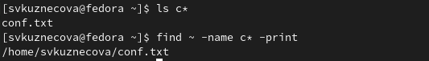

---
## Front matter
lang: ru-RU
title: Лабораторная работа №6.
subtitle: Поиск файлов. Перенаправление ввода-вывода. Просмотр запущенных процессов.
author:
  - Кузнецова С. В.
institute:
  - Российский университет дружбы народов, Москва, Россия
date: 12 марта 2023

## i18n babel
babel-lang: russian
babel-otherlangs: english

## Formatting pdf
toc: false
toc-title: Содержание
slide_level: 2
aspectratio: 169
section-titles: true
theme: metropolis
header-includes:
 - \metroset{progressbar=frametitle,sectionpage=progressbar,numbering=fraction}
 - '\makeatletter'
 - '\beamer@ignorenonframefalse'
 - '\makeatother'
---

# Информация

## Докладчик

:::::::::::::: {.columns align=center}
::: {.column width="70%"}

  * Кузнецова София Вадимовна
  * Студенческий билет - 1132227132
  * НПИбд-02-22
  * Российский университет дружбы народов

:::
::: {.column width="30%"}

:::
::::::::::::::

## Цели и задачи

Ознакомление с инструментами поиска файлов и фильтрации текстовых данных.
Приобретение практических навыков: по управлению процессами (и заданиями), по
проверке использования диска и обслуживанию файловых систем.

# Выполнение лабораторной работы

## Каталог /etc

Записываем в файл file.txt названия файлов, содержащихся в каталоге /etc. Дописываем в этот же файл названия файлов, содержащихся в нашем домашнем каталоге.

{#fig:002 width=70%}

## Расширение .conf

Выводим имена всех файлов из file.txt, имеющих расширение .conf, после чего записываем их в новый текстовой файл conf.txt.

{#fig:003.1 width=70%}

{#fig:003.2 width=70%}

## Файлы начинающиеся с с

Определяем, какие файлы в нашем домашнем каталоге имеют имена, начинавшиеся с символа c? Предлгаем несколько вариантов, как это сделать.

{#fig:004 width=70%}

## Файлы начинающиеся с h

Выводим на экран (по странично) имена файлов из каталога /etc, начинающиеся с символа h.

{#fig:005 width=70%}

## Файл logfile

Запускаем в фоновом режиме процесс, который будет записывать в файл ~/logfile файлы, имена которых начинаются с log.

{#fig:006 width=70%}

## Удаление logfile

Удаляем файл ~/logfile.

{#fig:007 width=70%}

## Редактор gedit

Запускаем из консоли в фоновом режиме редактор gedit.

{#fig:008 width=70%}

## Команда ps

Определяем идентификатор процесса gedit, используя команду ps, конвейер и фильтр grep. Определяем, как ещё можно определить идентификатор процесса.

{#fig:009 width=70%}

## Команда kill

Прочтём справку (man) команды kill, после чего используем её для завершения процесса gedit.

{#fig:010.1 width=70%}

{#fig:010.2 width=70%}

## Команды df и du

Выполняем команды df и du, предварительно получив более подробную информацию об этих командах, с помощью команды man.

{#fig:011.1 width=70%}

{#fig:011.2 width=70%}

## Команда find

Воспользовавшись справкой команды find, выводим имена всех директорий, имеющихся в нашем домашнем каталог.

{#fig:012 width=70%}

## Вывод

Ознакомилась с инструментами поиска файлов и фильтрации текстовых данных.
Приобрела практических навыков: по управлению процессами (и заданиями), по
проверке использования диска и обслуживанию файловых систем.

