---
## Front matter
lang: ru-RU
title: Лабораторная работа №7
subtitle: Командная оболочка Midnight Commander
author:
  - Кузнецова С. В.
institute:
  - Российский университет дружбы народов, Москва, Россия
date: 13 марта 2023

## i18n babel
babel-lang: russian
babel-otherlangs: english

## Formatting pdf
toc: false
toc-title: Содержание
slide_level: 2
aspectratio: 169
section-titles: true
theme: metropolis
header-includes:
 - \metroset{progressbar=frametitle,sectionpage=progressbar,numbering=fraction}
 - '\makeatletter'
 - '\beamer@ignorenonframefalse'
 - '\makeatother'
---

# Информация

## Докладчик

:::::::::::::: {.columns align=center}
::: {.column width="70%"}

  * Кузнецова София Вадимовна
  * Студенческий билет - 1132227132
  * НПИбд-02-22
  * Российский университет дружбы народов
  
:::
::: {.column width="30%"}

:::
::::::::::::::

## Цели и задачи

Освоение основных возможностей командной оболочки Midnight Commander. Приобретение навыков практической работы по просмотру каталогов и файлов; манипуляций с ними.

## Выполнение лабораторной работы 

## Команда man mc

Изучаем информацию о mc, вызвав в командной строке man mc.

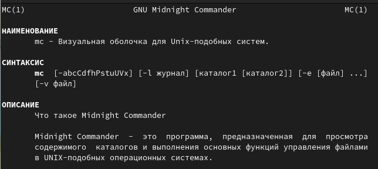{#fig:001.2 width=70%}

## Команда mc

Запускаем из командной строки mc, изучаем его структуру и меню.

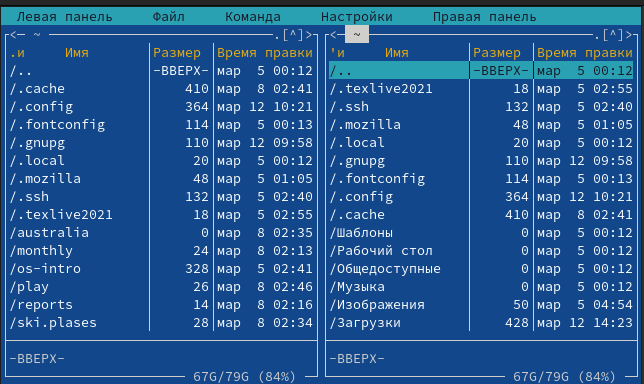{#fig:002.2 width=50%}

## Команды левой панели 

Выполняем основные команды меню левой панели. Оцениваем степень подробности вывода информации о файлах.

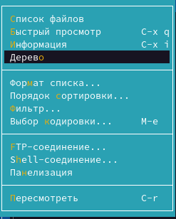{#fig:004.1 width=30%}

## Текстовый файл

Просматриваем содержимое текстового файла.

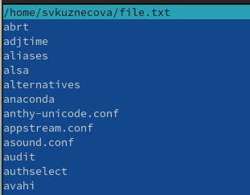{#fig:005.1 width=50%}

## Редактирование текстового файла

Редактируем содержимое текстового файла (без сохранения результатов редактирования).

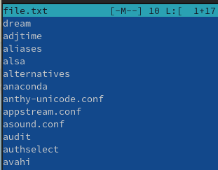{#fig:005.2 width=50%}

## Создание нового каталога

Создаём каталога.

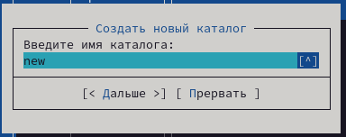{#fig:005.3 width=70%}

## Копирование файла

Копируем файлы в созданный каталог.

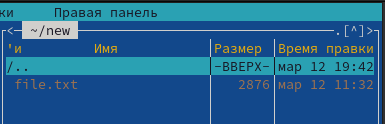{#fig:005.4 width=70%}

## Расширение срр

Ищем в файловой системе файлы с заданными условиями .cpp, содержащие строку main.

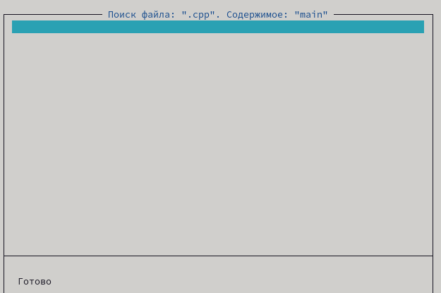{#fig:006.1.2 width=50%}

## Домашний каталог

Переходим в домашний каталог.

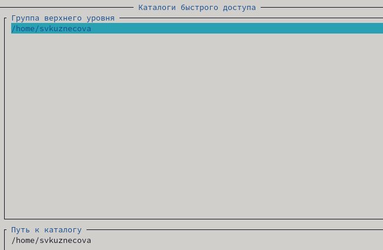{#fig:006.3 width=50%}

## Файл меню и файл расширений

Анализируем файл меню и файл расширений.

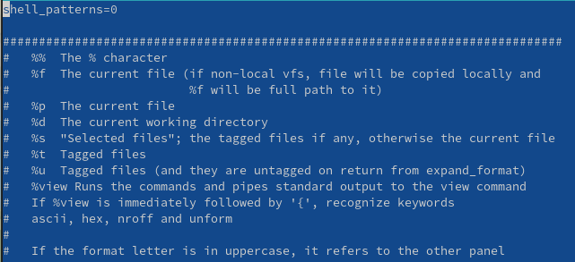{#fig:006.4.1 width=30%}

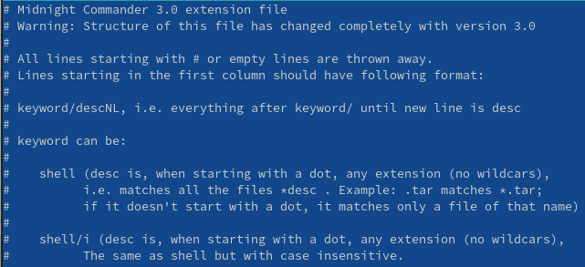{#fig:006.4.2 width=30%}

## Подменю настройки

Вызываем подменю Настройки. Осваиваем операции, определяющие структуру экрана mc (Full screen, Double Width, Show Hidden Files и т.д.)

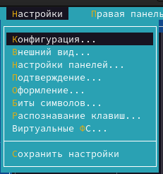{#fig:007 width=30%}

## Текстовый файл text.txt

Создаём текстовый файл text.txt.

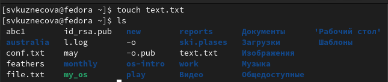{#fig:008 width=70%}

## Открытие файла с помощью mc  редактора

Открываем этот файл с помощью встроенного в mc редактора.

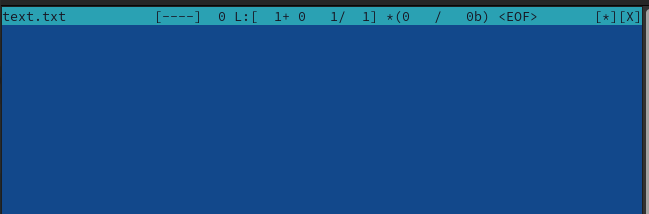{#fig:009.2 width=70%}

## Фрагмент текста

Вставляем в открытый файл небольшой фрагмент текста, скопированный из Интернета.

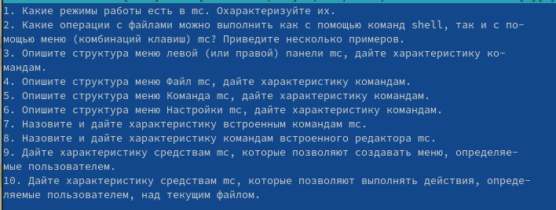{#fig:010 width=70%}

## Манипуляция с текстом, используя горячие клавиши

Проделаем с текстом следующие манипуляции. Для начала удалим строку текста с помощью "Ctrl-y". Выделим фрагмент текста "F3" и скопируем его на новую строку "F5". Снова выделим любой фрагмент и переместим его "F6". Сохраним файл и сразу же отменим последнее действие "Ctrl-u". Перемещаться по файлу можно с помощью "F7". В конце сохраним и закроем файл.

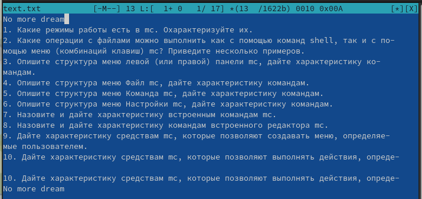{#fig:011 width=70%}

## Подсветка синтаксиса

Используем меню редактора, включаем подсветку синтаксиса, если она не включена, или выключите, если она включена.

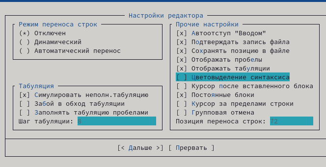{#fig:012 width=70%}

## Вывод

Освоила основные возможности командной оболочки Midnight Commander. Приобрела навыки практической работы по просмотру каталогов и файлов; манипуляций с ними.

