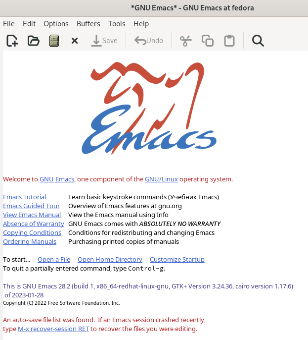
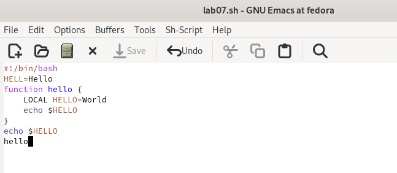
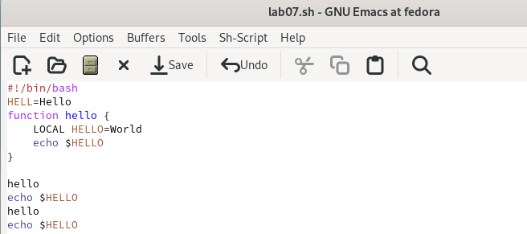
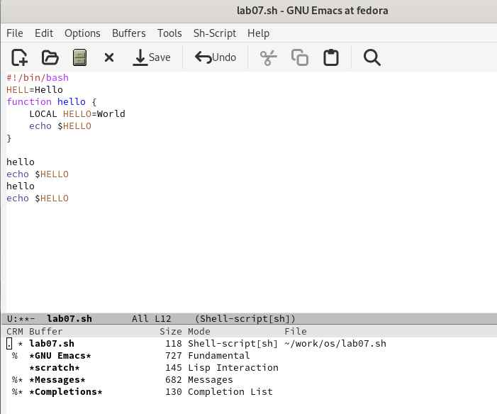
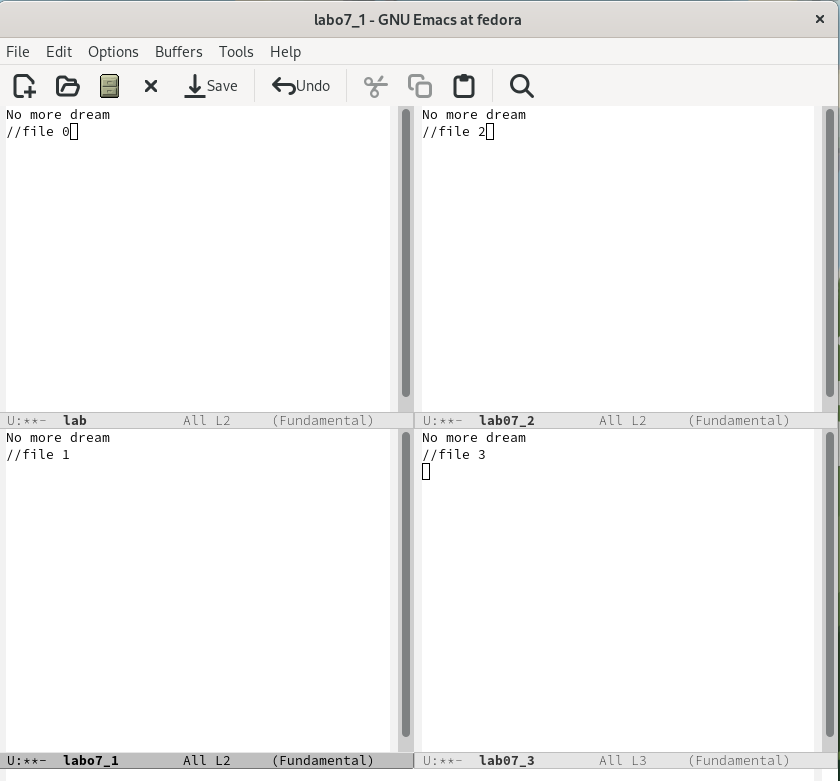
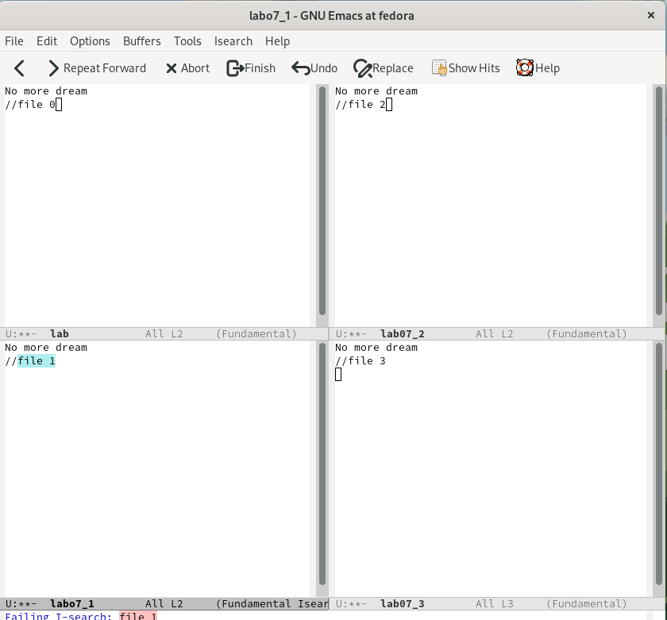
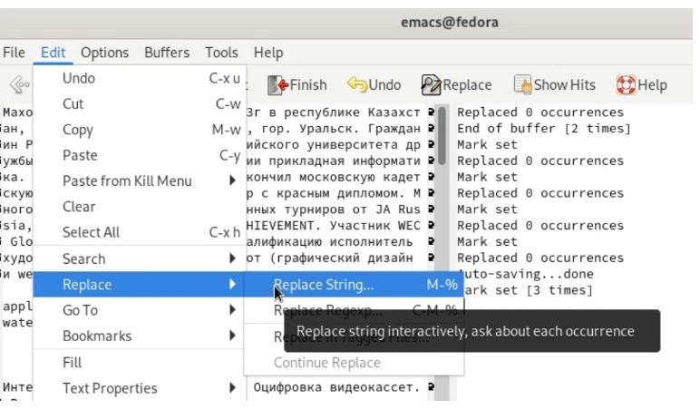
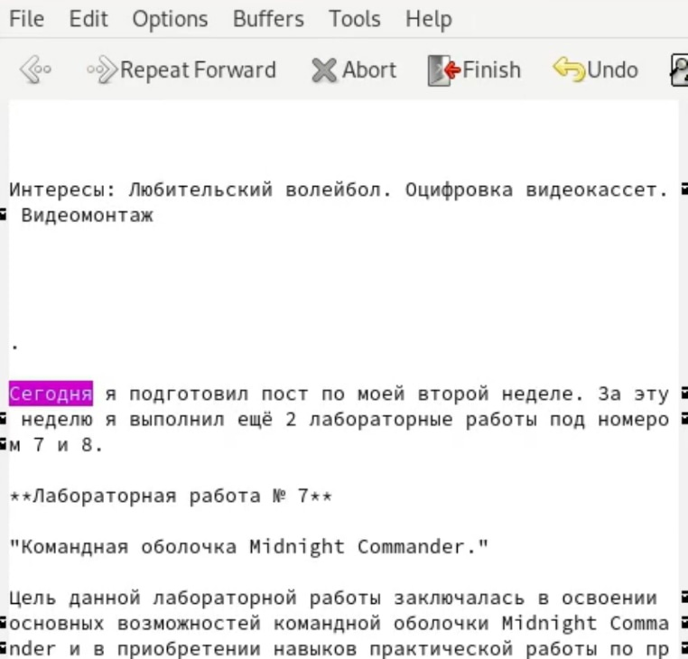
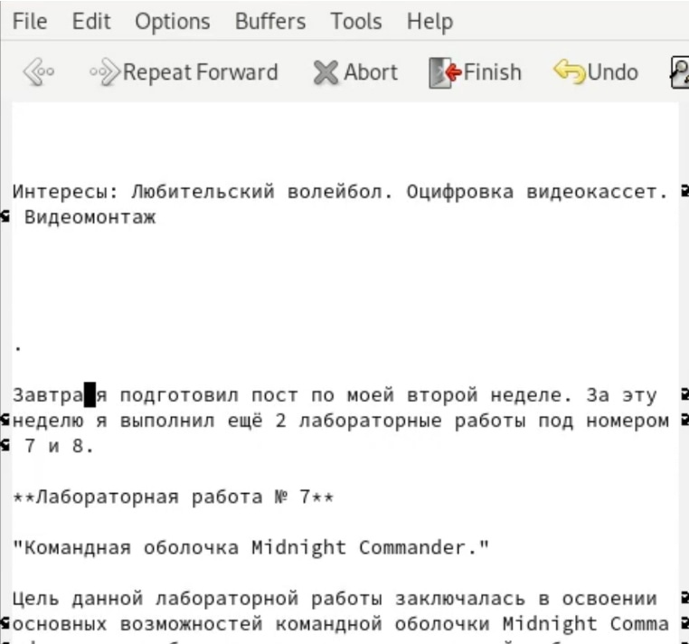
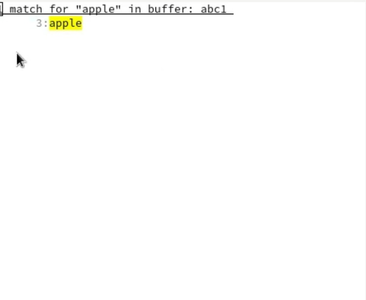

---
## Front matter
title: "Лабораторная работа №9"
subtitle: "Текстовый редактор emacs"
author: "Кузнецова София Вадимовна"

## Generic otions
lang: ru-RU
toc-title: "Содержание"

## Bibliography
bibliography: bib/cite.bib
csl: pandoc/csl/gost-r-7-0-5-2008-numeric.csl

## Pdf output format
toc: true # Table of contents
toc-depth: 2
lof: true # List of figures
lot: true # List of tables
fontsize: 12pt
linestretch: 1.5
papersize: a4
documentclass: scrreprt
## I18n polyglossia
polyglossia-lang:
  name: russian
  options:
	- spelling=modern
	- babelshorthands=true
polyglossia-otherlangs:
  name: english
## I18n babel
babel-lang: russian
babel-otherlangs: english
## Fonts
mainfont: PT Serif
romanfont: PT Serif
sansfont: PT Sans
monofont: PT Mono
mainfontoptions: Ligatures=TeX
romanfontoptions: Ligatures=TeX
sansfontoptions: Ligatures=TeX,Scale=MatchLowercase
monofontoptions: Scale=MatchLowercase,Scale=0.9
## Biblatex
biblatex: true
biblio-style: "gost-numeric"
biblatexoptions:
  - parentracker=true
  - backend=biber
  - hyperref=auto
  - language=auto
  - autolang=other*
  - citestyle=gost-numeric
## Pandoc-crossref LaTeX customization
figureTitle: "Рис."
tableTitle: "Таблица"
listingTitle: "Листинг"
lofTitle: "Список иллюстраций"
lotTitle: "Список таблиц"
lolTitle: "Листинги"
## Misc options
indent: true
header-includes:
  - \usepackage{indentfirst}
  - \usepackage{float} # keep figures where there are in the text
  - \floatplacement{figure}{H} # keep figures where there are in the text
---

# Цель работы

Познакомиться с операционной системой Linux. Получить практические навыки работы с редактором Emacs.

# Задание

1. Открыть emacs.
2. Создать файл lab07.sh с помощью комбинации Ctrl-x Ctrl-f (C-x C-f).
3. Наберите текст:

!/bin/bash

HELL=Hello

function hello {

LOCAL HELLO=World

echo $HELLO

}

echo $HELLO

hello

4. Сохранить файл с помощью комбинации Ctrl-x Ctrl-s (C-x C-s).
5. Проделать с текстом стандартные процедуры редактирования, каждое действие должно осуществляться комбинацией клавиш.
- Вырезать одной командой целую строку (С-k).
- Вставить эту строку в конец файла (C-y).
- Выделить область текста (C-space).
- Скопировать область в буфер обмена (M-w).
- Вставить область в конец файла.
- Вновь выделить эту область и на этот раз вырезать её (C-w).
- Отмените последнее действие (C-/).
6. Научитесь использовать команды по перемещению курсора.
- Переместите курсор в начало строки (C-a).
- Переместите курсор в конец строки (C-e).
- Переместите курсор в начало буфера (M-<).
- Переместите курсор в конец буфера (M->).
7. Управление буферами.
- Вывести список активных буферов на экран (C-x C-b).
- Переместитесь во вновь открытое окно (C-x) o со списком открытых буферов и переключитесь на другой буфер.
- Закройте это окно (C-x 0).
- Теперь вновь переключайтесь между буферами, но уже без вывода их списка на экран (C-x b).
8. Управление окнами.
- Поделите фрейм на 4 части: разделите фрейм на два окна по вертикали (C-x 3), а затем каждое из этих окон на две части по горизонтали (C-x 2).
- В каждом из четырёх созданных окон откройте новый буфер (файл) и введите несколько строк текста.
9. Режим поиска
- Переключитесь в режим поиска (C-s) и найдите несколько слов, присутствующих в тексте.
- Переключайтесь между результатами поиска, нажимая C-s.
- Выйдите из режима поиска, нажав C-g.
- Перейдите в режим поиска и замены (M-%), введите текст, который следует найти и заменить, нажмите Enter , затем введите текст для замены. После того как будут подсвечены результаты поиска, нажмите ! для подтверждения замены.
- Испробуйте другой режим поиска, нажав M-s o. Объясните, чем он отличается от обычного режима?

# Теоретическое введение 

  Определение 1. Буфер — объект, представляющий какой-либо текст.
Буфер может содержать что угодно, например, результаты компиляции программы или встроенные подсказки. Практически всё взаимодействие с пользователем, в том числе интерактивное, происходит посредством буферов.
  Определение 2. Фрейм соответствует окну в обычном понимании этого слова. Каждый фрейм содержит область вывода и одно или несколько окон Emacs.
  Определение 3. Окно — прямоугольная область фрейма, отображающая один из буферов.
Каждое окно имеет свою строку состояния, в которой выводится следующая информация: название буфера, его основной режим, изменялся ли текст буфера и как далеко вниз по буферу расположен курсор. Каждый буфер находится только в одном из возможных основных режимов. Существующие основные режимы включают режим Fundamental (наименее специализированный), режим Text, режим Lisp, режим С, режим Texinfo и другие. Под второстепенными режимами понимается список режимов, которые включены в данный момент в буфере выбранного окна.
  Определение 4. Область вывода — одна или несколько строк внизу фрейма, в которой Emacs выводит различные сообщения, а также запрашивает подтверждения и дополнительную информацию от пользователя.
  Определение 5. Минибуфер используется для ввода дополнительной информации и всегда отображается в области вывода.
  Определение 6. Точка вставки — место вставки (удаления) данных в буфере.
Для запуска Emacs необходимо в командной строке набрать emacs (или emacs & для работы в фоновом режиме относительно консоли). Для работы с Emacs можно использовать как элементы меню, так и различные сочетания клавиш. Например, для выхода из Emacs можно воспользоваться меню File и выбрать пункт Quit , а можно нажать последовательно Ctrl-x Ctrl-c (в обозначениях Emacs: C-x C-c).
  Определение 7. Режим — пакет расширений, изменяющий поведение буфера Emacs при редактировании и просмотре текста (например, для редактирования исходного текста программ на языках С или Perl).

# Выполнение лабораторной работы

Откроем терминал и пропишем в нём команду emacs. После чего с помощью комбинации Ctrl-x Ctrl-f создадим файл lab07.sh.

{#fig:001 width=70%}

В открывшемся файле набираем текст и сохраняем этот файл с помощью комбинации Ctrl-x Ctrl-s. 

{#fig:002 width=70%}

Теперь нам нужно проделать с текстом стандартные процедуры редактирования.
Для начала вырежем  одной командой целую строку (С-k), после чего вставим эту строку в конец файла (C-y). Выделяем область текста (C-space) и копируем область в буфер обмена (M-w), вставляем область в конец файла(С-y).Теперь вновь выделяем эту область и на этот раз вырезаем её (C-w). Отменяем последнее действие (C-/).

{#fig:003 width=70%}

Научимся использовать команды по перемещению курсора. Для перемещения курсора в начало строки (C-a), в конец строки (C-e). Чтобы переместить курсор в начало буфера (Alt-<), в конец буфера (Alt->).

{#fig:004 width=70%}

Выведем список активных буферов на экран (C-x C-b) и переместим во вновь открытое окно (C-x) со списком открытых буферов и переключимся на другой буфер. Закроем это окно (C-x 0).

{#fig:005 width=70%}

Поделим фрейм на 4 части: разделим фрейм на два окна по вертикали (C-x 3),а затем каждое из этих окон на две части по горизонтали (C-x 2). В каждом из четырёх созданных окон откроем новый буфер (файл) и введем несколько строк текста.

{#fig:006 width=70%}

Переключимся в режим поиска (C-s) и найдём несколько слов, присутствующих в тексте. Теперь будем переключаться между результатами поиска, нажимая C-s. Выйдем из режима поиска, нажав C-g.

{#fig:007 width=70%}

Перейдём в режим поиска и замены. Для этого в подменю "Edit" выберем "Replace" и в подменю "Replase", "Replase string".

{#fig:008 width=70%}

Введём текст, который следует найти и заменить, нажмём Enter. Затем введём текст для замены. После того как будут подсвечены результаты поиска, нажмите ! для подтверждения замены.

{#fig:009 width=70%}

{#fig:010 width=70%}

Испробуем другой режим поиска, нажав Alt-s o. Этот режим поиска отличается воыводом более подробной информации, а именно выводом имени файла, в котором находится это слово и указание строки. 

{#fig:011 width=70%}

# Контрольные вопросы

1. Кратко охарактеризуйте редактор emacs.

Emacs это один из наиболее мощных и широко распространённых редакторов, используемых в мире Unix. По популярности он соперничает с редактором vi и его клонами. В зависимости от ситуации, Emacs может быть текстовым редактором; программой для чтения почты и новостей Usenet; интегрированной средой разработки (IDE); операционной системой и т.д. Всё это разнообразие достигается благодаря архитектуре Emacs, которая позволяет расширять возможности редактора при помощи языка Emacs Lisp. На языке C написаны лишь самые базовые и низкоуровневые части Emacs, включая полнофункциональный. интерпретатор языка Lisp. Таким образом, Emacs имеет встроенный язык программирования, который может использоваться для настройки, расширения и изменения поведения редактора. В действительности, большая часть того редактора, с которым пользователи Emacs работают в наши дни,написана на языке Lisp. 

2. Какие особенности данного редактора могут сделать его сложным для освоения новичком?

Основную трудность для новичков при освоении данного редактора могут составлять большое количество команд, комбинаций клавиш, которые не получится все запомнить с первого раза и поэтоупридется часто обращаться к справочным материалам. 

3. Своими словами опишите, что такое буфер и окно в терминологии emacs’а.

Буфер–это объект, представляющий собой текст. Если имеется несколько буферов, то редактировать можно только один. Обычно буфер считывает данные из файла или записывает в файл данные из буфера. Окно–это область экрана, отображающая буфер. При запуске редактора отображается одно окно, но при обращении к некоторым функциям могут открыться дополнительные окна. Окна Emacsи окна графической среды XWindow–разные вещи. Одно окно XWindowможет быть разбито на несколько окон в смысле Emacs, в каждом из которых отображается отдельный буфер. 

4. Можно ли открыть больше 10 буферов в одном окне?

Да, можно. 

5. Какие буферы создаются по умолчанию при запуске emacs?

При запуске Emacsпо умолчанию создаются следующие буферы: «scratch»(буфер для несохраненного текста) «Messages»(журнал ошибок, включающий такжеинформацию, которая появляется в области EchoArea) «GNUEmacs»(справочный буфер о редакторе). 

6. Какие клавиши вы нажмёте, чтобы ввести следующую комбинацию C-c | и C-c C-|?

C-c |сначала, удерживая «ctrl»,нажимаю «c»,после –отпускаюобе клавишии нажимаю «|» C-cC-|сначала, удерживая «ctrl»,нажимаю «с», после –отпускаю обе клавиши и, удерживая «ctrl», нажимаю «|». 

7. Как поделить текущее окно на две части?

Чтобы поделить окно на две части необходимо воспользоваться комбинацией «Ctrl-x 3»(по вертикали) или «Ctrl-x 2» (по горизонтали). 

8. В каком файле хранятся настройки редактора emacs?

Настройки Emacsхранятся в файле .emacs. 

9. Какую функцию выполняет клавиша и можно ли её переназначить?

По умолчанию клавиша «←» удаляет символперед курсором, нов редакторе её можно переназначить. Для этого необхдимоизменить конфигурацию файла .emacs. 

10. Какой редактор вам показался удобнее в работе vi или emacs? Поясните почему.

Более удобным я считаю редактор emacs, потому чтов нем проще открывать другие файлы, можно использовать сразу несколько окон, нет «Командногорежима», «Режима ввода», «Режима командной строки», которые являются немного непривычными и в какой-то степени неудобным.

# Выводы

Познакомилась с операционной системой Linux. Получила практические навыки работы с редактором Emacs.

