---
## Front matter
lang: ru-RU
title: Лабораторная работа №10
subtitle: программирование в командном процессоре ОС UNIX. Командные файлы
author:
  - Кузнецова С. В.
institute:
  - Российский университет дружбы народов, Москва, Россия
date: 06 апреля 2023

## i18n babel
babel-lang: russian
babel-otherlangs: english

## Formatting pdf
toc: false
toc-title: Содержание
slide_level: 2
aspectratio: 169
section-titles: true
theme: metropolis
header-includes:
 - \metroset{progressbar=frametitle,sectionpage=progressbar,numbering=fraction}
 - '\makeatletter'
 - '\beamer@ignorenonframefalse'
 - '\makeatother'
---

# Информация

## Докладчик

  * Кузнецова София Вадимовна
  * студент прикладной информатики
  * Российский университет дружбы народов

# Цель

Изучить основы программирования в оболочке ОС UNIX/Linux. Научиться писать небольшие командные файлы

# Выполнение лабораторной работы

## Создание нового каталога и файла для скрипта

Откроем терминал и создадим в домашнем каталоге папку backup. После чего создадим файл lab10_1.sh для написания скрипта. Откроем emacs.

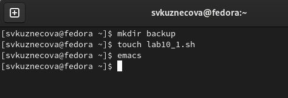{ #fig:001 width=70% }

## Первый скрипт

В emacs  откроем созданный файл lab10_1.sh и приступим к написанию скрипта, который при запуске будет делать резервную копию самого себя (то есть файла, в котором содержится его исходный код) в другую директорию backup в нашем домашнем каталоге. При этом файл должен архивироваться одним из архиваторов на выбор zip, bzip2 или tar. 

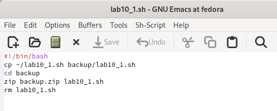{#fig:002 width=70%}

## Право на выполнение, запуск файла и проверка

После того как скрипт написан мы сохраняем файл и закрываем emacs. В терминале мы даём этому файлу право на выполнение. Теперь запустим этот файл и перейдём в каталог backup для проверки командой ls.

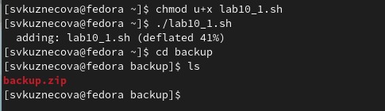{#fig:003 width=70%}

## Создание второго файла и открытие emacs

Возвращаемся в домашний каталог и создаём второй файл для скрипта lab10_2.sh.

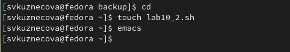{#fig:004 width=70%}

## Второй скрипт

Открываем файл lab10_2.sh и начинаем писать пример командного файла, обрабатывающего любое произвольное число аргументов командной строки, в том числе превышающее десять. Скрипт может последовательно распечатывать значения всех переданных аргументов.

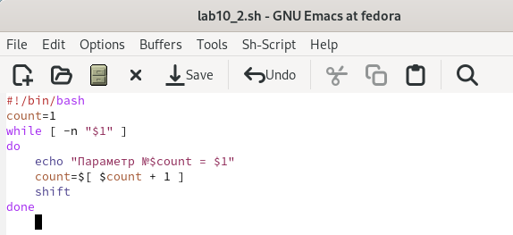{#fig:005 width=70%}

## Право на выполнение, запуск файла

Сохраняем файл и также даём в терминале право на выполнение. Запускаем файл lab10_2.sh.

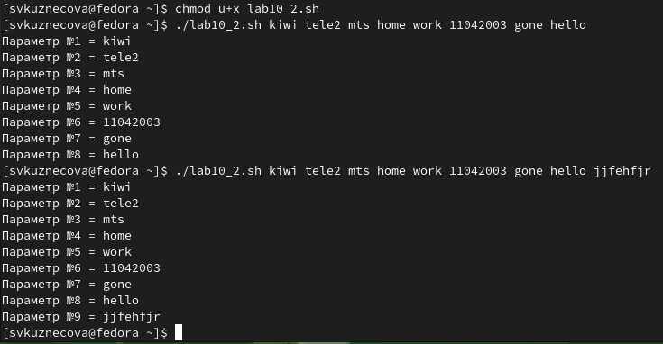{#fig:006 width=60%}

## Создание третьего файла

Снова переходим в домашний каталог и создаём третий файл. Запускаем emacs.

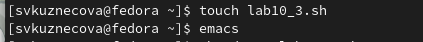{#fig:007 width=70%}

## Третий скрипт

После открытия файла lab10_3.sh напишем командный файл — аналог команды ls (без использования самой этой команды и команды dir). В котором требуется, чтобы он выдавал информацию о нужном каталоге и выводил информацию о возможностях доступа к файлам этого каталога.

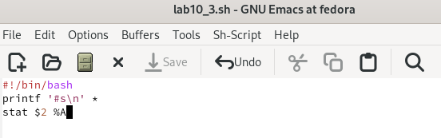{#fig:008 width=70%}

## Право на выполнение, запуск файла для каталога backup

Сохраняем наш скрипт и даём право на выполнение. Запускаем файл для каталога backup.

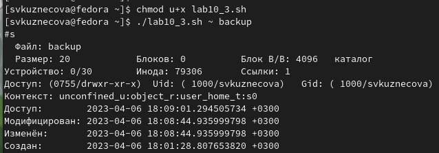{#fig:009 width=60%}

## Создание четвёртого файла

Переходим в домашний каталог и создаём четвёртый файл. Запускаем emacs.

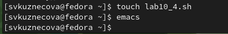{#fig:0010 width=70%}

## Четвёртый скрипт

В четвёртом файле напишем командный файл, который получает в качестве аргумента командной строки формат файла (.txt, .doc, .jpg, .pdf и т.д.) и вычисляет количество таких файлов в указанной директории. Путь к директории также передаётся в виде аргумента командной строки.

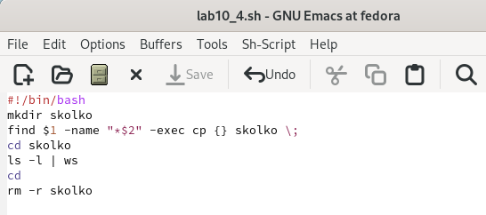{#fig:0011 width=70%}

## Право на выполнение, запуск файла для формата .txt

Сохраним файл и выйдем из emacs. Как делали ранее, дадим файлу право на выполнение и запустим его для двух форматов: .txt и .pdf.

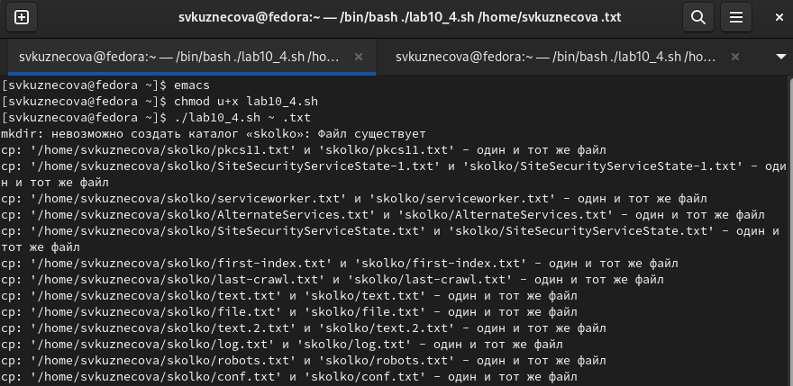{#fig:0012 width=60%}

## Право на выполнение, запуск файла для формата .pdf

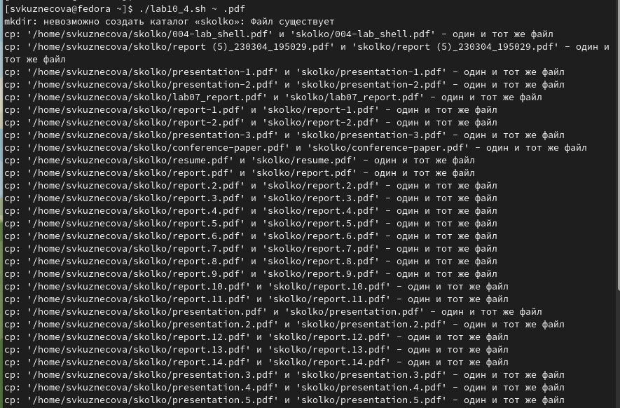{#fig:0013 width=60%}

# Вывод 

Изучила основы программирования в оболочке ОС UNIX/Linux. Научилась писать небольшие командные файлы.

## {.standout}

Спасибо за внимание!
