---
## Front matter
lang: ru-RU
title: Лабораторная работа №10
subtitle: Программирование в командном процессоре ОС UNIX. Ветвления и циклы
author:
  - Кузнецова С. В.
institute:
  - Российский университет дружбы народов, Москва, Россия
date: 22 апреля 2023

## i18n babel
babel-lang: russian
babel-otherlangs: english

## Formatting pdf
toc: false
toc-title: Содержание
slide_level: 2
aspectratio: 169
section-titles: true
theme: metropolis
header-includes:
 - \metroset{progressbar=frametitle,sectionpage=progressbar,numbering=fraction}
 - '\makeatletter'
 - '\beamer@ignorenonframefalse'
 - '\makeatother'
---

# Информация

## Докладчик

  * Кузнецова София Вадимовна
  * студент прикладной информатики
  * Российский университет дружбы народов

# Цель

Изучить основы программирования в оболочке ОС UNIX. Научится писать более сложные командные файлы с использованием логических управляющих конструкций и циклов.                

# Выполнение лабораторной работы

## Создание первого файла для скрипта

Открываем терминал и создаём в домашнем каталоге файл prog1.sh. После чего перейдём в emacs. 

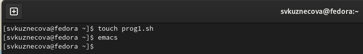{#fig:001 width=70%}

## Написание первого скрипта

В emacs откроем созданный файл prog1.sh и приступим к написанию скрипта, который анализирует командную строку с определёнными ключами, а затем ищет в указанном файле нужные строки, определяемые ключом p.

## Написание первого скрипта

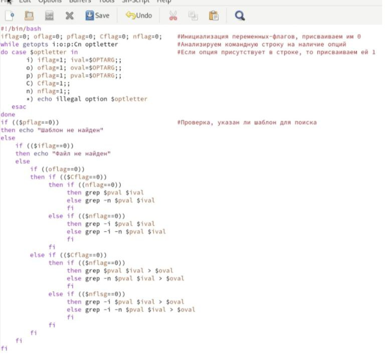{ #fig:002 width=45% }

## Запуск и проверка выполнения первого скрипта

После того как скрипт написан мы сохраняем файл и закрываем emacs. В терминале мы даём этому файлу право на выполнение. Также создаём через терминал два текстовых файла (a1.txt и a2.txt). Далее прописываем нужные нам команды и проверяем корректность работы скрипта.

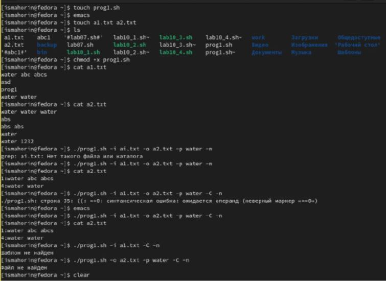{ #fig:003 width=40% }

## Создание файлов для второго задания

Теперь открываем в терминале два файла(chslo.c и chslo.sh), для второго задания. Открываем emacs.

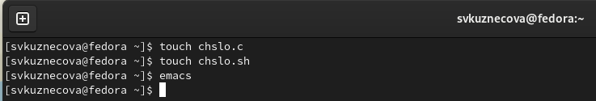{ #fig:004 width=70% }

## Написание скрипта на языке программирования Си

Открываем файл chslo.c и начинаем писать на языке Си программу, которая вводит число и определяет, является ли оно больше нуля, меньше нуля или равно нулю. Затем программа завершается с помощью функции exit(n), передавая информацию в о коде завершения в оболочку.

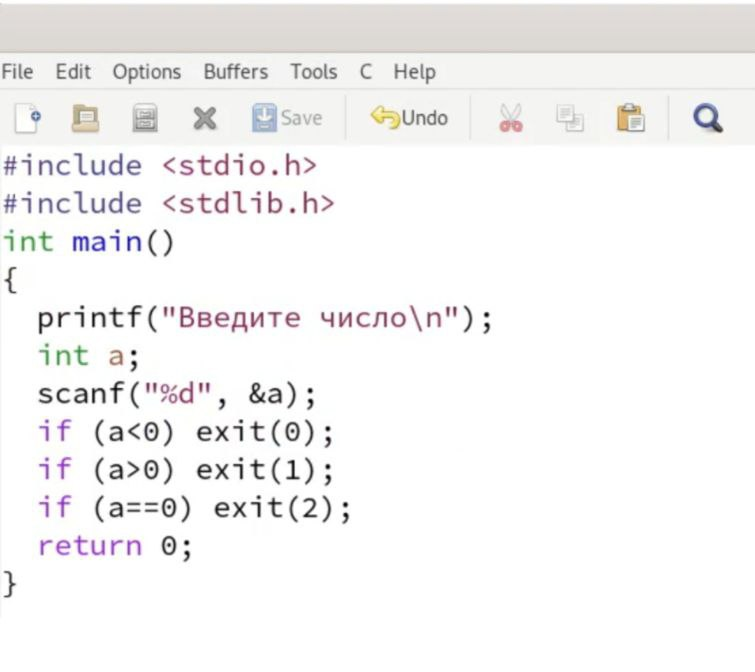{ #fig:005 width=35% }

## Написание скрипта для второго задания

После программы на Си, в файле chslo.sh пишем командный файл, который должен вызывать эту программу и, проанализировав с помощью команды $?, выдать сообщение о том, какое число было выведено.

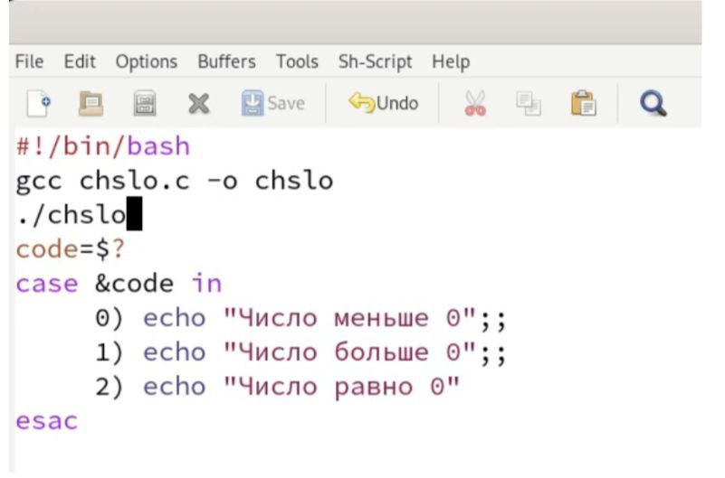{ #fig:006 width=50% }

## Право на выполнение и последующая проверка

Сохраняем файл и также даём в терминале право на выполнение для файла chslo.sh. Запускаем файл chslo.sh.

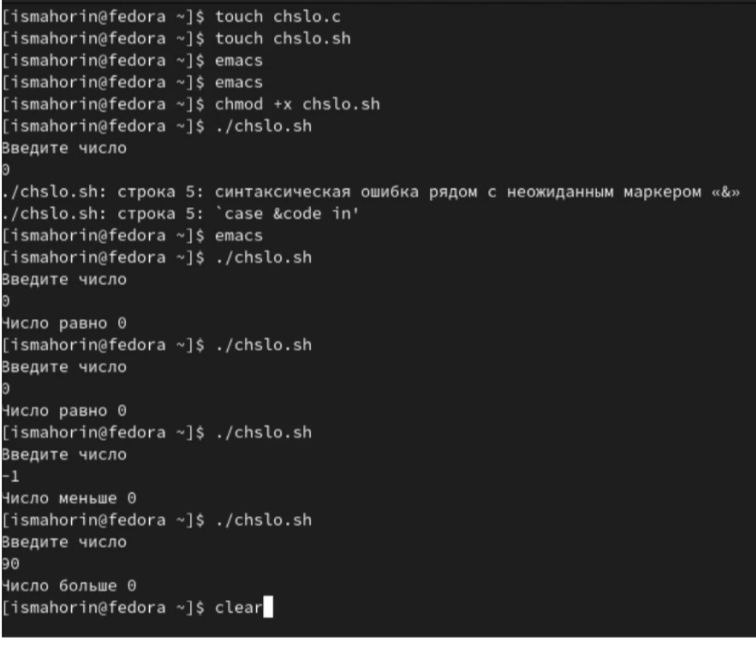{ #fig:007 width=40% }

## Создание файла для третьего скрипта

Снова в домашнем каталоге создаём файл, но уже для третьего задания. Запускаем emacs.

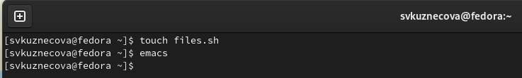{ #fig:008 width=70% }

## Написание третьего скрипта

После открытия файла files.sh напишем командный файл, создающий указанное число файлов, пронумерованных последовательно от 1 до N (например 1.tmp, 2.tmp, 3.tmp,4.tmp и т.д.). Число файлов, которые необходимо создать, передаётся в аргументы командной строки. Этот же командный файл должен уметь удалять все созданные им файлы (если они существуют).

##  Написание третьего скрипта
	
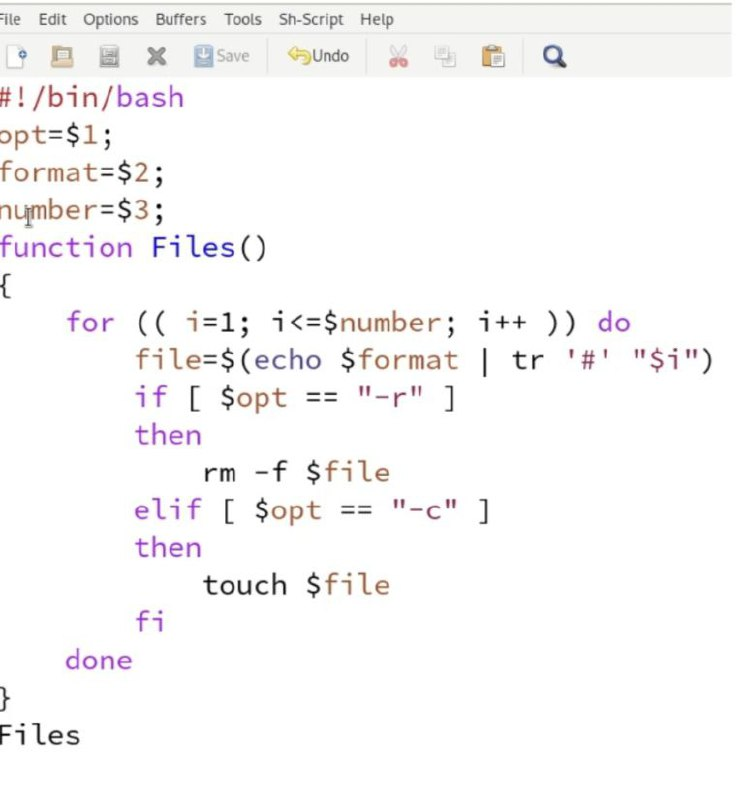{ #fig:009 width=35% }

## Право на выполнение и запуск файла

Сохраняем наш скрипт и даём право на выполнение. Запускаем файл и создаём три текстовых файла. Удаляем эти три файла.

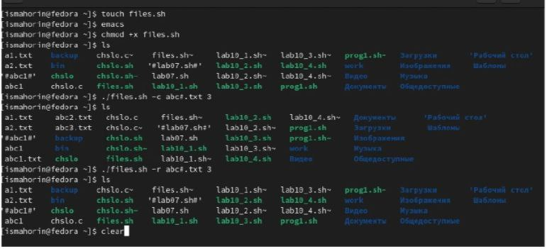{ #fig:010 width=50% }

## Создание файла для четвёртого скрипта

Создаём последний файл для четвёртого скрипта. Запускаем emacs.

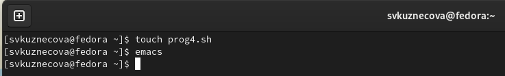{ #fig:011 width=70% }

## Написание четвёртого скрипта

В четвёртом файле напишем командный файл, который с помощью команды tar запаковывает в архив все файлы в указанной директории. Модифицировать его так, чтобы запаковывались только те файлы, которые были изменены менее недели тому назад (использовать команду find).

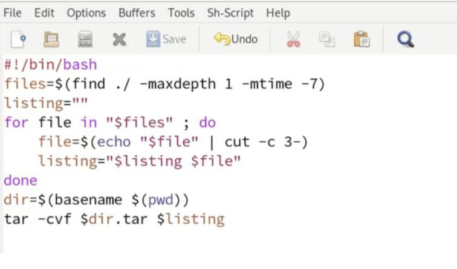{ #fig:012 width=40% }

## Право на выполнение и запуск файла для нужного каталога

Сохраним файл и выйдем из emacs. Как делали ранее, дадим файлу право на выполнение и запустим его для каталога Catalog1 (который мы создали ранее в терминале и в который перенесли некоторые файлы из домашнего каталога).

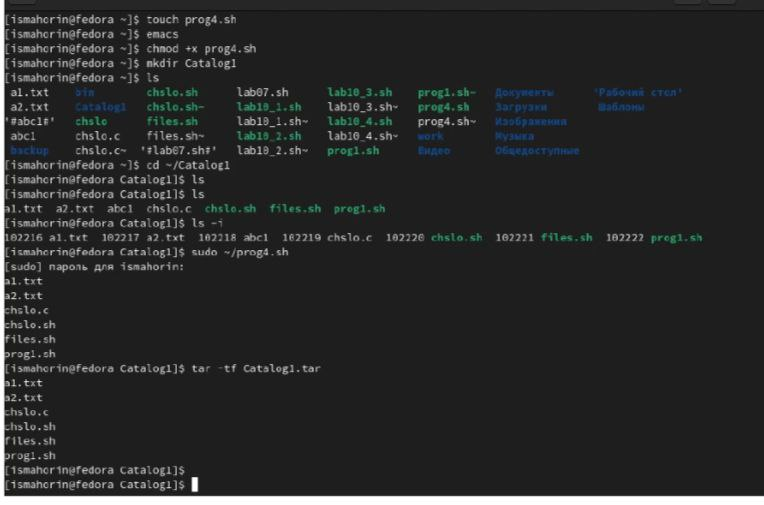{ #fig:013 width=50% }

## Проверка

Перейдём в файл и выполним проверку архивации.

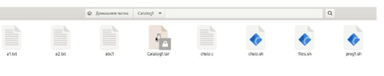{ #fig:014 width=100% }

# Вывод 

В ходе выполнения лабораторной работы мы изучили основы программирования в оболочке ОС UNIX и научились писать более сложные командные файлы с использованием логических управляющих конструкций и циклов.

## {.standout}

Спасибо за внимание!

