---
## Front matter
lang: ru-RU
title: Лабораторная работа №12
subtitle: Программирование в командном процессоре ОС UNIX.  Расширенное программирование
author:
  - Кузнецова С. В.
institute:
  - Российский университет дружбы народов, Москва, Россия
date: 23 апреля 2023

## i18n babel
babel-lang: russian
babel-otherlangs: english

## Formatting pdf
toc: false
toc-title: Содержание
slide_level: 2
aspectratio: 169
section-titles: true
theme: metropolis
header-includes:
 - \metroset{progressbar=frametitle,sectionpage=progressbar,numbering=fraction}
 - '\makeatletter'
 - '\beamer@ignorenonframefalse'
 - '\makeatother'
---

# Информация

## Докладчик

  * Кузнецова София Вадимовна
  * студент прикладной информатики
  * Российский университет дружбы народов

# Цель

# Выполнение лабораторной работы

## Создание первого файла для скрипта

Откроем терминал и создадим в домашнем каталоге файл sem.sh. После чего перейдём в emacs.

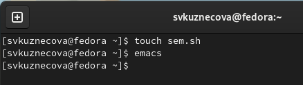{#fig:001 width=70%}

## Написание первого скрипа

В emacs откроем созданный файл sem.sh и приступим к написанию командного файла, который реализует упрощённый механизм семафоров. Командный файл должен в течение некоторого времени t1 дожидаться освобождения ресурса, выдавая об этом сообщение, а дождавшись его освобождения, использовать его в течение некоторого времени t2<>t1, также выдавая информацию о том, что ресурс используется соответствующим командным файлом (процессом). Запустить командный файл в одном виртуальном терминале в фоновом режиме, перенаправив его вывод в другой (> /dev/tty#, где # — номер терминала куда перенаправляется вывод), в котором также запущен этот файл, но не фоновом, а в привилегированном режиме. 

## Написание первого скрипта

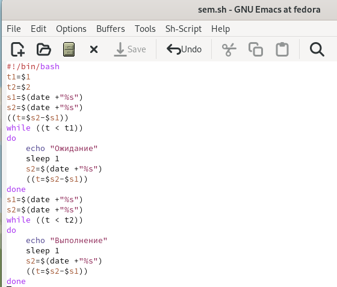{#fig:002 width=50%}

## Запуск файла

После того как скрипт написан мы сохраняем файл и запускаем emacs. В терминале мы даём этому файлу право на выполнение и запускаем его.

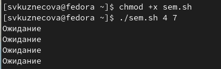{#fig:003 width=60%}

## Доработка 

Теперь нам нужно доработать программу так, чтобы имелась возможность взаимодействия трёх и более процессов. Снова открываем emacs  и наш файл sem.sh.

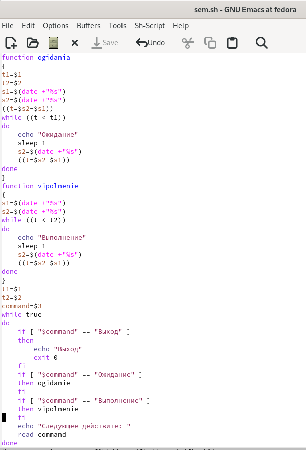{#fig:004 width=20%}

## Сохранение и проверка

Сохраняем файл и проверяем его работу.

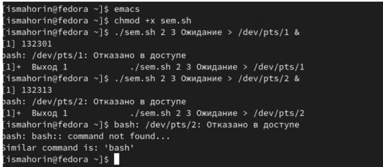{#fig:005 width=60%}

## Создание файла для второго скрипта

В домашнем каталоге создаём файл man.sh, но уже для второго скрипта. Запускаем emacs.

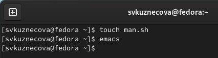{#fig:006 width=70%}

## Написание второго скрипта 

Приступаем к реализации команды man с помощью командного файла. Изучим содержимое каталога /usr/share/man/man1. В нем находятся архивы текстовых файлов, содержащих справку по большинству установленных в системе программ и команд. Каждый архив можно открыть командой less сразу же просмотрев содержимое справки. Командный файл должен получать в виде аргумента командной строки название команды и в виде результата выдавать справку об этой команде или сообщение об отсутствии справки, если соответствующего файла нет в каталоге man1.

## Написание второго скрипта

{#fig:007 width=70%}

## Право на выполнение и запуск файла

Сохраняем файл и даём в терминале право на выполнение. Запускаем файл man.sh для команды ls.

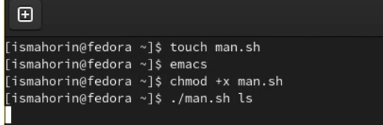{#fig:008 width=70%}

## Информация

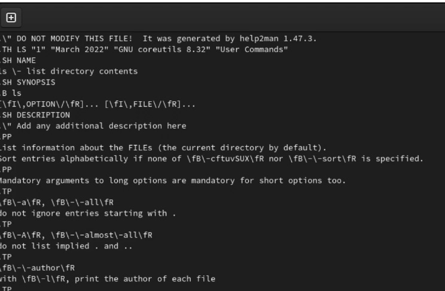{#fig:009 width=70%}

## Создание третьего файла

Снова в домашнем каталоге создаём файл. Запускаем emacs.

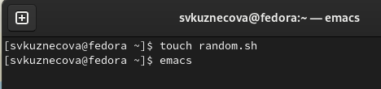{#fig:010 width=70%}

## Написание третьего скрипта

После открытия файла random.sh напишем командный файл, генерирующий случайную последовательность букв латинского алфавита. Учтём, что $RANDOM выдаёт псевдослучайные числа в диапазоне от 0 до 32767.

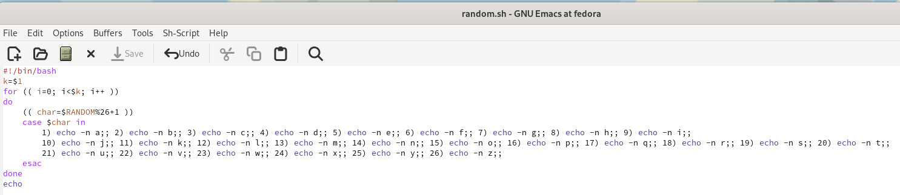{#fig:011 width=60%}

## Сохранение и право на выполнение 

Сохраняем наш скрипт и даём право на выполнение. Запускаем файл для трёх разных чисел.

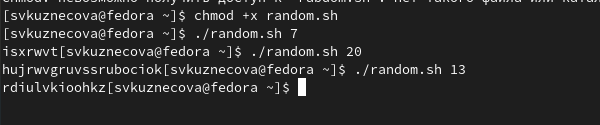{#fig:012 width=60%}

# Вывод 

Изучила основы программирования в оболочке ОС UNIX. Научилась писать более сложные командные файлы с использованием логических управляющих конструкций и циклов.

## {.standout}

Спасибо за внимание!

