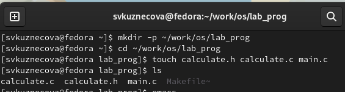
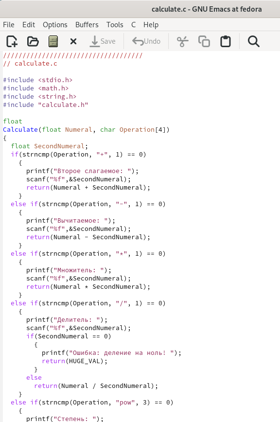
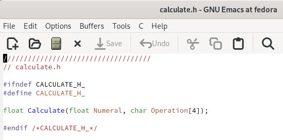
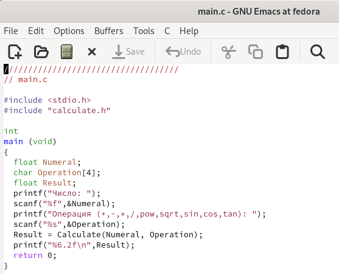
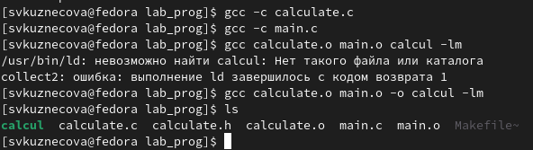
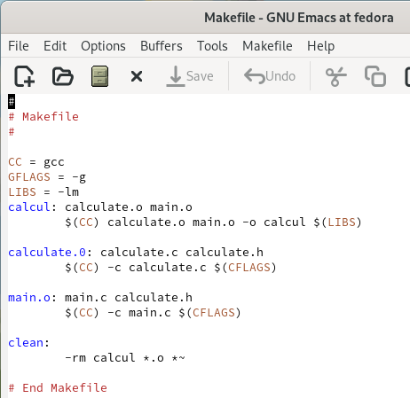
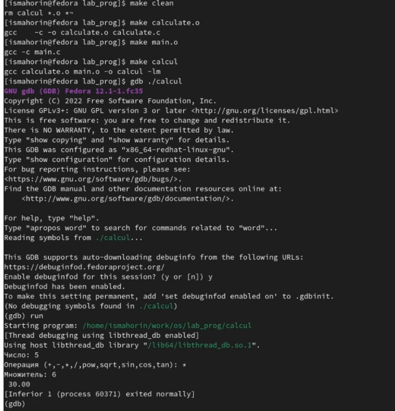
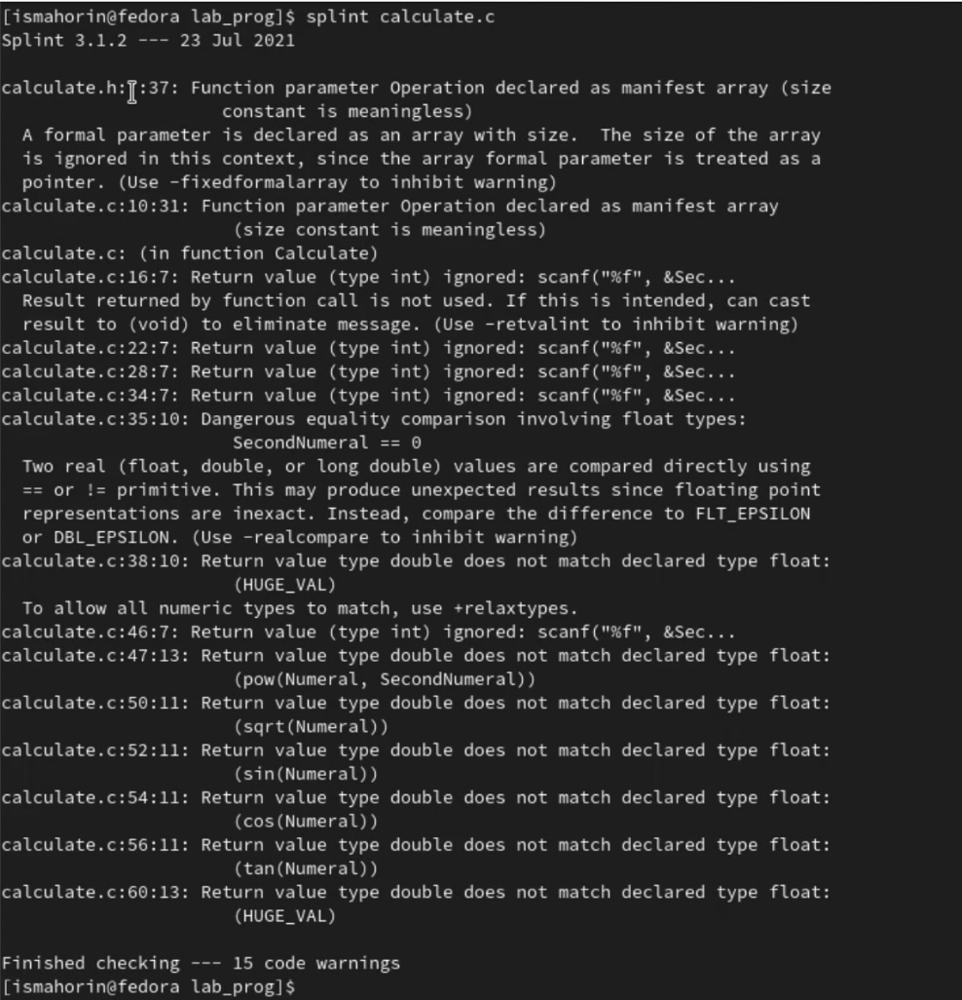
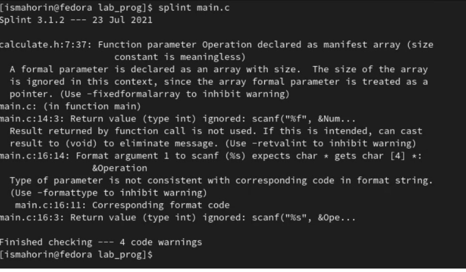

---
## Front matter
lang: ru-RU
title: Лабораторная работа №13
subtitle: Средства, применяемые при разработке программного обеспечения в ОС UNIX/Linux
author:
  - Кузнецова С. В.
institute:
  - Российский университет дружбы народов, Москва, Россия
date: 30 апреля 2023

## i18n babel
babel-lang: russian
babel-otherlangs: english

## Formatting pdf
toc: false
toc-title: Содержание
slide_level: 2
aspectratio: 169
section-titles: true
theme: metropolis
header-includes:
 - \metroset{progressbar=frametitle,sectionpage=progressbar,numbering=fraction}
 - '\makeatletter'
 - '\beamer@ignorenonframefalse'
 - '\makeatother'
---

# Информация

## Докладчик

  * Кузнецова София Вадимовна
  * студент прикладной информатики
  * Российский университет дружбы народов

# Выполнение лабораторной работы

## Создание подкаталога, файлов и переход в emacs

В домашнем каталоге создадим подкаталог ~/work/os/lab_prog. После чего создадим в нём файлы: calculate.h, calculate.c, main.c и выполним проверку. Перейдём в emacs.

{#fig:001 width=70%}

## Перенос первого скрипта

В emacs откроем созданный файл calculate.c  и приступим к переносу в него скрипта из файла.

{#fig:002 width=20%}

## Перенос второго скрипта

После того как мы перенесли и сохранили скрипт для первого файла, открываем файл calculate.h и также приступим в него скрипта, но уже для второго файла. Выполняем сохранение.

{#fig:003 width=50%}

## Перенос третьего скрипта

Теперь нам нужно перенести последний третий скрипт в файл main.c. После чего также выполняем сохранение и закрываем emacs.  

{#fig:004 width=40%}

## Компиляция программы посредством gcc 

В терминале выполняем компиляцию программ посредством gcc. 

{#fig:005 width=60%}

## Создание и изменение Makefile

Создадим Makefile и внесём туда небольшие изменения. В переменную CFLAGS добавил опцию -g, необходимую для компиляции объектных файлов и их использования в программе отладчика GDB. Сделал так, что утилита компиляции выбирается с помощью переменной CC.

{#fig:006 width=35%}

## Отладка программы calcul с помощью gdb

С помощью gdb выполняем отладку программы calcul. После чего запустим программу командой run. 

{#fig:007 width=30%}

## Анализ файлов утилитой splint

Воспользовавшись утилитой splint проанализируем коды файлов calculate.c и main.c. C помощью утилиты splint выяснилось, что в файлах calculate.c и main.c присутствует функция чтения scanf, возвращающая целое число (тип int), но эти числа не используются и нигде не сохранятся. Утилита вывела предупреждение о том, что в файле calculate.c происходит сравнение вещественного числа с нулем. Также возвращаемые значения (тип double) в функциях pow, sqrt, sin, cos и tan записываются в переменную типа float, что свидетельствует о потери данных.

## Анализ файла calculate.c утилитой splint

{#fig:008 width=40%}

## Анализ файла main.c утилитой splint

{#fig:009 width=50%}

# Выводы

В ходе выполнения лабораторной работы мы приобрели простейшие навыки разработки, анализа, тестирования и отладки приложений в ОС типа UNIX/Linux на примере создания на языке программирования С калькулятора с простейшими функциями.

## {.standout}

Спасибо за внимание!
