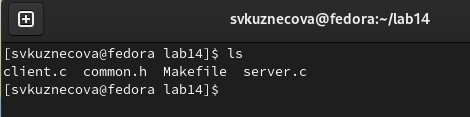
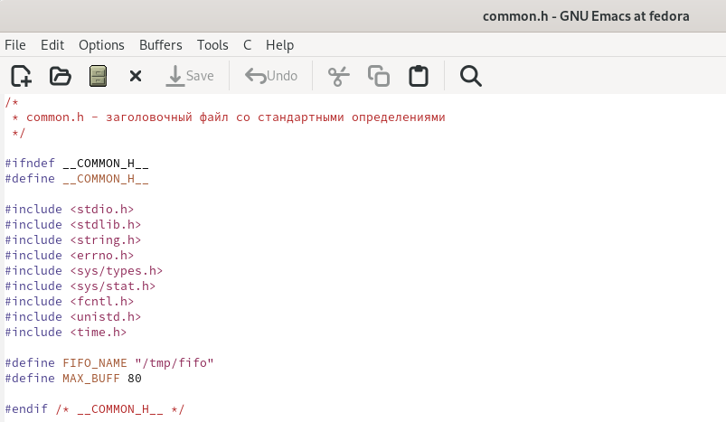
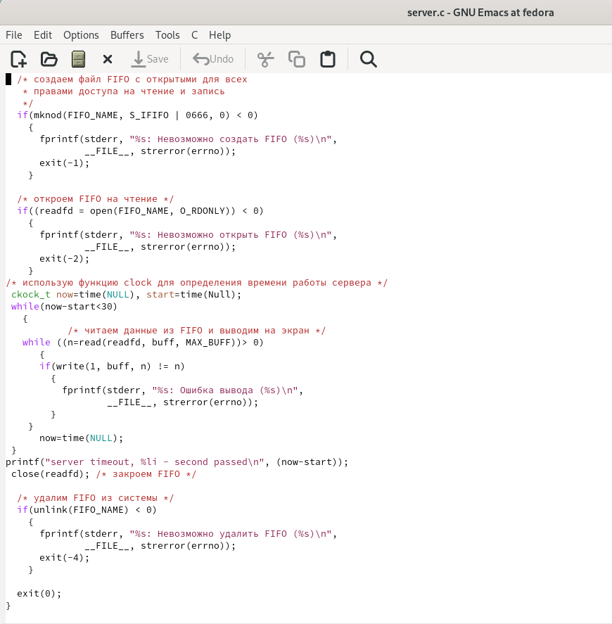
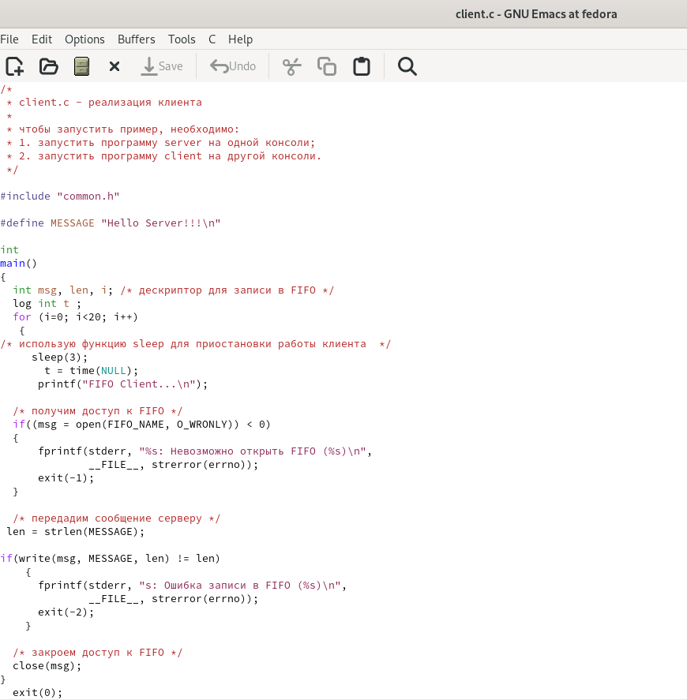
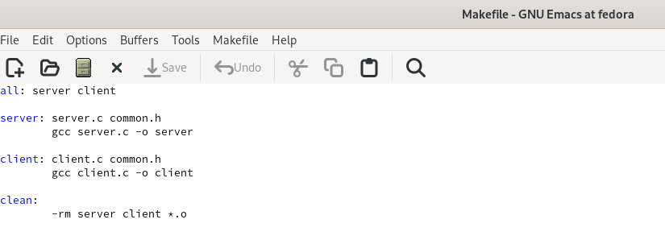
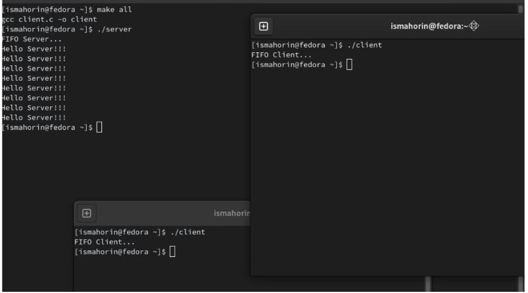

---
## Front matter
lang: ru-RU
title: Лабораторная работа №14
subtitle: Именованные каналы
author:
  - Кузнецова С. В.
institute:
  - Российский университет дружбы народов, Москва, Россия
date: 30 апреля 2023

## i18n babel
babel-lang: russian
babel-otherlangs: english

## Formatting pdf
toc: false
toc-title: Содержание
slide_level: 2
aspectratio: 169
section-titles: true
theme: metropolis
header-includes:
 - \metroset{progressbar=frametitle,sectionpage=progressbar,numbering=fraction}
 - '\makeatletter'
 - '\beamer@ignorenonframefalse'
 - '\makeatother'
---

# Информация

## Докладчик

  * Кузнецова София Вадимовна
  * студент прикладной информатики
  * Российский университет дружбы народов

# Выполнение лабораторной работы

## Создание файлов и переход в emacs

В домашнем каталоге создадим файлы common.h, server.c, client.c и Makefile, выполним проверку. Перейдём в emacs.

{#fig:001 width=60%}

## Первый скрипт

В emacs откроем созданный файл common.h и приступим к переносу в него скрипта из файла, а также внесём в него дополнительные изменения.

{#fig:002 width=50%}

## Второй скрипт

После того как мы перенесли, изменили и сохранили скрипт для первого файла, открываем файл server.c и также переносим в него скрипт с изменениями, но уже для второго файла. Выполняем сохранение.

{ #fig:003 width=30% }

## Третий скрипт

Теперь нам нужно перенести третий скрипт в файл client.c. После чего также выполняем сохранение.

{ #fig:004 width=30% }

## Четвёртый скрипт

Выполняем перенос скрипта для последнего, четвёртого файла Makefile и закрываем emacs.

{ #fig:005 width=50% }

## Проверка выполнения

В терминале выполняем команду make all. После чего в одном терминале запустим команду ./server, а в других ./client и проверим корректность выполнения.
 
{ #fig:006 width=50% }

# Выводы

В ходе выполнения лабораторной работы были приобретены практические навыки работы с именованными каналами.

## {.standout}

Спасибо за внимание!
