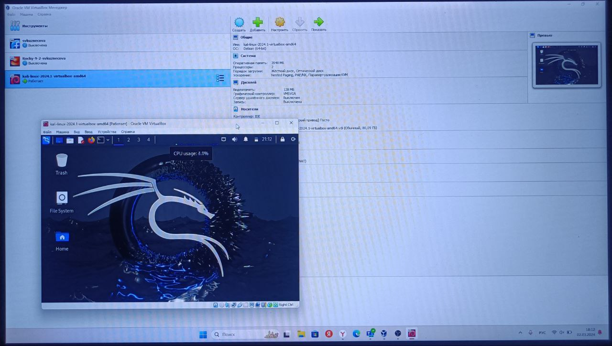

---
## Front matter
lang: ru-RU
title: 1-ый этап проекта
subtitle: Установка дистрибутива Kali Linyx
author:
  - Кузнецова С. В.
institute:
  - Российский университет дружбы народов, Москва, Россия
date:  2 марта  2024

## i18n babel
babel-lang: russian
babel-otherlangs: english

## Formatting pdf
toc: false
toc-title: Содержание
slide_level: 2
aspectratio: 169
section-titles: true
theme: metropolis
header-includes:
 - \metroset{progressbar=frametitle,sectionpage=progressbar,numbering=fraction}
 - '\makeatletter'
 - '\beamer@ignorenonframefalse'
 - '\makeatother'
---

# Информация

## Докладчик

:::::::::::::: {.columns align=center}
::: {.column width="70%"}

  * Кузнецова София Вадимовна
  * Российский университет дружбы народов

:::
::: {.column width="30%"}

:::
::::::::::::::

# Ход работы

## Установите дистрибутив Kali Linux в виртуальную машину.

В качестве среды виртуализации предлагается использовать VirtualBox.

Сайт Kali Linux: https://www.kali.org/.

{ #fig:001 width=30% }

## Ввод учётных данных 

Учётные данные по умолчанию:
        логин: kali;
        пароль: kali.

{ #fig:002 width=50% }

## Итог работы.

{ #fig:003 width=70% }

## {.standout}

Спасибо за внимание!

