---
## Front matter
lang: ru-RU
title: Индивидуальный проект
subtitle: Второй этап
author:
  - Кузнецова С. В.
institute:
  - Российский университет дружбы народов, Москва, Россия
date: 16 марта 2023

## i18n babel
babel-lang: russian
babel-otherlangs: english

## Formatting pdf
toc: false
toc-title: Содержание
slide_level: 2
aspectratio: 169
section-titles: true
theme: metropolis
header-includes:
 - \metroset{progressbar=frametitle,sectionpage=progressbar,numbering=fraction}
 - '\makeatletter'
 - '\beamer@ignorenonframefalse'
 - '\makeatother'
---

# Информация

## Докладчик

:::::::::::::: {.columns align=center}
::: {.column width="70%"}

  * Кузнецова София Вадимовна
  * 16.03.2023
  * Студент направления прикладная информатика
  * Российский университет дружбы народов

:::
::: {.column width="30%"}

:::
::::::::::::::

## Цель работы

Добавить к сайту данные о себе.

## Задание

Добавить к сайту данные о себе:

1.Список добавляемых данных.
2.Разместить фотографию владельца сайта.
3.Разместить краткое описание владельца сайта (Biography).
4.Добавить информацию об интересах (Interests).
5.Добавить информацию от образовании (Education).
Сделать пост по прошедшей неделе.
Добавить пост на тему по выбору:
-Управление версиями. Git.
-Непрерывная интеграция и непрерывное развертывание (CI/CD).

# Выполнение второго этапа индивидуального проекта 

## Добавление фотографии на сайт

Для начала добавим нашу фотографию. Для этого мы должны проделать данный путь : "work", "blog", "content", "authors", "admin". Здесь удаляем предыдущий avatar и добавляем свой. 

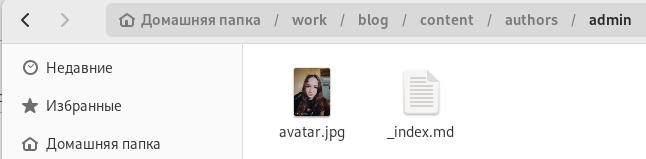{#fig:001 width=70%}

##  Добавление информации о себе

В этом каталоге ("admin") открываем файл "_index.md". В него мы внесём наше имя, фамилию. Также добавим биографию, интересы, образование и т.д. 

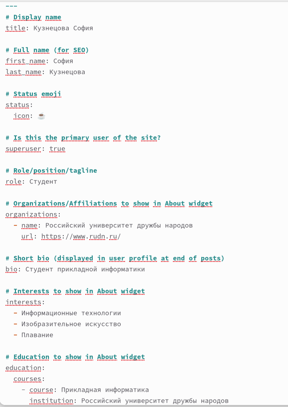{#fig:002 width=20%}

## Создание постов

Следующим шагом будет создание двух постов. Открываем терминал из каталога "blog" и вводим команду : hugo new -kind post post/(название поста).

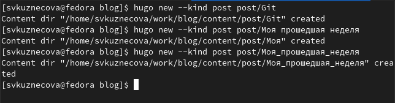{#fig:003 width=70%}

## Проверка создания постов

После этого в каталоге "post" появляются наши новые подкаталоги "GIT" и "Моя прошедшая неделя". Именно внутри этих подкаталогов мы будем добавлять информацию для постов.

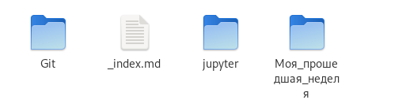{#fig:004 width=70%}

## Внесение информации для поста

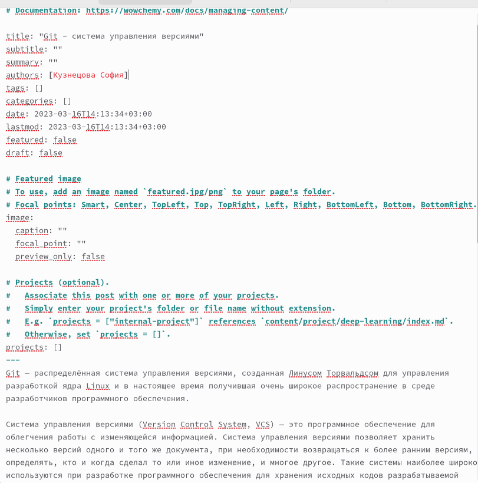{#fig:005 width=30%}

## Внесение информации для поста

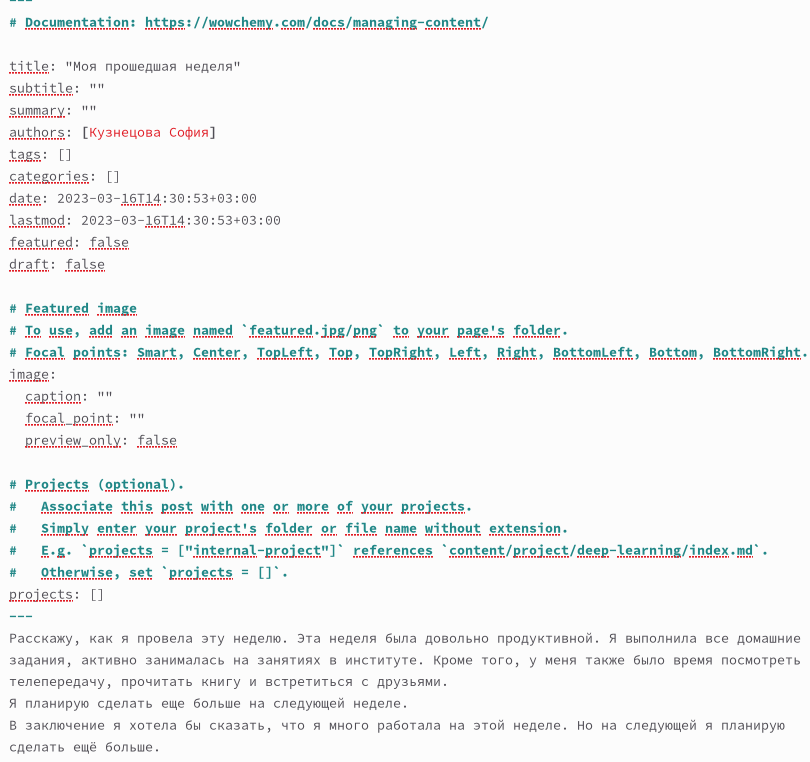{#fig:006 width=30%}

## Запуск команды hugo

Чтобы вся наша информация выгрузилась на сайт, откроем в каталоге "blog" терминал и запустим команду hugo.

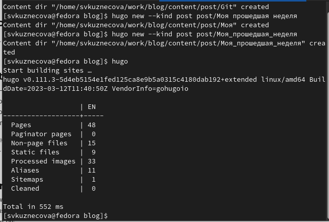{#fig:007 width=50%}

## Выгрузка на github

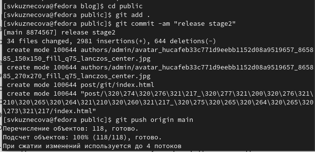{#fig:008 width=70%}

## Выгрузка на github

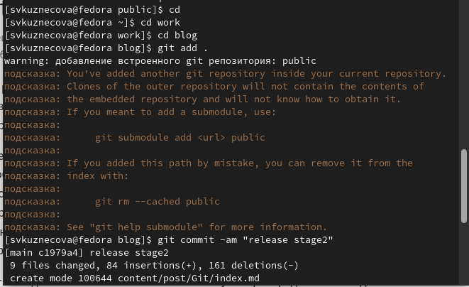{#fig:009 width=70%}

## Просмотр изменений на сайте

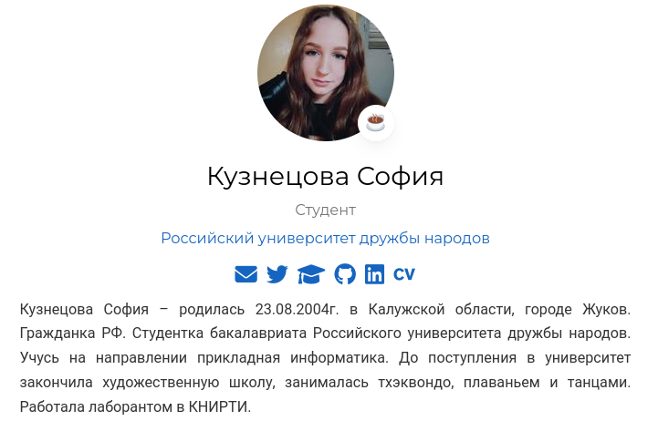{#fig:0010 width=70%}

## Просмотр изменений на сайте

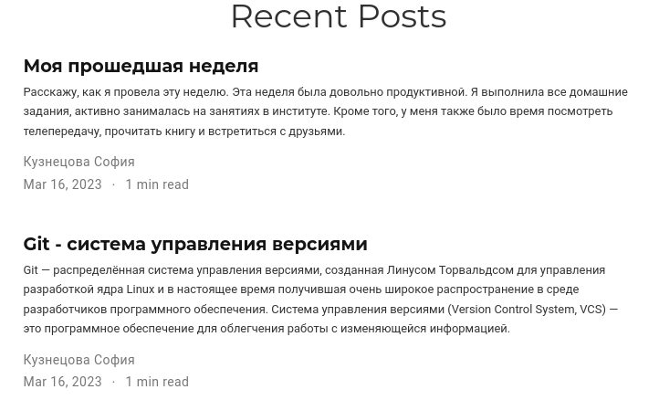{#fig:011 width=70%}

## Вывод

В ходе выполнения второго этапа индивидуального проекта мы научились добавлять к сайту информацию о себе, а также создавать новые посты.

## {.standout}

Спасибо за внимание!

