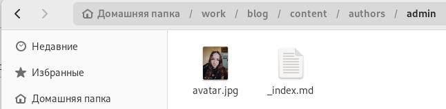
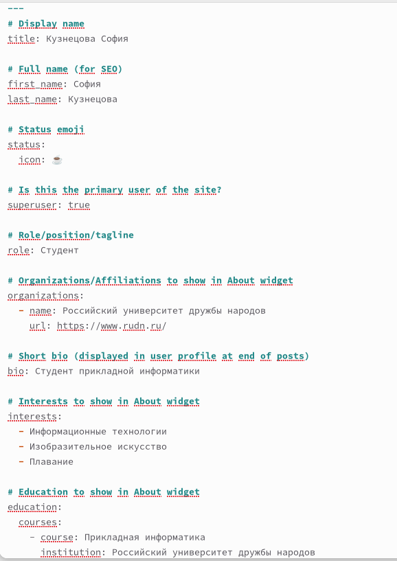
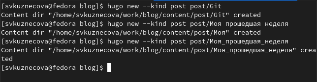
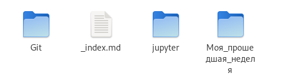
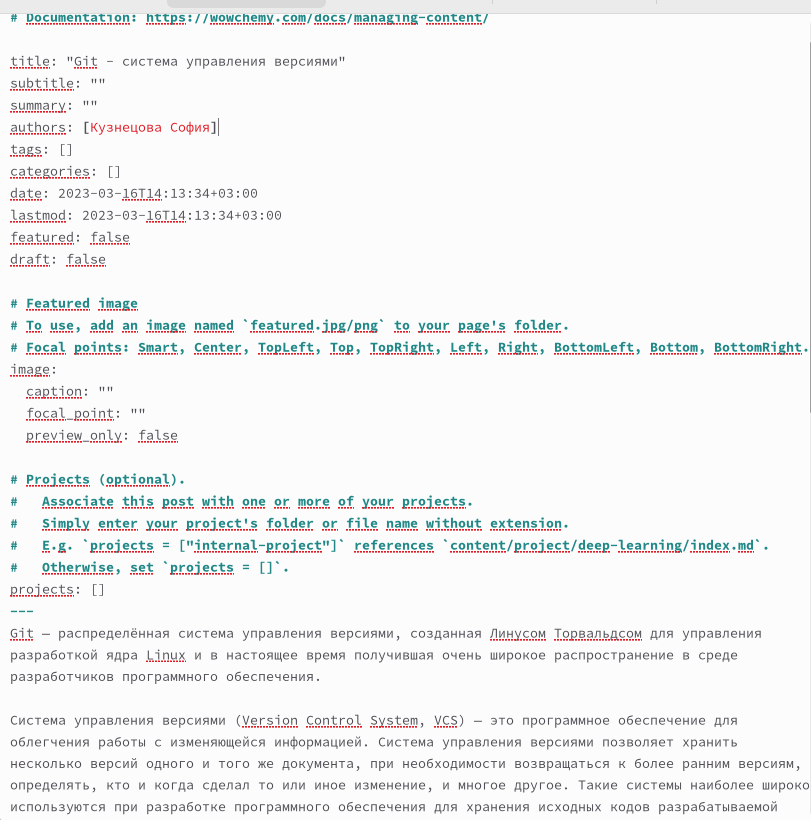
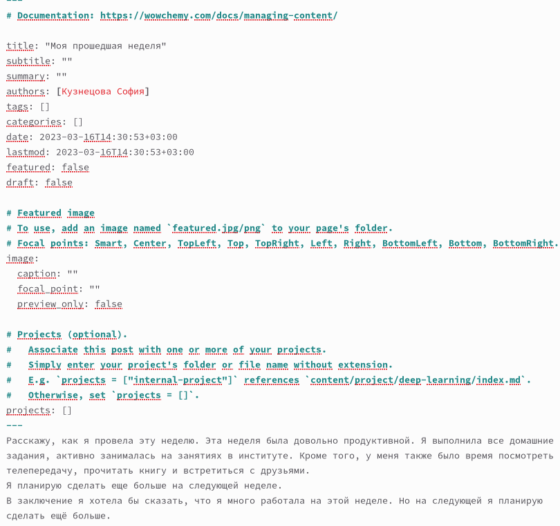
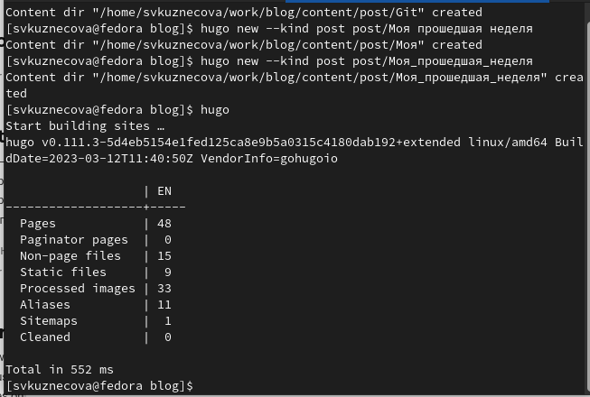
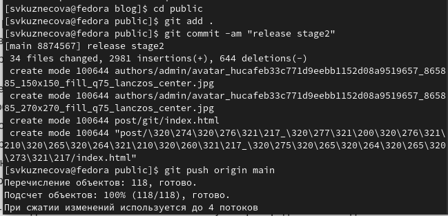
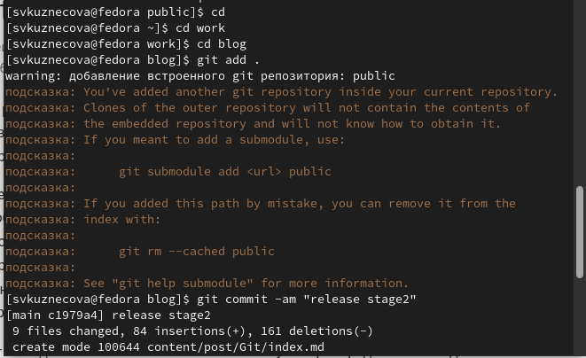
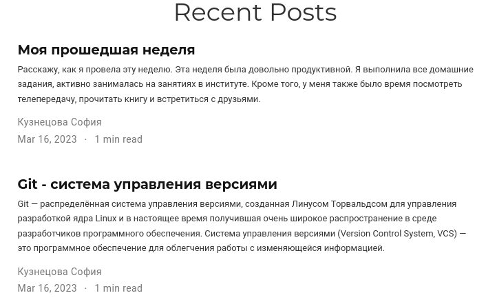

---
## Front matter
title: "Индивидуальный проект"
subtitle: "Второй этап"
author: "Кузнецова София Вадимовна"

## Generic otions
lang: ru-RU
toc-title: "Содержание"

## Bibliography
bibliography: bib/cite.bib
csl: pandoc/csl/gost-r-7-0-5-2008-numeric.csl

## Pdf output format
toc: true # Table of contents
toc-depth: 2
lof: true # List of figures
lot: true # List of tables
fontsize: 12pt
linestretch: 1.5
papersize: a4
documentclass: scrreprt
## I18n polyglossia
polyglossia-lang:
  name: russian
  options:
	- spelling=modern
	- babelshorthands=true
polyglossia-otherlangs:
  name: english
## I18n babel
babel-lang: russian
babel-otherlangs: english
## Fonts
mainfont: PT Serif
romanfont: PT Serif
sansfont: PT Sans
monofont: PT Mono
mainfontoptions: Ligatures=TeX
romanfontoptions: Ligatures=TeX
sansfontoptions: Ligatures=TeX,Scale=MatchLowercase
monofontoptions: Scale=MatchLowercase,Scale=0.9
## Biblatex
biblatex: true
biblio-style: "gost-numeric"
biblatexoptions:
  - parentracker=true
  - backend=biber
  - hyperref=auto
  - language=auto
  - autolang=other*
  - citestyle=gost-numeric
## Pandoc-crossref LaTeX customization
figureTitle: "Рис."
tableTitle: "Таблица"
listingTitle: "Листинг"
lofTitle: "Список иллюстраций"
lotTitle: "Список таблиц"
lolTitle: "Листинги"
## Misc options
indent: true
header-includes:
  - \usepackage{indentfirst}
  - \usepackage{float} # keep figures where there are in the text
  - \floatplacement{figure}{H} # keep figures where there are in the text
---

# Цель работы

Добавить к сайту данные о себе.

# Задание

Добавить к сайту данные о себе.

1.Список добавляемых данных.
2.Разместить фотографию владельца сайта.
3.Разместить краткое описание владельца сайта (Biography).
4.Добавить информацию об интересах (Interests).
5.Добавить информацию от образовании (Education).
6.Сделать пост по прошедшей неделе.
7.Добавить пост на тему по выбору:
-Управление версиями. Git.
-Непрерывная интеграция и непрерывное развертывание (CI/CD).

# Выполнение 2-го этапа индивидуального проекта

Для начала добавим нашу фотографию. Для этого мы должны проделать данный путь : "work", "blog", "content", "authors", "admin". Здесь удаляем предыдущий avatar и добавляем свой. 

{#fig:001 width=70%}

В этом каталоге ("admin") открываем файл "_index.md". В него мы внесём наше имя, фамилию. Также добавим биографию, интересы, образование и т.д. 

{#fig:002 width=40%}

Следующим шагом будет создание двух постов. Открываем терминал из каталога "blog" и вводим команду : hugo new -kind post post/(название поста).

{#fig:003 width=70%}

После этого в каталоге "post" появляются наши новые подкаталоги "GIT" и "Моя прошедшая неделя". Именно внутри этих подкаталогов мы будем добавлять информацию для постов.

{#fig:004 width=70%}

Внесём информацию для наших постов и не забудем  добавить название и автора.

{#fig:005 width=50%}

{#fig:006 width=50%}

Чтобы вся наша информация выгрузилась на сайт, откроем в каталоге "blog" терминал и запустим команду hugo.

{#fig:007 width=70%}

Как только команда hugo выполнилась перейдём первым этапом в подкаталог "public" и проделаем указанные на скриншоте действия. Вторым этапом проделаем все те же самые действия, но уже в каталоге "blog".

{#fig:008 width=70%}

{#fig:009 width=70%}

Последним шагом перейдём на наш сайт и посмотрим итог работы.

{#fig:0010 width=70%}

{#fig:011 width=70%}
 
 
# Выводы

В ходе выполнения второго этапа индивидуального проекта мы научились добавлять к сайту информацию о себе, а также создавать новые посты.

