---
## Front matter
lang: ru-RU
title: Индивидуальный проект
subtitle: Третий этап
author:
  - Кузнецова С. В.
institute:
  - Российский университет дружбы народов, Москва, Россия
date: 07 апреля 2023

## i18n babel
babel-lang: russian
babel-otherlangs: english

## Formatting pdf
toc: false
toc-title: Содержание
slide_level: 2
aspectratio: 169
section-titles: true
theme: metropolis
header-includes:
 - \metroset{progressbar=frametitle,sectionpage=progressbar,numbering=fraction}
 - '\makeatletter'
 - '\beamer@ignorenonframefalse'
 - '\makeatother'
---

# Информация

## Докладчик

  * Кузнецова София Вадимовна
  * студент прикладной информатики 
  * Российский университет дружбы народов

# Выполнение 3-го этапа индивидуального проекта

## Добавление навыков на сайт

Для начала добавим информацию о навыках. Для этого мы должны проделать данный путь: "work", "blog", "content", "home" и зайти в файл "skills.md". Внутри файла мы закомментируем шаблонные данные и будем использовать emoji.

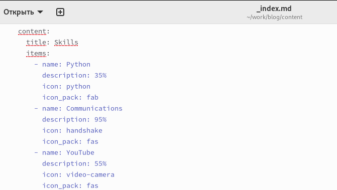{ #fig:001 width=50% }

## Добавление опыта на сайт

В каталоге "home" выберим файл "experience.md" для добавления опыта.

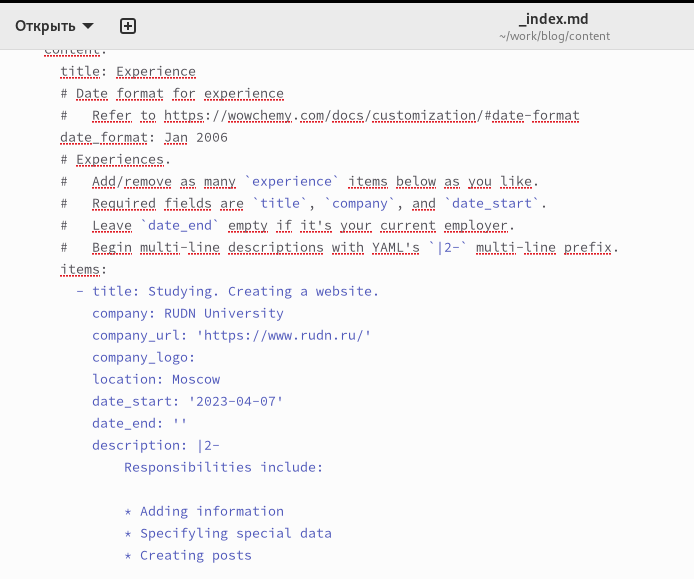{ #fig:002 width=50% }

## Добавление достижений на сайт

Последним файлом для редактирования будет "accomplishments.md", где мы добавим наши достижения.

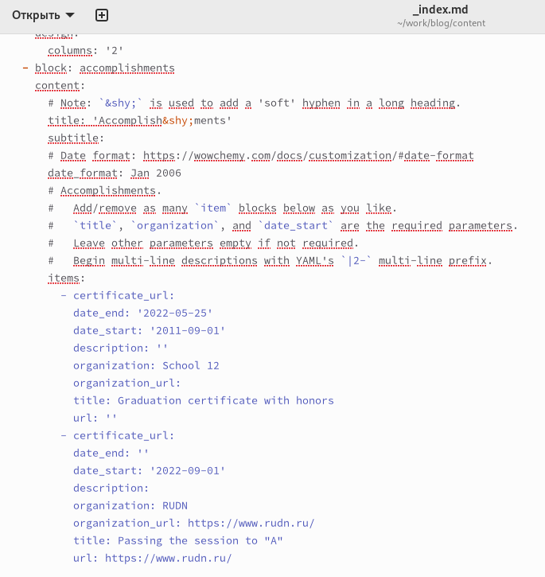{ #fig:003 width=30% }

## Посты через терминал

Через терминал создаём два поста "Markdown" и "Моя прошедшая неделя(2)", в которые добавляем написанный нами текст для постов.

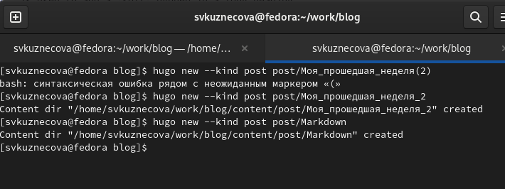{ #fig:004 width=60% }

## Пост

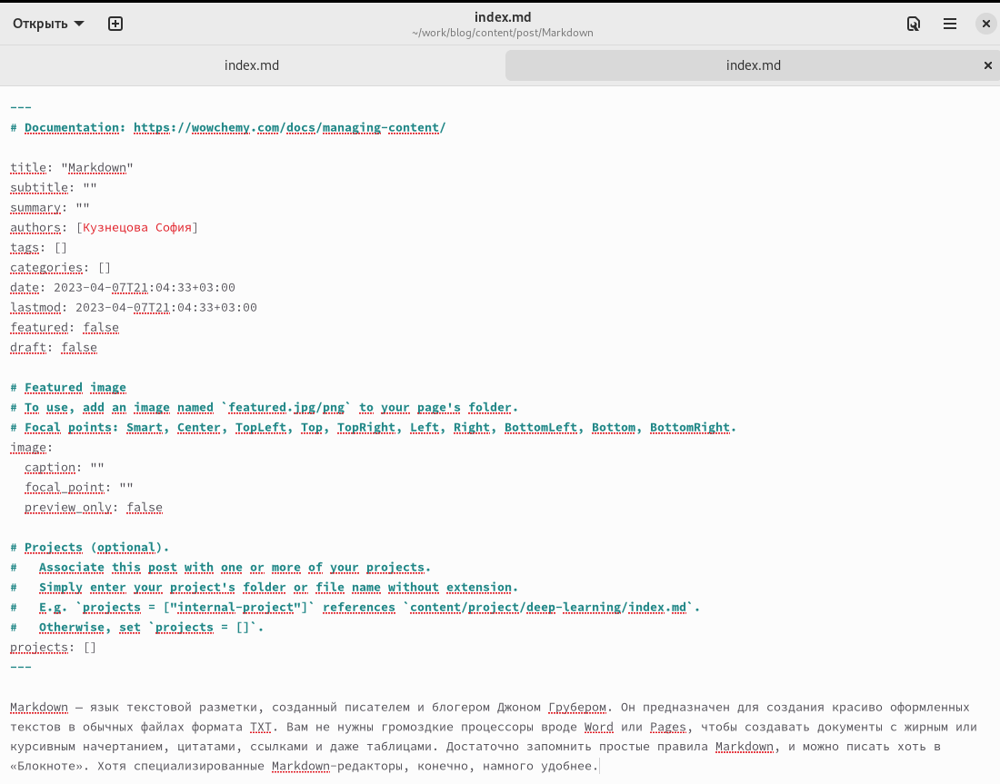{ #fig:005 width=40% }

## Пост

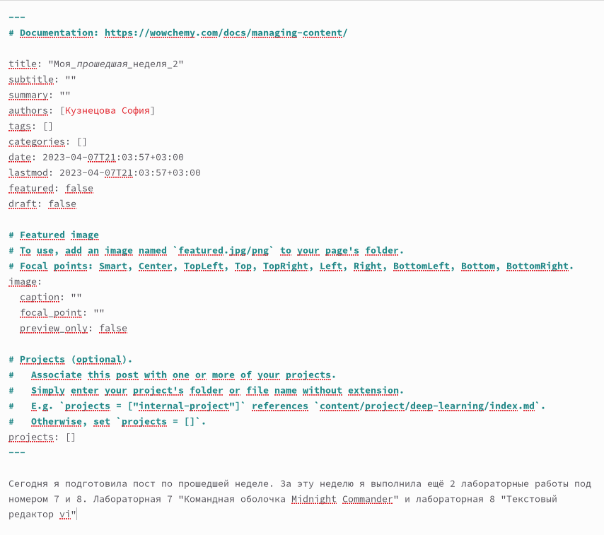{ #fig:006 width=40% }

## Команда hugo

Чтобы вся наша информация выгрузилась на сайт, открываем в каталоге "blog"  терминал и запускаем команду hugo.

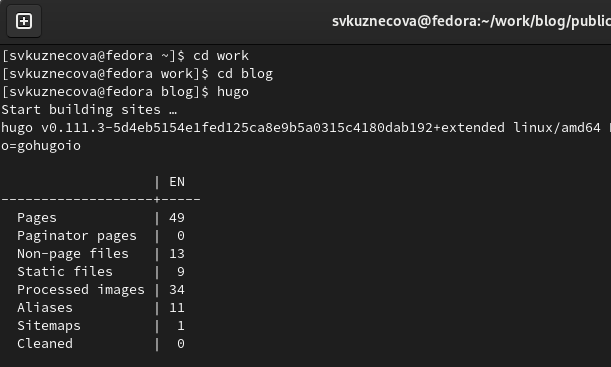{ #fig:007 width=60% }

## Выгрузка из подкаталога "public"

Как только команда hugo выполнилась перейдём первым этапом в подкаталог "public" и проделаем указанные на скриншоте действия. Вторым этапом проделаем все те же самые действия, но уже в каталоге "blog".

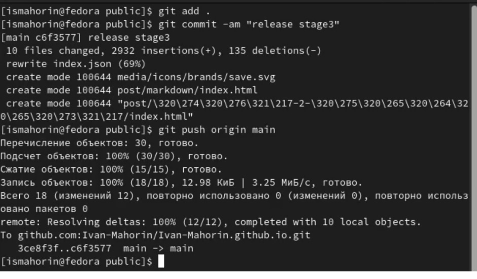{ #fig:008 width=50% }

## Выгрузка из каталога "blog"

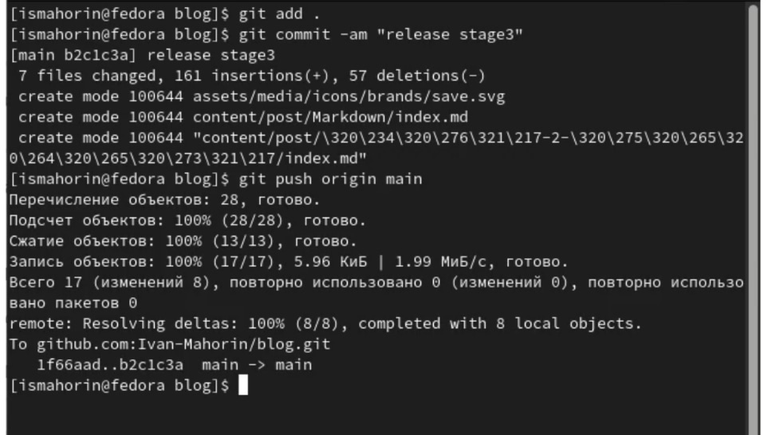{ #fig:009 width=50% }

## Внешний вид обновлённого сайта

Последним шагом перейдём на наш сайт и посмотрим итог работы.

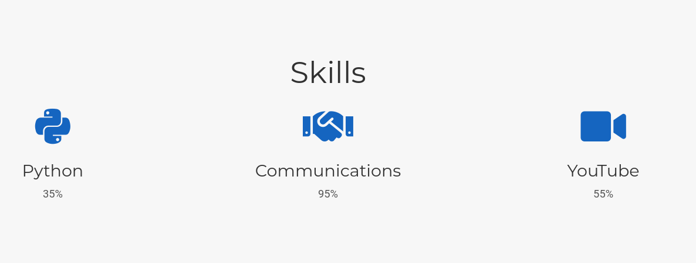{ #fig:010 width=60% }

## Внешний вид обновлённого сайта

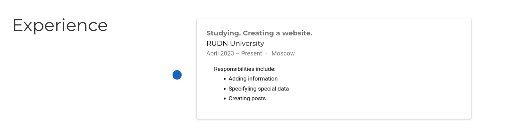{ #fig:011 width=60% }

## Внешний вид обновлённого сайта

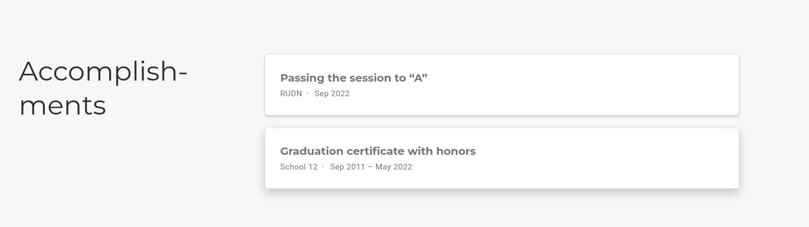{ #fig:012 width=60% }

## Внешний вид обновлённого сайта

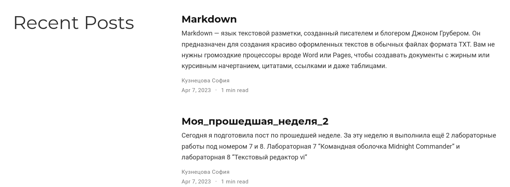{ #fig:013 width=60% }

## Добавление ссылки на GitHub

Добавим к сайту ссылку на научные и библиотметрические ресурсы.

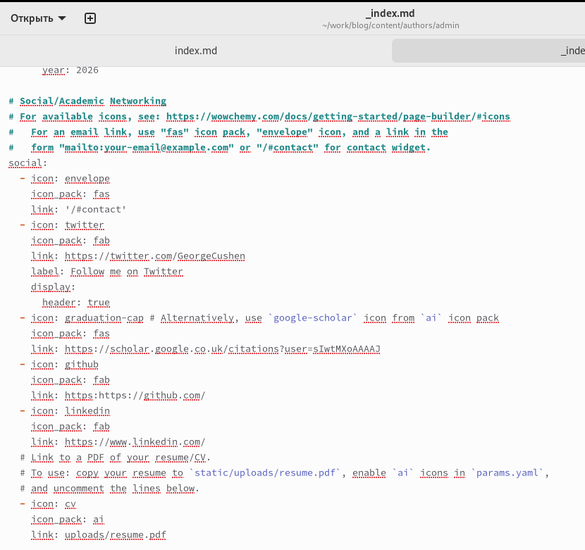{ #fig:013 width=45% }

# Вывод

Добавила к сайту достижения.

## {.standout}

Спасибо за внимание!

