---
## Front matter
title: "Индивидуальный проект"
subtitle: "Третий этап"
author: "Кузнецова София Вадимовна"

## Generic otions
lang: ru-RU
toc-title: "Содержание"

## Bibliography
bibliography: bib/cite.bib
csl: pandoc/csl/gost-r-7-0-5-2008-numeric.csl

## Pdf output format
toc: true # Table of contents
toc-depth: 2
lof: true # List of figures
lot: true # List of tables
fontsize: 12pt
linestretch: 1.5
papersize: a4
documentclass: scrreprt
## I18n polyglossia
polyglossia-lang:
  name: russian
  options:
	- spelling=modern
	- babelshorthands=true
polyglossia-otherlangs:
  name: english
## I18n babel
babel-lang: russian
babel-otherlangs: english
## Fonts
mainfont: PT Serif
romanfont: PT Serif
sansfont: PT Sans
monofont: PT Mono
mainfontoptions: Ligatures=TeX
romanfontoptions: Ligatures=TeX
sansfontoptions: Ligatures=TeX,Scale=MatchLowercase
monofontoptions: Scale=MatchLowercase,Scale=0.9
## Biblatex
biblatex: true
biblio-style: "gost-numeric"
biblatexoptions:
  - parentracker=true
  - backend=biber
  - hyperref=auto
  - language=auto
  - autolang=other*
  - citestyle=gost-numeric
## Pandoc-crossref LaTeX customization
figureTitle: "Рис."
tableTitle: "Таблица"
listingTitle: "Листинг"
lofTitle: "Список иллюстраций"
lotTitle: "Список таблиц"
lolTitle: "Листинги"
## Misc options
indent: true
header-includes:
  - \usepackage{indentfirst}
  - \usepackage{float} # keep figures where there are in the text
  - \floatplacement{figure}{H} # keep figures where there are in the text
---

# Цель работы

Добавить к сайту достижения.

# Задание

1. Добавить информацию о навыках (Skills).
2. Добавить информацию об опыте (Experience).
3. Добавить информацию о достижениях (Accomplishments).
4. Сделать пост по прошедшей неделе.
6. Добавить пост на тему: "Язык разметки Markdown"

# Выполнение лабораторной работы

Для начала добавим информацию о навыках. Для этого мы должны проделать данный путь: "work", "blog", "content", "home" и зайти в файл "skills.md". Внутри файла мы закомментируем шаблонные данные и будем использовать emoji.

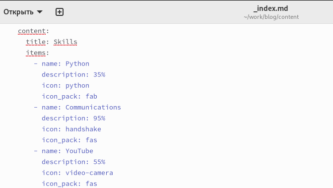{ #fig:001 width=100% }

В каталоге "home" выберим файл "experience.md" для добавления опыта.

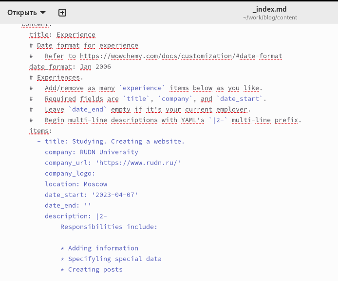{ #fig:002 width=100% }

Последним файлом для редактирования будет "accomplishments.md", где мы добавим наши достижения.

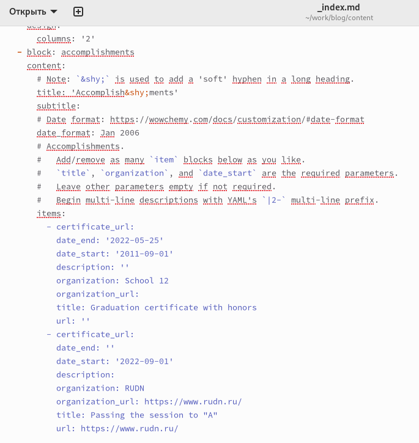{ #fig:003 width=100% }

Через терминал создаём два поста "Markdown" и "Моя прошедшая неделя(2)", в которые добавляем написанный нами текст для постов.

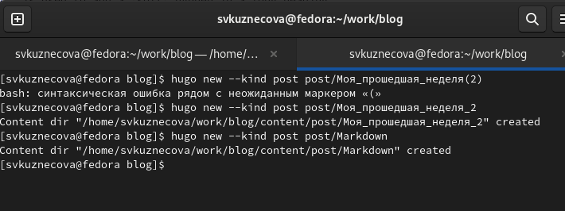{ #fig:004 width=100% }

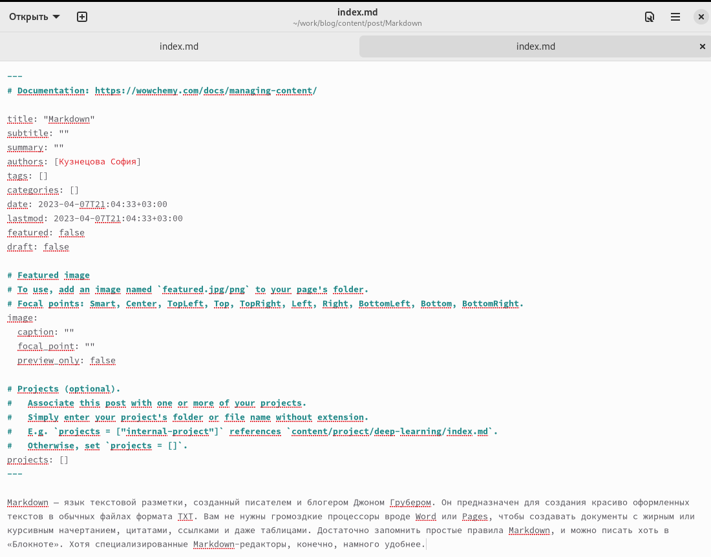{ #fig:005 width=100% }

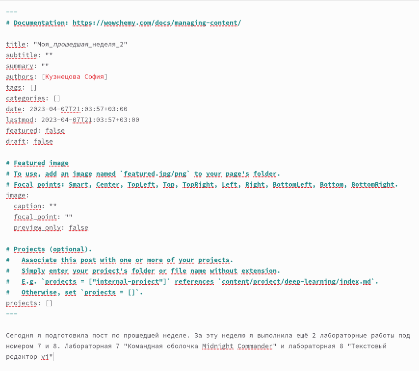{ #fig:006 width=100% }

Чтобы вся наша информация выгрузилась на сайт, открываем в каталоге "blog"  терминал и запускаем команду hugo.

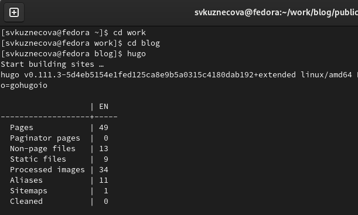{ #fig:007 width=100% }

Как только команда hugo выполнилась перейдём первым этапом в подкаталог "public" и проделаем указанные на скриншоте действия. Вторым этапом проделаем все те же самые действия, но уже в каталоге "blog".

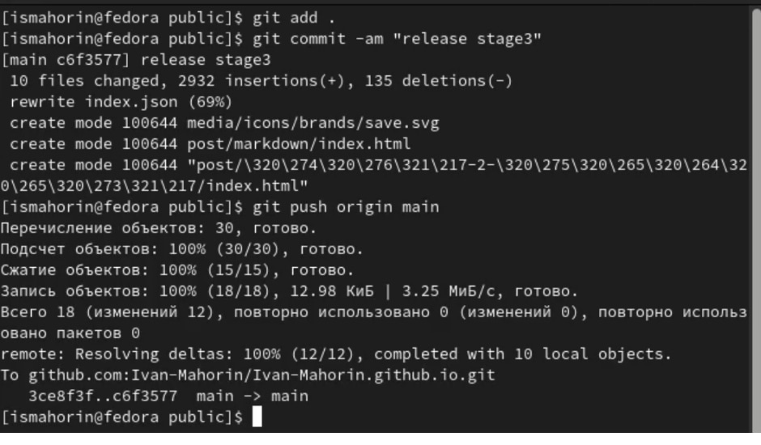{ #fig:008 width=100% }

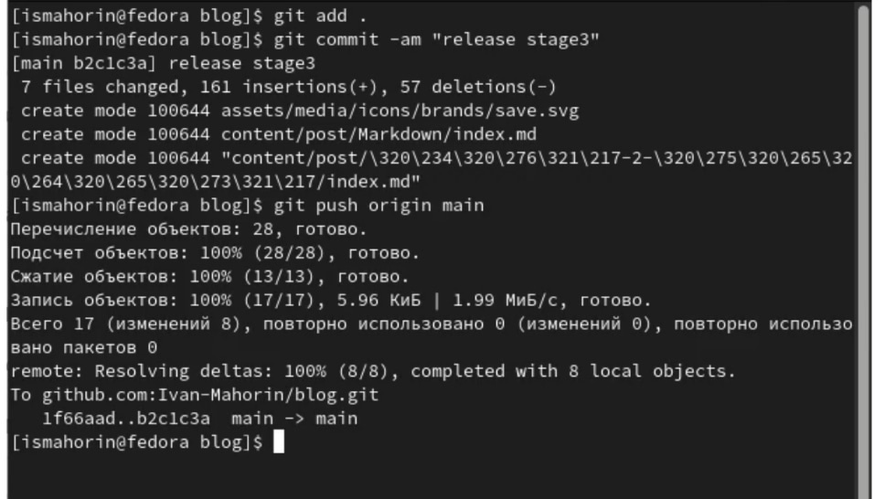{ #fig:009 width=100% }

Последним шагом перейдём на наш сайт и посмотрим итог работы.

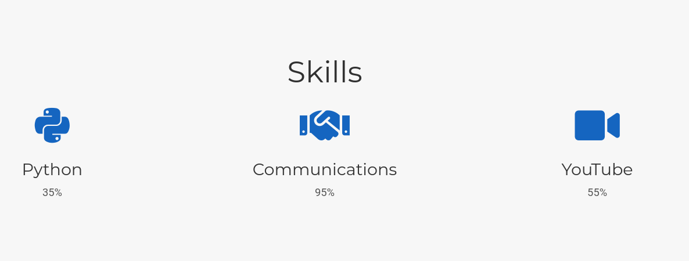{ #fig:010 width=100% }

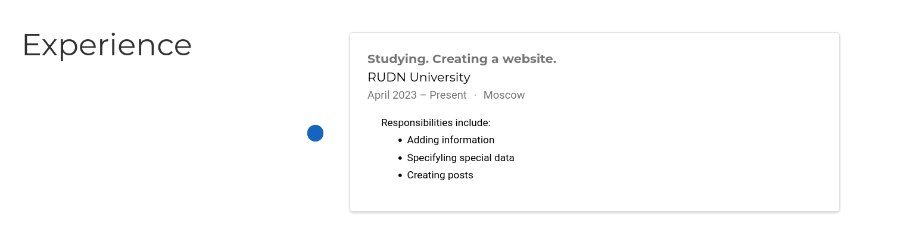{ #fig:011 width=100% }

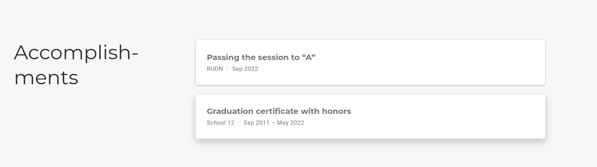{ #fig:012 width=100% }

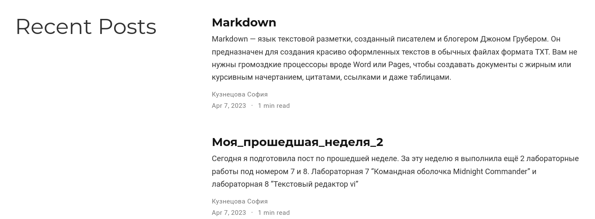{ #fig:013 width=100% }

Добавим к сайту ссылку на научные и библиотметрические ресурсы.

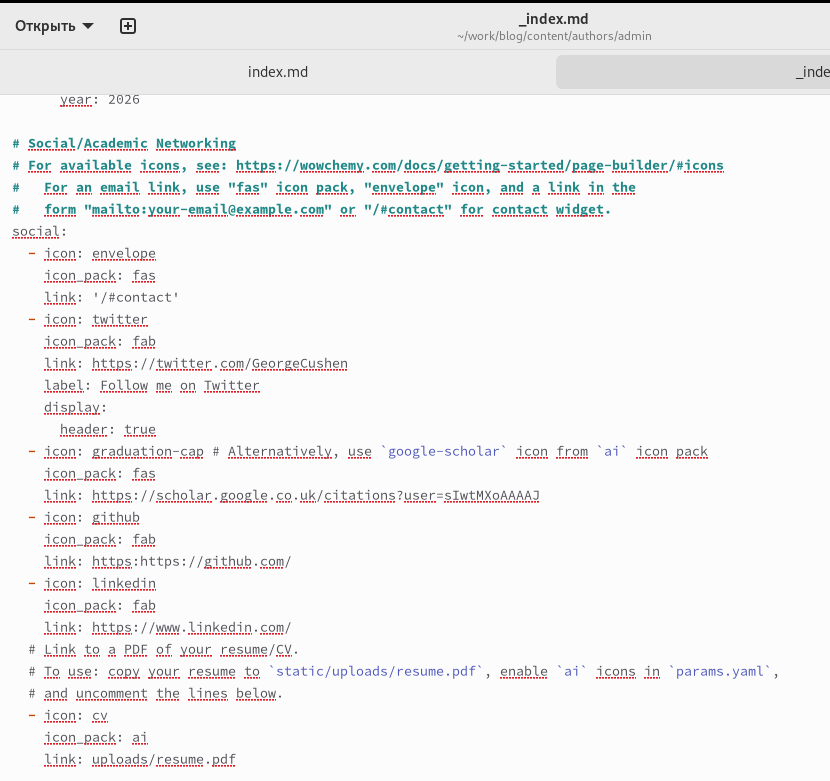{ #fig:013 width=100% }

# Выводы

Добавила к сайту достижения.

