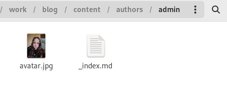
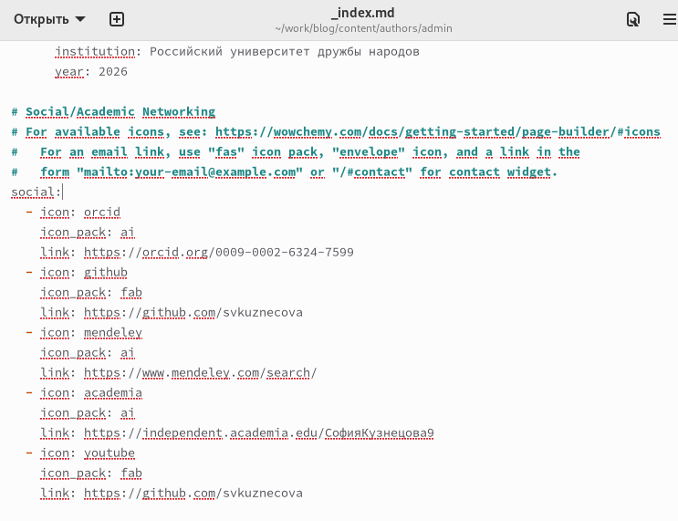
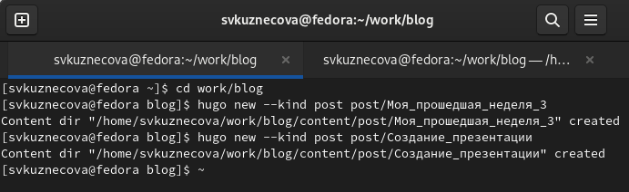
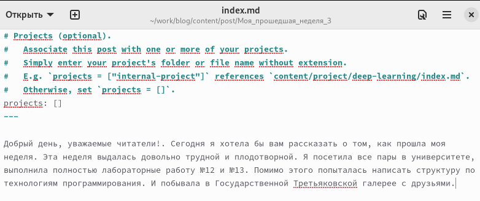
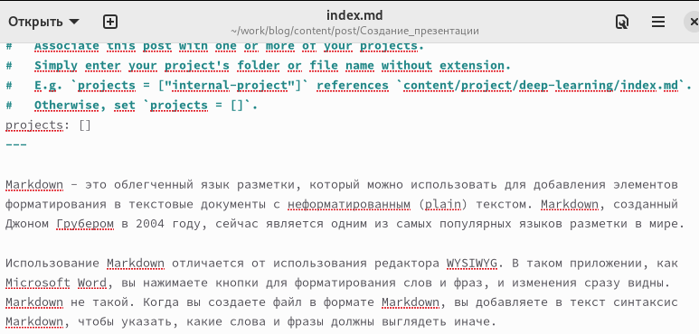
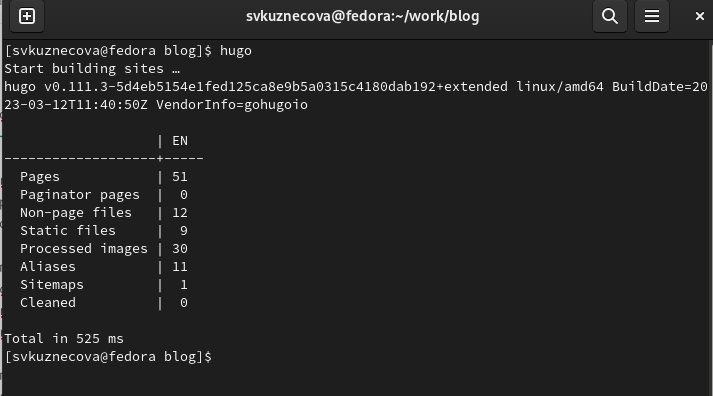
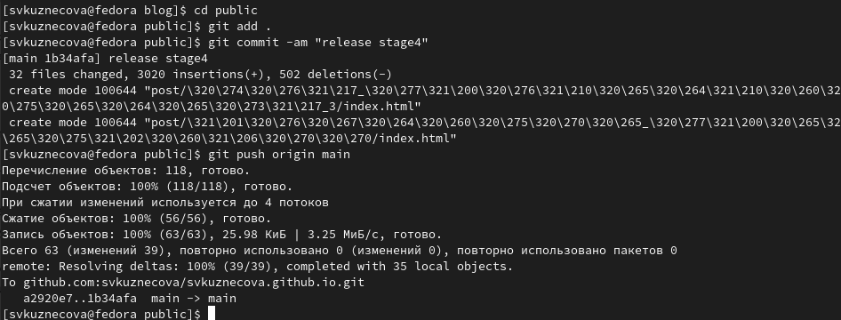
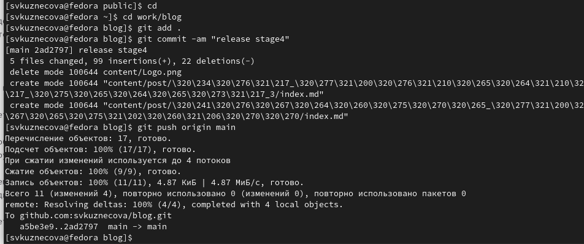
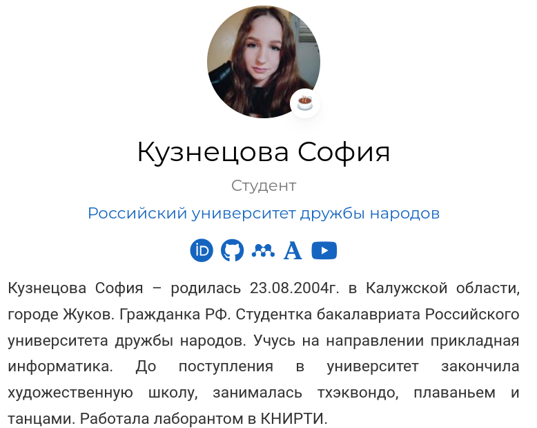
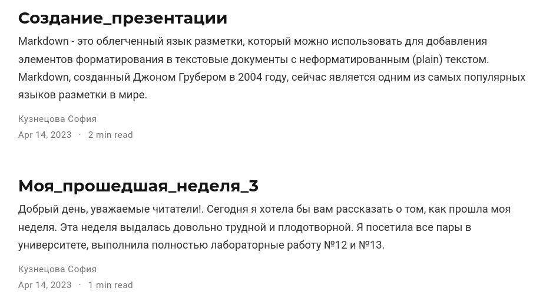

---
## Front matter
lang: ru-RU
title: Индивидуальный проект
subtitle: Четвёртый этап
author:
  - Кузнецова С. В.
institute:
  - Российский университет дружбы народов, Москва, Россия
date: 14 апреля 2023

## i18n babel
babel-lang: russian
babel-otherlangs: english

## Formatting pdf
toc: false
toc-title: Содержание
slide_level: 2
aspectratio: 169
section-titles: true
theme: metropolis
header-includes:
 - \metroset{progressbar=frametitle,sectionpage=progressbar,numbering=fraction}
 - '\makeatletter'
 - '\beamer@ignorenonframefalse'
 - '\makeatother'
---

# Информация

## Докладчик

  * Кузнецова София Вадимовна
  * студент прикладной информатики 
  * Российский университет дружбы народов

# Выполнение 3-го этапа индивидуального проекта

## Добавление ссылок на ресурсы

После того, как мы зарегистрировались на всех нужных ресурсах, приступим к добавлению ссылок на наш сайт. Для этого мы должны проделать данный путь: "work", "blog", "content", "authors", "admin". Внутри каталога "admin" мы открываем файл "_index.md".

{ #fig:000 width=60% }

## Добавление ссылок на ресурсы

В разделе "social" меняем icon_pack на ai и пишем название нужных нам логотипов. Всю информацию о логотипах и нужных паков можно узнать по ссылке: https://wowchemy.com/docs/getting-started/page-builder/#icons. Также не забываем добавить ссылки на ресурсы.

{ #fig:001 width=40% }

## Создание постов

Теперь создадим каталоги для наших новых постов, назовём их: "Моя прошедшая неделя(3)" и "Презентация в Markdown". Чтобы создать эти каталоги нужно проделать следующий путь: "work", "blog", "content", "post".

{ #fig:002 width=50% }

## Добавление информации для постов

Добавим информацию для наших постов, которую мы написали заранее.

{ #fig:003 width=50% }

## Добавление информации для постов

{ #fig:004 width=50% }

## Hugo

Чтобы наша информация выгрузилась на сайт, откроем в каталоге "blog" терминал и запусти команду hugo.

{ #fig:005 width=50% }

## Выгрузка из подкаталога "public"

Как только команда hugo выполнилась перейдём первым этапом в подкаталог "public" и проделаем указанные на скриншоте действия. Вторым этапом проделаем все те же самые действия, но уже в каталоге "blog".

{ #fig:006 width=50% }

## Выгрузка из подкаталога "blog"

{ #fig:007 width=50% }

## Внешний вид обновлённого сайта

Последним шагом перейдём на наш сайт и посмотрим итог работы.

{ #fig:008 width=50% }

## Внешний вид обновлённого сайта

{ #fig:009 width=50% }

# Вывод

В ходе выполнения четвёртого этапа индивидуального проекта мы научились добавлять к сайту ссылки на научные и библиометрические ресурсы.

## {.standout}

Спасибо за внимание!

