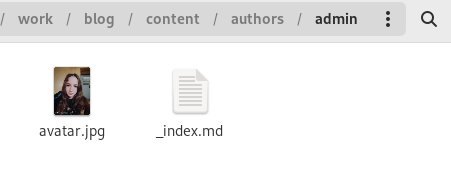
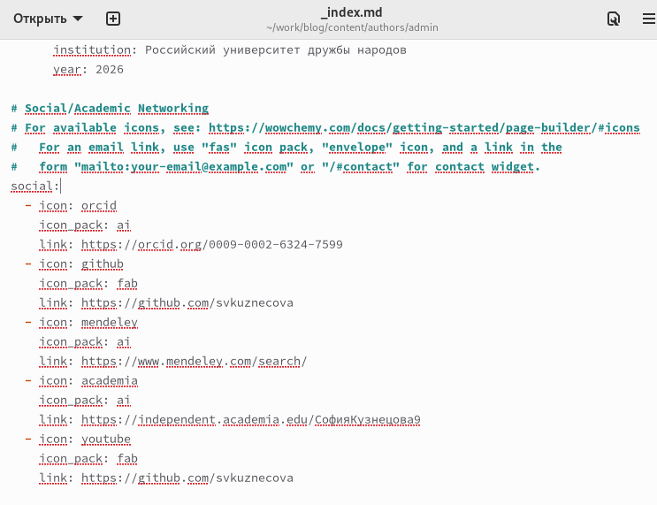
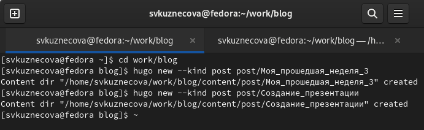
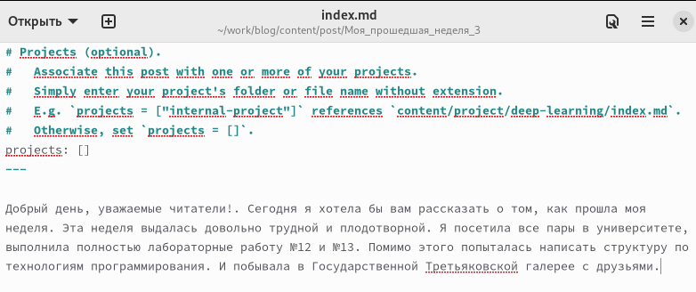
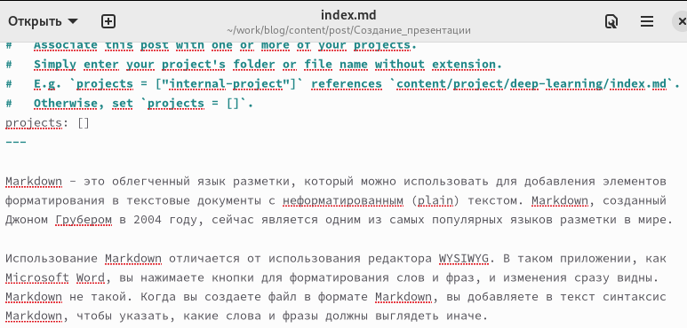
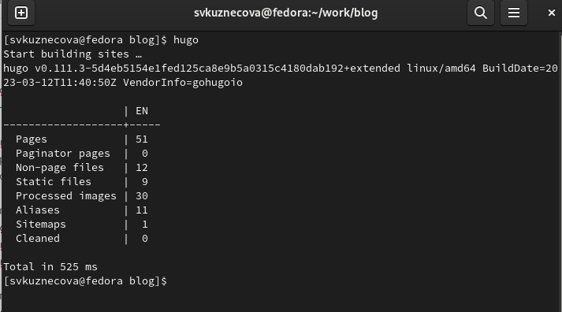
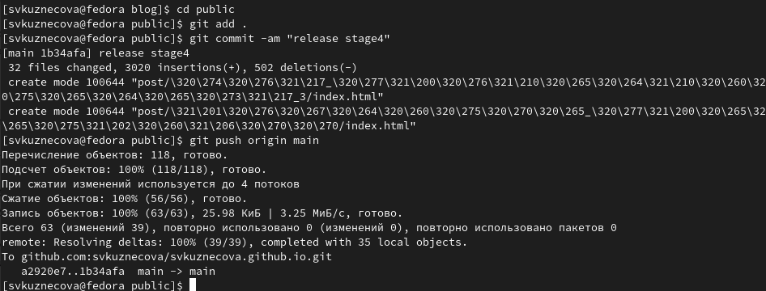
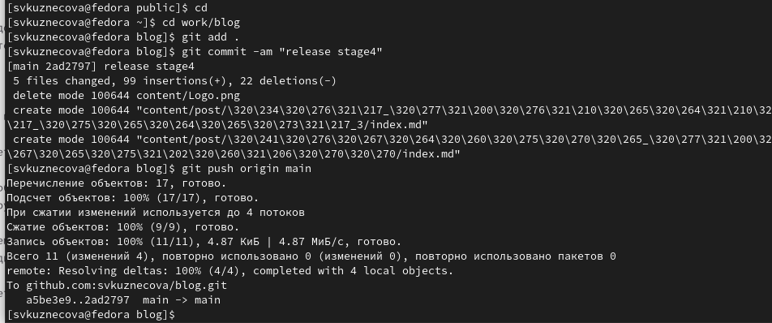
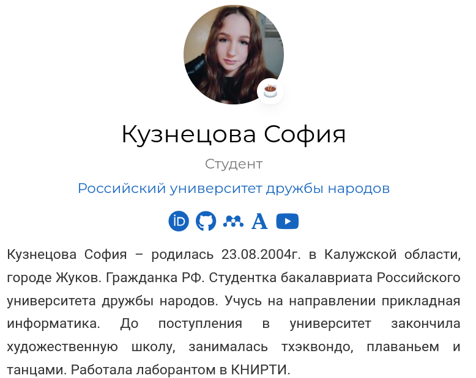
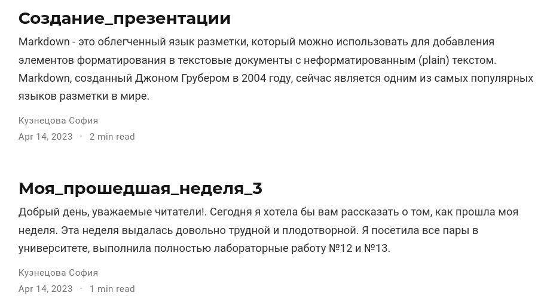

---
## Front matter
title: "Индивидуальный проект"
subtitle: "Четвёртый этап"
author: "Кузнецова София Вадимовна"

## Generic otions
lang: ru-RU
toc-title: "Содержание"

## Bibliography
bibliography: bib/cite.bib
csl: pandoc/csl/gost-r-7-0-5-2008-numeric.csl

## Pdf output format
toc: true # Table of contents
toc-depth: 2
lof: true # List of figures
lot: true # List of tables
fontsize: 12pt
linestretch: 1.5
papersize: a4
documentclass: scrreprt
## I18n polyglossia
polyglossia-lang:
  name: russian
  options:
	- spelling=modern
	- babelshorthands=true
polyglossia-otherlangs:
  name: english
## I18n babel
babel-lang: russian
babel-otherlangs: english
## Fonts
mainfont: PT Serif
romanfont: PT Serif
sansfont: PT Sans
monofont: PT Mono
mainfontoptions: Ligatures=TeX
romanfontoptions: Ligatures=TeX
sansfontoptions: Ligatures=TeX,Scale=MatchLowercase
monofontoptions: Scale=MatchLowercase,Scale=0.9
## Biblatex
biblatex: true
biblio-style: "gost-numeric"
biblatexoptions:
  - parentracker=true
  - backend=biber
  - hyperref=auto
  - language=auto
  - autolang=other*
  - citestyle=gost-numeric
## Pandoc-crossref LaTeX customization
figureTitle: "Рис."
tableTitle: "Таблица"
listingTitle: "Листинг"
lofTitle: "Список иллюстраций"
lotTitle: "Список таблиц"
lolTitle: "Листинги"
## Misc options
indent: true
header-includes:
  - \usepackage{indentfirst}
  - \usepackage{float} # keep figures where there are in the text
  - \floatplacement{figure}{H} # keep figures where there are in the text
---

# Цель работы

Добавить к сайту ссылки на научные и библиометрческие ресурсы.

# Задание

1. Зарегистрироваться и разместить ссылку на сайт eLibrary.
2. Зарегистрироваться и разместить ссылку на сайт Google Scholar.
3. Зарегистрироваться и разместить ссылку на сайт ORCID.
4. Зарегистрироваться и разместить ссылку на сайт Mendeley.
6. Зарегистрироваться и разместить ссылку на сайт ResearchGate.
7. Зарегистрироваться и разместить ссылку на сайт Academia.edu.
8. Зарегистрироваться и разместить ссылку на сайт arXiv.
9. Зарегистрироваться и разместить ссылку на сайт github.
10. Сделать пост по прошедшей неделе.
11. Добавить пост на тему: "Создание презентаций".

# Выполнение лабораторной работы

После того, как мы зарегистрировались на всех нужных ресурсах, приступим к добавлению ссылок на наш сайт. Для этого мы должны проделать данный путь: "work", "blog", "content", "authors", "admin". Внутри каталога "admin" мы открываем файл "_index.md".

{ #fig:000 width=100% }

В разделе "social" меняем icon_pack на ai и пишем название нужных нам логотипов. Всю информацию о логотипах и нужных паков можно узнать по ссылке: https://wowchemy.com/docs/getting-started/page-builder/#icons. Также не забываем добавить ссылки на ресурсы.

{ #fig:001 width=100% }

Теперь создадим каталоги для наших новых постов, назовём их: "Моя прошедшая неделя(3)" и "Презентация в Markdown". Чтобы создать эти каталоги нужно проделать следующий путь: "work", "blog", "content", "post".

{ #fig:002 width=100% }

Добавим информацию для наших постов, которую мы написали заранее.

{ #fig:003 width=100% }

{ #fig:004 width=100% }

Чтобы наша информация выгрузилась на сайт, откроем в каталоге "blog" терминал и запусти команду hugo.

{ #fig:005 width=100% }

Как только команда hugo выполнилась перейдём первым этапом в подкаталог "public" и проделаем указанные на скриншоте действия. Вторым этапом проделаем все те же самые действия, но уже в каталоге "blog".

{ #fig:006 width=100% }

{ #fig:007 width=100% }

Последним шагом перейдём на наш сайт и посмотрим итог работы.

{ #fig:008 width=100% }

{ #fig:009 width=100% }

# Выводы

В ходе выполнения четвёртого этапа индивидуального проекта мы научились добавлять к сайту ссылки на научные и библиометрические ресурсы.

